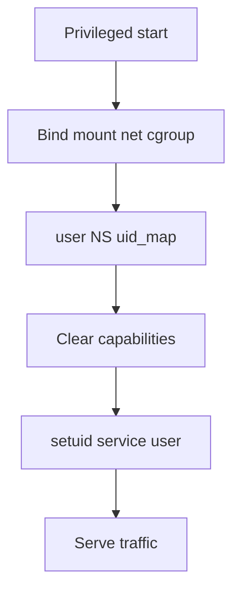
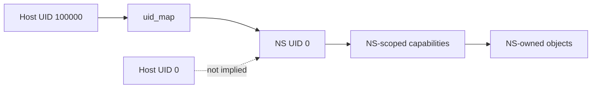
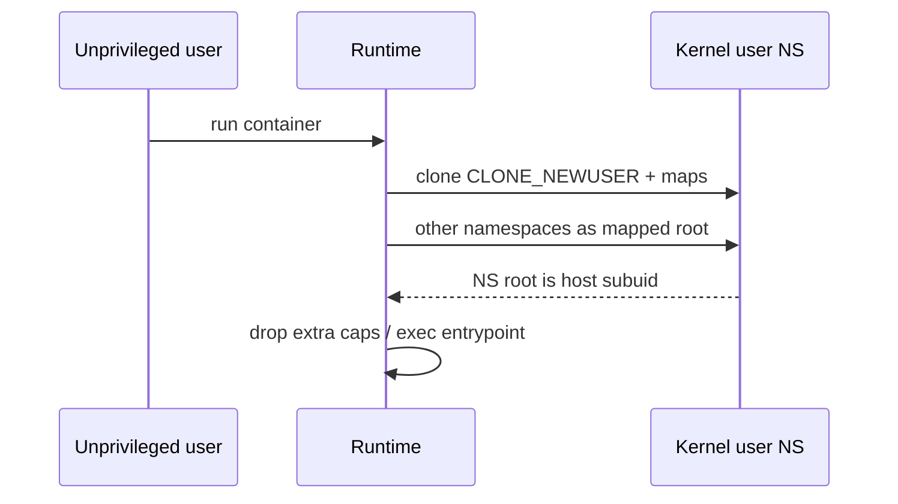

# User Namespaces Capabilities and Privilege Drops

## Overview

**User namespaces** map credentials inside a namespace to different UIDs/GIDs on the host. Combined with **capabilities**, they enable **rootless** containers: “root” inside may be UID 100000 outside. **Privilege drops** are the deliberate reduction of effective caps/UID after binding privileged ports or opening devices.

This note ties UID mapping, capability sets, and safe drop patterns for host operators. Full capability catalog and threat models → [[10-Linux/09-Security-Primitives-on-the-Host/Capabilities vs root All-Powerful Myth|Capabilities vs root]] and [[18-Security/README|Security]]. Runtime wiring → [[14-Docker/README|Docker]].

## Learning Objectives

- Read and write `uid_map` / `gid_map` semantics (single-writer, no overlapping lies)
- Explain why NS-root ≠ host-root
- Drop privileges after setup (`setuid`, `cap_set_proc`, systemd `CapabilityBoundingSet`)
- Spot filesystem ownership surprises on bind mounts under user NS
- Contrast privileged vs rootless container security postures

## Prerequisites

- [[10-Linux/07-Cgroups-Namespaces-and-Isolation/Namespaces Types and Isolation Boundaries|Namespaces Types and Isolation Boundaries]]
- [[10-Linux/01-Shell-Filesystem-Hierarchy-and-Permissions/Users Groups and DAC Permissions|Users Groups and DAC Permissions]]
- Capability basics (module 09 note; can be read in parallel)

## Difficulty

`advanced`

## Estimated Time

- Reading: 1.5 hours
- Exercises: 2.5 hours
- Mini project: 3 hours

## History

For years “containers need root” was operational reality: creating netns, mounting, and cgroup ops required privileges. User namespaces matured to map subordinate UID ranges (`/etc/subuid`) so unprivileged users could synthesize a full ID space. Rootless Docker/Podman and Kubernetes userNS features build on this—still with sharp edges around devices, filesystems, and kernel attack surface.

## Problem It Solves

| Problem | Mechanism |
| --- | --- |
| Daemon runs as host root forever | Drop UID/caps after bind |
| Container root equals host root | User NS mapping |
| Breakout with CAP_SYS_ADMIN | Bounding sets + no_new_privs + seccomp |
| Bind mount files owned by “root” confuse apps | Map-aware ownership |

## Internal Implementation

### UID/GID maps

Inside user NS, UID 0 maps to a host UID via `/proc/PID/uid_map`:

```text
# inside-ns-start inside-ns-count host-start
0 100000 65536
```

Only one mapping write is allowed for non-root openers (rules tightened over years). `/etc/subuid` allocates ranges for rootless runtimes.

### Capabilities in a user NS

Capabilities are **namespace-aware**: owning CAP_SYS_ADMIN *in a user NS* grants privileged ops *on objects governed by that NS*, not arbitrary host power. Cross-NS operations still need host privilege or careful delegation. Theory of least privilege → Security track.

### Privilege drop sequence (classic)

1. Start with needed caps (or root).
2. Bind ports / open devices / chroot/pivot_root.
3. `capset` to clear permitted/effective; optionally `PR_SET_NO_NEW_PRIVS`.
4. `setgid`/`setuid` to service user.
5. Fail closed if any step errors.



## Mermaid Diagrams

### Structure



### Sequence / Lifecycle — rootless container start



## Examples

### Minimal Example — inspect maps

```bash
# For a process in a user namespace
PID=12345
cat /proc/$PID/uid_map
cat /proc/$PID/gid_map
id
# From host: see real ownership on a bind-mounted file
ls -ln /path/on/host/bind
```

### Production-Shaped Example — systemd drop

```ini
[Service]
User=api
Group=api
NoNewPrivileges=true
CapabilityBoundingSet=CAP_NET_BIND_SERVICE
AmbientCapabilities=CAP_NET_BIND_SERVICE
# Or bind via socket activation and use zero caps:
# RestrictAddressFamilies=AF_UNIX AF_INET AF_INET6
ProtectSystem=strict
ProtectHome=true
PrivateTmp=true
```

See also [[10-Linux/06-systemd-Timers-and-Logging/Service Hardening Directives|Service Hardening Directives]].

```bash
# Verify
grep Cap /proc/$(pidof api)/status
# CapEff should show only intended bits (decode with capsh --decode=)
```

## Trade-offs

| Dimension | Upside | Downside | When it matters |
| --- | --- | --- | --- |
| User NS rootless | Smaller host blast radius | Incompatible volumes/devices | Shared developer hosts |
| Ambient CAP_NET_BIND_SERVICE | Non-root :80 | Still a capability attack gadget | Public listeners |
| Full drop to nobody | Minimal privilege | Can’t re-bind / reload some fds | Long-running daemons |
| Privileged containers | “Just works” | Host-equivalent risk | Almost never in prod |

### When to Use

- Rootless CI and local container engines
- Any network daemon that only needed root for port &lt; 1024
- Hardening systemd units before containerizing

### When Not to Use

- Assuming user NS alone stops kernel exploits (Security handoff)
- Complex device passthrough without testing ownership and cgroup device rules

## Exercises

1. Decode `CapEff` for a hardened unit with `capsh --decode`.
2. Create a user NS with `unshare -U` and attempt `ping`; explain failure via caps.
3. Compare file UIDs on a bind mount from host vs inside a rootless container.
4. Write a privilege-drop order checklist for a Go/Node service binding :443.
5. Find `subuid` range for your user; relate to a Podman/Docker rootless mapping.

## Mini Project

Implement a tiny C or Go “bind then drop” demo: bind `:8443` with `CAP_NET_BIND_SERVICE` or root, drop to nobody, prove `getuid` and caps. Document failure if drop is skipped.

## Portfolio Project

[[10-Linux/projects/Linux Host Workbench/README|Linux Host Workbench]] — security ADR: rootless vs privileged runtime for the lab’s containerized agents.

## Interview Questions

1. Is root in a user namespace root on the host? Why?
2. What do `uid_map` lines mean?
3. Outline a safe privilege-drop sequence.
4. Role of `NO_NEW_PRIVS`?
5. Why do bind mounts show “wrong” owners with user NS?

### Stretch / Staff-Level

1. Threat-model a rootless runtime against a malicious image (Security collaboration).
2. Design UID mapping for nested containers without exhausting subuid ranges.

## Common Mistakes

- Dropping UID before clearing caps that allow regain
- Leaving `CAP_SYS_ADMIN` “for convenience”
- Ignoring filesystem ID mappings in CI volume mounts
- Treating rootless as equal to VM isolation

## Best Practices

- Prefer socket activation over ambient caps when possible
- Pair user NS with seccomp and read-only rootfs
- Audit `subuid`/`subgid` allocation in fleet images
- Test volume permissions explicitly under rootless

## Summary

User namespaces remap identity; capabilities gate privileged operations; privilege drops make both sticky. Together they enable rootless operation without pretending the kernel is a hypervisor. Deep escape analysis belongs in Security; runtime defaults in Docker/Podman tracks.

## Further Reading

- `man user_namespaces`, `man capabilities`
- [[10-Linux/09-Security-Primitives-on-the-Host/seccomp and Syscall Filtering Basics|seccomp and Syscall Filtering Basics]]
- [[18-Security/README|Security]]

## Related Notes

- [[10-Linux/07-Cgroups-Namespaces-and-Isolation/Namespaces Types and Isolation Boundaries|Namespaces Types and Isolation Boundaries]]
- [[10-Linux/09-Security-Primitives-on-the-Host/Capabilities vs root All-Powerful Myth|Capabilities vs root All-Powerful Myth]]
- [[10-Linux/06-systemd-Timers-and-Logging/Service Hardening Directives|Service Hardening Directives]]
- [[14-Docker/README|Docker]]

## Progress Checklist

- [ ] Explained from first principles
- [ ] Drew at least one Mermaid diagram
- [ ] Implemented a minimal version
- [ ] Documented trade-offs and non-goals
- [ ] Completed exercises
- [ ] Practiced interview questions aloud
- [ ] Linked prerequisites and dependents
