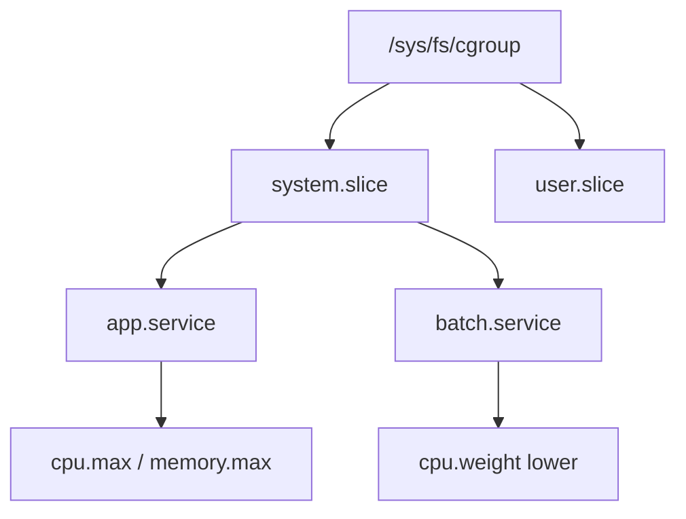
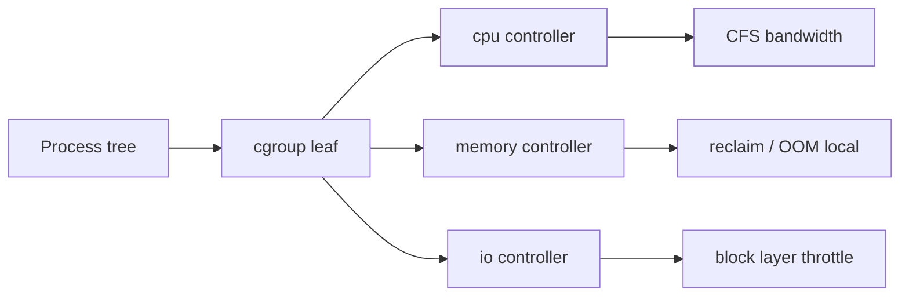
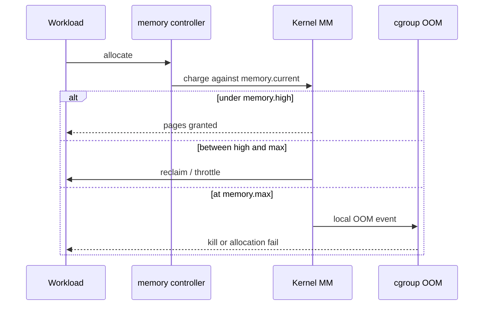

# cgroup v2 Controllers CPU Memory IO

## Overview

**cgroup v2** (control groups, unified hierarchy) is the kernel mechanism that **accounts for and constrains** CPU time, memory, and block I/O for a tree of processes. Unlike `ulimit` (per-process rlimits), cgroups apply budgets to a **group**: a service unit, a container, or a subtree you create under `/sys/fs/cgroup`.

This note covers the three controllers operators touch daily—`cpu`, `memory`, and `io`—their knobs (`cpu.max`, `memory.max`, `io.max`), and how pressure / reclaim interact with host OOM. Container runtimes and Kubernetes *consume* these primitives; the orchestration story lives in [[14-Docker/README|Docker]] and [[15-Kubernetes/README|Kubernetes]].

## Learning Objectives

- Explain unified hierarchy vs legacy cgroup v1 multi-mount model
- Set and verify `cpu.max`, `memory.max` / `memory.high`, and `io.max` / `io.weight`
- Read `cpu.stat`, `memory.current`, `memory.events`, and `io.stat` under pressure
- Distinguish soft (`memory.high`) vs hard (`memory.max`) memory control
- Hand off image/pod resource specs to Docker/K8s without treating YAML as the kernel

## Prerequisites

- [[10-Linux/02-Processes-Signals-and-Job-Control/Limits ulimit and rlimits|Limits ulimit and rlimits]]
- [[10-Linux/03-Memory-Swap-and-OOM/OOM Killer Scores and Policy|OOM Killer Scores and Policy]]
- [[01-Computer-Science/04-Processes-and-Execution/Processes|Processes]] — process trees and scheduling intuition

## Difficulty

`intermediate`

## Estimated Time

- Reading: 1.5 hours
- Exercises: 2 hours
- Mini project: 3 hours

## History

cgroup v1 exposed separate hierarchies per controller (`cpu`, `memory`, …), which made cross-controller membership painful and forced runtimes into awkward mounts. **cgroup v2** (merged ~4.5+, default on modern distros) uses one tree: every process belongs to exactly one leaf; controllers are enabled per subtree via `cgroup.subtree_control`. systemd became the default root organizer; containerd/CRI-O map pod/container limits onto the same files.

## Problem It Solves

| Failure without cgroup budgets | What controllers provide |
| --- | --- |
| Batch job steals all cores from latency-critical API | `cpu.max` / `cpu.weight` fair share |
| Cache warm-up allocates until host OOM | `memory.max` + reclaim before kill |
| Backup `dd` saturates disk, API p99 collapses | `io.max` / `io.weight` |
| “Docker limit worked” but bare metal service did not | Same knobs under systemd `MemoryMax=` |

rlimits alone cannot express “this *slice* of processes may use 2 GiB total.”

## Internal Implementation

### Unified hierarchy

Processes are moved by writing PIDs to `cgroup.procs`. Controllers enabled on a parent apply accounting/limits to descendants. Delegation (e.g. to containers) requires careful `subtree_control` so an unprivileged agent cannot escape the parent’s budget.



### Controllers (operator view)

| Controller | Primary files | Semantics |
| --- | --- | --- |
| `cpu` | `cpu.max`, `cpu.weight`, `cpu.stat` | Bandwidth: `$MAX $PERIOD` µs; weight for fair share when unconstrained |
| `memory` | `memory.max`, `memory.high`, `memory.current`, `memory.events` | Hard cap vs throttle-before-OOM; PSI via `memory.pressure` |
| `io` | `io.max`, `io.weight`, `io.stat` | Per-device rbps/wbps/riops/wiops; weight for BFQ/io.cost |

**CPU:** `cpu.max` = `150000 100000` means 1.5 cores over each 100 ms period. Weight (default 100) matters when siblings compete *without* hard max.

**Memory:** `memory.high` triggers reclaim/throttle; `memory.max` is the hard limit—further allocation fails / OOM within the cgroup (`memory.events` `oom` / `oom_kill`). Host OOM killer still exists; cgroup-aware reclaim reduces blast radius. Theory of virtual memory → [[01-Computer-Science/03-Memory-and-Addressing/Virtual Memory|Virtual Memory]].

**IO:** Limits are device-scoped (`MAJOR:MINOR rbps=…`). Without `io` controller enabled, disk is a shared free-for-all.

## Mermaid Diagrams

### Structure



### Sequence / Lifecycle — hit memory.max



## Examples

### Minimal Example — inspect and set CPU/memory

```bash
# Where is this shell?
cat /proc/self/cgroup

# systemd-managed service (preferred over raw echo)
systemctl show myapp.service -p MemoryMax -p CPUQuota -p IOReadBandwidthMax

# Manual lab under a delegated slice (root; use a throwaway cgroup)
CG=/sys/fs/cgroup/lab.slice/noisy
mkdir -p "$CG"
echo '+cpu +memory +io' > /sys/fs/cgroup/lab.slice/cgroup.subtree_control
echo '50000 100000' > "$CG/cpu.max"          # 0.5 CPU
echo $((512*1024*1024)) > "$CG/memory.max"   # 512 MiB
echo $$ > "$CG/cgroup.procs"
```

### Production-Shaped Example — systemd unit budgets

```ini
# /etc/systemd/system/api.service.d/budget.conf
[Service]
CPUQuota=200%
MemoryHigh=1G
MemoryMax=1536M
IOWeight=100
# Optional device throttle (maj:min from lsblk)
# IOReadBandwidthMax=/dev/nvme0n1 50M
```

```bash
systemctl daemon-reload
systemctl restart api.service
# Verify kernel view
CG=$(systemctl show -p ControlGroup --value api.service)
cat "/sys/fs/cgroup${CG}/memory.current"
cat "/sys/fs/cgroup${CG}/memory.events"
cat "/sys/fs/cgroup${CG}/cpu.stat"
```

Observability of these counters → [[10-Linux/08-Observability-Tracing-and-Profiling/Metrics from procfs and sysfs|Metrics from procfs and sysfs]].

## Trade-offs

| Dimension | Upside | Downside | When it matters |
| --- | --- | --- | --- |
| Hard `memory.max` | Predictable isolation | Sudden local OOM under spike | Multi-tenant hosts |
| Soft `memory.high` | Absorbs bursts via reclaim | Latency jitter under reclaim | Latency-sensitive APIs |
| `cpu.max` | Caps runaway loops | Leaves cores idle if mis-sized | Noisy batch vs interactive |
| `io.max` | Protects shared disks | Hard to size without iostat baselines | Shared SSD/HDD nodes |
| Complexity | Matches container semantics | Mis-delegation = silent no limits | Rootless / nested cgroups |

### When to Use

- Any multi-workload host (API + batch + agents)
- Before blaming “the kernel OOM’d randomly”
- When mapping K8s `resources.limits` back to host reality

### When Not to Use

- As a substitute for fixing unbounded memory growth in the app
- Tuning random numbers without measuring `*.stat` / PSI
- Re-implementing cluster scheduling—that is [[15-Kubernetes/README|Kubernetes]]

## Exercises

1. Create a cgroup with `cpu.max = 10000 100000` (0.1 CPU). Run a busy loop inside and outside; compare wall time.
2. Set `memory.max` to 64 MiB and run a memory allocator until `memory.events` shows `oom_kill`. Capture the event counters.
3. Compare `MemoryHigh` vs `MemoryMax` under the same workload; graph latency or reclaim stalls.
4. Enable `io` on a test device and throttle write bandwidth; confirm with `iostat` and `io.stat`.
5. Trace a Docker/K8s memory limit to the cgroup files on the node (handoff: name the runtime path, then stop—depth in Docker/K8s tracks).

## Mini Project

Build a **Cgroup Budget Clinic** script (bash or TypeScript spawning processes) that: creates a subtree, applies CPU/memory/io limits, runs a noisy neighbor + victim workload, and writes a report of `cpu.stat` / `memory.events` / victim latency. See [[10-Linux/projects/Cgroup Budget Clinic/README|Cgroup Budget Clinic]].

## Portfolio Project

[[10-Linux/projects/Linux Host Workbench/README|Linux Host Workbench]] — add an ADR documenting default `MemoryHigh`/`MemoryMax` ratios for API vs batch slices on a shared host.

## Interview Questions

1. What problem does cgroup v2’s unified hierarchy solve vs v1?
2. Difference between `memory.high` and `memory.max`?
3. How does `cpu.max` express “2 CPUs”?
4. Why are rlimits insufficient for multi-process services?
5. Where do Kubernetes limits land in the kernel?

### Stretch / Staff-Level

1. Design delegation so an unprivileged runtime can manage nested cgroups without escaping the node budget.
2. Explain interaction between cgroup OOM and global OOM killer under memory pressure across slices.

## Common Mistakes

- Writing limits on a parent that has processes in non-leaf nodes (v2 forbids controllers with live procs incorrectly placed)
- Assuming `CPUQuota` without verifying `cpu` in `cgroup.controllers`
- Ignoring `memory.events` and only watching host free RAM
- Throttling IO without identifying the right `MAJOR:MINOR`
- Confusing cgroup isolation with security isolation (namespaces + caps + seccomp)

## Best Practices

- Prefer systemd/`MemoryMax=` over ad-hoc `echo` in production
- Pair hard caps with alerts on `memory.events` and PSI
- Size CPU/memory from measured saturation, not folklore
- Document device IDs when using `io.max`
- Cross-link container specs to these files during incidents

## Summary

cgroup v2 gives the host a **single tree of resource budgets**. `cpu`, `memory`, and `io` controllers turn multi-tenant chaos into enforceable shares and caps; systemd and container runtimes are clients of the same files. Master the knobs and stats here, then hand orchestration and pod QoS to Docker/Kubernetes, and virtual-memory theory to Computer Science.

## Further Reading

- Kernel docs: `Documentation/admin-guide/cgroup-v2.rst`
- `man systemd.resource-control`
- [[10-Linux/07-Cgroups-Namespaces-and-Isolation/Resource Budgets and Noisy Neighbor Containment|Resource Budgets and Noisy Neighbor Containment]]
- [[00-References/Linux/README|Linux References]]

## Related Notes

- [[10-Linux/07-Cgroups-Namespaces-and-Isolation/Namespaces Types and Isolation Boundaries|Namespaces Types and Isolation Boundaries]]
- [[10-Linux/07-Cgroups-Namespaces-and-Isolation/From Host Primitives to Containers Handoff|From Host Primitives to Containers Handoff]]
- [[10-Linux/03-Memory-Swap-and-OOM/OOM Killer Scores and Policy|OOM Killer Scores and Policy]]
- [[14-Docker/README|Docker]]
- [[15-Kubernetes/README|Kubernetes]]

## Progress Checklist

- [ ] Explained from first principles
- [ ] Drew at least one Mermaid diagram
- [ ] Implemented a minimal version
- [ ] Documented trade-offs and non-goals
- [ ] Completed exercises
- [ ] Practiced interview questions aloud
- [ ] Linked prerequisites and dependents
