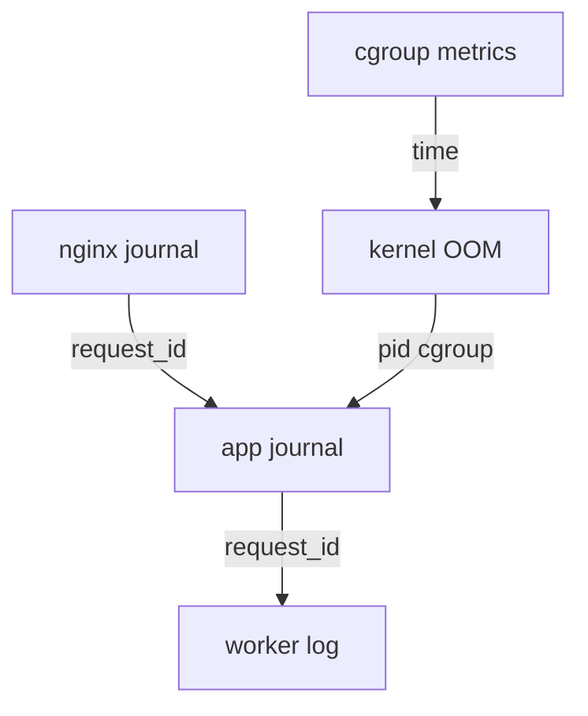
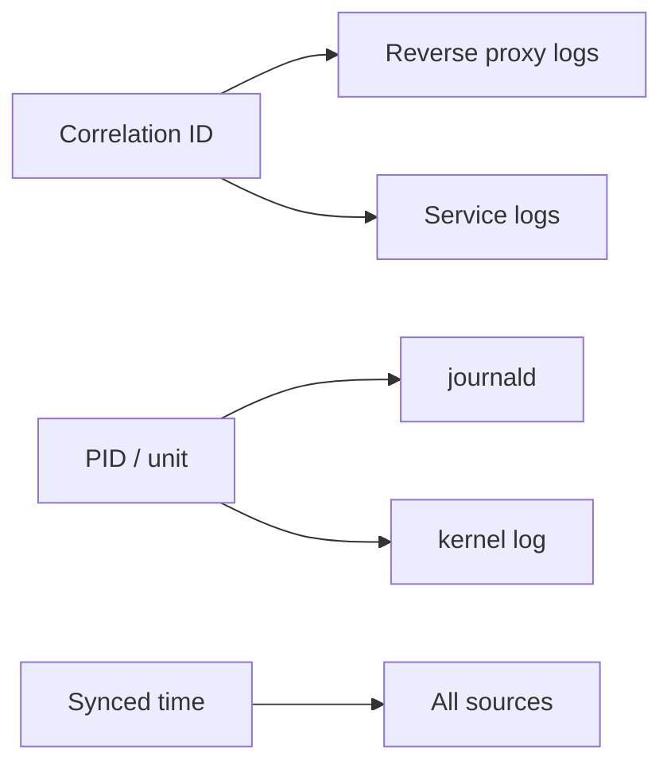
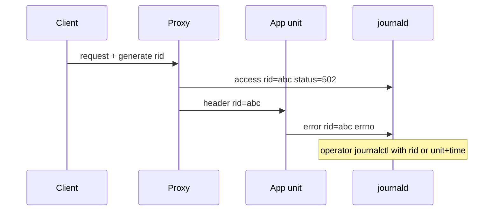

# Logging Correlation on a Single Host

## Overview

**Correlation on a single host** means joining **time**, **PID/cgroup/unit**, and **request or job IDs** across journald, app logs, auth logs, and kernel messages so an incident tells one story. Distributed tracing across services → [[07-Backend/09-API-Observability-and-Testing/Distributed Tracing Across Handlers|Backend tracing]] and [[09-System-Design/10-Observability-and-Control-Planes/Distributed Tracing Correlation Across Regions|System Design]]; here we nail the **box-local** join keys operators actually have during SSH triage.

## Learning Objectives

- Join journald fields (`_SYSTEMD_UNIT`, `_PID`, `PRIORITY`, timestamps) with app log lines
- Propagate a correlation ID from reverse proxy → service → worker on one machine
- Handle clock issues (chrony) when ordering kernel vs userspace logs
- Rate-limit and persistence effects that drop evidence
- Know when to stop and escalate to multi-host trace systems

## Prerequisites

- [[10-Linux/06-systemd-Timers-and-Logging/journald Persistence and Rate Limits|journald Persistence and Rate Limits]]
- [[10-Linux/08-Observability-Tracing-and-Profiling/Metrics from procfs and sysfs|Metrics from procfs and sysfs]]

## Difficulty

`intermediate`

## Estimated Time

- Reading: 1 hour
- Exercises: 1.5 hours
- Mini project: 2.5 hours

## History

syslog + `/var/log/*` files forced grep archaeology. journald structured fields improved joins; containers split logs across runtime drivers. Correlation IDs became standard in HTTP stacks; hosts still need PID/unit joins for OOM killer lines and sshd events that never saw an HTTP header.

## Problem It Solves

| Fragment | Join key |
| --- | --- |
| nginx 502 + app stack | time + upstream port + PID |
| OOM kill + service restart | journal `_PID` / cgroup + `memory.events` |
| sudo + file change | auth log time + audit/path |
| cron job + batch errors | unit/timer name + job id |

## Internal Implementation

### Join dimensions

1. **Time** — synchronized clocks; use monotonic where possible; widen windows under skew.
2. **Identity** — `_SYSTEMD_UNIT`, cgroup path, container ID, PID (short-lived!).
3. **Request** — `X-Request-ID` / `traceparent` logged by each hop on the host.
4. **Kernel** — `dmesg`/journal kernel facility; match oom_reaper PIDs carefully (PID reuse!).



## Mermaid Diagrams

### Structure



### Sequence / Lifecycle — one failed request on one host



## Examples

### Minimal Example — journal joins

```bash
# Unit timeline
journalctl -u api.service --since "10 min ago" -o short-iso

# By PID (before reuse!)
journalctl _PID=12345 -o verbose | head

# Kernel OOM context
journalctl -k --since "10 min ago" | grep -i oom
```

### Production-Shaped Example — require request IDs

```typescript
// App logs structured fields journald/JSON can index
export function logErr(rid: string, msg: string, err: unknown) {
  console.log(JSON.stringify({
    ts: new Date().toISOString(),
    level: "error",
    request_id: rid,
    msg,
    err: String(err),
  }));
}
```

```bash
# Proxy should log the same request_id
journalctl -u nginx.service -u api.service --since "-5m" | grep 'request_id":"abc'
# Or ship to a local Loki/grep pipeline—still single-host mental model
```

Clock ops → [[10-Linux/11-Packaging-Config-and-Automation-Basics/Time NTP Chrony and Clock Skew Ops|Time NTP Chrony and Clock Skew Ops]].

## Trade-offs

| Dimension | Upside | Downside | When it matters |
| --- | --- | --- | --- |
| Structured JSON logs | Grep/jq friendly | Volume/cost | Incidents |
| Verbose debug | Rich joins | PII + rate limits | Prod defaults off |
| PID joins | Precise | Reuse races | Short windows only |
| Full distributed trace | Cross-host | Overhead/complexity | Multi-service |

### When to Use

- SSH-box triage and postmortems on one VM
- Bridging kernel events to systemd units

### When Not to Use

- As the only strategy for mesh-wide latency (System Design / Backend traces)
- Logging secrets as correlation convenience

## Exercises

1. Generate a request ID; prove it appears in two units’ journals.
2. Correlate an intentional OOM kill line to a cgroup path and unit.
3. Demonstrate PID reuse confusion with a short-lived process (document the race).
4. Show journal rate limiting dropping messages under flood; mitigate.
5. Map `traceparent` to the same host’s proxy+app logs (W3C awareness; depth in Backend).

## Mini Project

First-Aid Kit: `correlate.sh --unit api --since '-15m' --rid RID` printing merged journal slices + matching dmesg window.

## Portfolio Project

Postmortem template section: “Single-host correlation keys used” with examples from a drill.

## Interview Questions

1. What join keys exist if the app never logged a request ID?
2. Why is PID a weak long-term key?
3. How do journal rate limits affect evidence?
4. Kernel OOM line → which cgroup files?
5. When escalate to distributed tracing?

### Stretch / Staff-Level

1. Design correlation for containers where journal fields differ by runtime driver.
2. Privacy policy for request IDs that embed user handles (Security collaboration).

## Common Mistakes

- Comparing logs across skewed clocks without chrony check
- Grepping only app logs while nginx returned 499/502
- Keeping debug logging on permanently
- Assuming container stdout always hits the same journal fields

## Best Practices

- Standardize `request_id` / `traceparent` at the host edge
- Prefer unit + time + rid over PID alone
- Persist journal for incident windows; document vacuum policy
- Link metrics timestamps in the same runbook step

## Summary

Single-host correlation joins **time, unit/PID/cgroup, and request IDs** across journald, apps, and kernel logs. Master this before blaming “missing traces” in distributed systems. Multi-region tracing and threat-side log abuse belong in System Design, Backend, and Security.

## Further Reading

- `man journalctl`, `man systemd.journal-fields`
- [[10-Linux/12-Incidents-Runbooks-and-Portfolio/Postmortem Evidence Collection on Linux|Postmortem Evidence Collection on Linux]]
- [[07-Backend/09-API-Observability-and-Testing/Distributed Tracing Across Handlers|Distributed Tracing Across Handlers]]

## Related Notes

- [[10-Linux/06-systemd-Timers-and-Logging/journald Persistence and Rate Limits|journald Persistence and Rate Limits]]
- [[07-Backend/10-Production-Services/Reverse Proxy Expectations and Trusted Headers|Reverse Proxy Expectations and Trusted Headers]]
- [[09-System-Design/10-Observability-and-Control-Planes/Distributed Tracing Correlation Across Regions|Distributed Tracing Correlation Across Regions]]

## Progress Checklist

- [ ] Explained from first principles
- [ ] Drew at least one Mermaid diagram
- [ ] Implemented a minimal version
- [ ] Documented trade-offs and non-goals
- [ ] Completed exercises
- [ ] Practiced interview questions aloud
- [ ] Linked prerequisites and dependents
