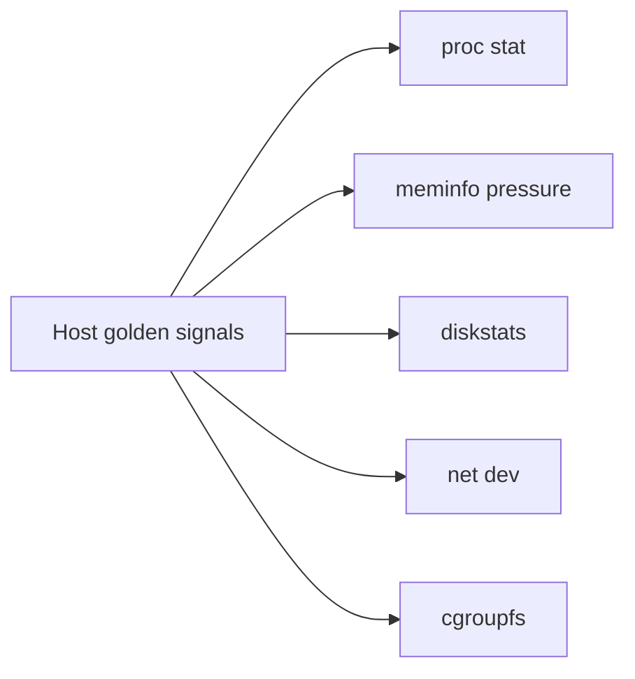
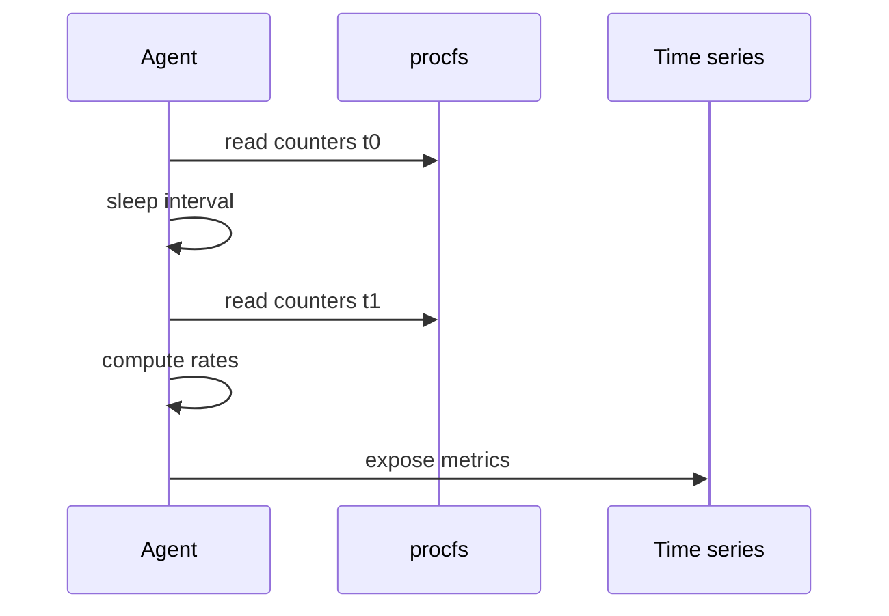

# Metrics from procfs and sysfs

## Overview

**procfs** (`/proc`) and **sysfs** (`/sys`) are the kernel’s primary **text ABI** for process state, CPU/memory aggregates, block/net devices, firmware, and cgroup controllers. Host metrics agents (node_exporter, telegraf, custom scrapers) are mostly disciplined readers of these files—plus accounting for **counter resets**, **units**, and **cgroup views**.

Multi-service SLO math and cardinality at fleet scale → [[09-System-Design/10-Observability-and-Control-Planes/SLIs SLOs Error Budgets for Multi-Service Systems|SLIs SLOs Error Budgets]]; this note stays on **one host**.

## Learning Objectives

- Map golden host signals to concrete `/proc` and `/sys` paths
- Parse `stat`, `meminfo`, `diskstats`, `net/dev`, and pressure files correctly
- Prefer cgroup-scoped metrics for containerized workloads
- Avoid anti-patterns: polling too hard, mis-scaling jiffies, ignoring online CPU count
- Hand off distributed tracing backends to System Design / Backend

## Prerequisites

- [[10-Linux/02-Processes-Signals-and-Job-Control/Process Lifecycle ps and procfs|Process Lifecycle ps and procfs]]
- [[10-Linux/03-Memory-Swap-and-OOM/Virtual Memory Ops RSS vs VSZ|Virtual Memory Ops RSS vs VSZ]]

## Difficulty

`intermediate`

## Estimated Time

- Reading: 1.25 hours
- Exercises: 2 hours
- Mini project: 3 hours

## History

`/proc` began as a process information filesystem and accreted system-wide stats. sysfs arrived with the driver model to expose devices/kobjects without stuffing everything into proc. Modern observability stacks scrape both; eBPF adds event streams later ([[10-Linux/08-Observability-Tracing-and-Profiling/eBPF Intro for Operators|eBPF Intro for Operators]]) but does not replace these baselines.

## Problem It Solves

| Need | Source |
| --- | --- |
| CPU utilization / steal | `/proc/stat` |
| Memory / swap pressure | `/proc/meminfo`, `/proc/pressure/*` |
| Disk ops / bytes | `/proc/diskstats`, `/sys/block/*/stat` |
| Network bytes/errors | `/proc/net/dev` |
| Per-service budgets | `/sys/fs/cgroup/...` |

Without reading the ABI, operators worship dashboards they cannot verify.

## Internal Implementation

### High-value paths

| Signal | Path | Notes |
| --- | --- | --- |
| CPU | `/proc/stat` | Aggregate + per-cpu; jiffies; compare deltas |
| Load | `/proc/loadavg` | Run-queue intuition, not pure CPU% |
| Memory | `/proc/meminfo` | Available vs free; buffers/cache |
| VM events | `/proc/vmstat` | pgmajfault, psi-related context |
| PSI | `/proc/pressure/{cpu,memory,io}` | some/full averages |
| Disk | `/proc/diskstats` | fields per kernel docs |
| Net | `/proc/net/dev` | iface counters |
| Process | `/proc/PID/stat`, `status`, `io` | per-task |
| Cgroup | `/sys/fs/cgroup/.../*.stat` | container truth |

**Derivation:** utilization = busy_delta / wall_delta, not instantaneous reads. Clock and jiffy theory → [[01-Computer-Science/README|Computer Science]] / clocks notes.

```mermaid
flowchart TD
    Kern[Kernel state] --> Proc[/proc]
    Kern --> Sys[/sys]
    Proc --> Agent[Metrics agent]
    Sys --> Agent
    Agent --> TSDB[Local or remote TSDB]
    Agent --> Alert[Host alerts]
```

## Mermaid Diagrams

### Structure



### Sequence / Lifecycle — scrape loop



## Examples

### Minimal Example — CPU busy fraction (sketch)

```bash
# Two snapshots of aggregate cpu line
grep '^cpu ' /proc/stat
# Fields: user nice system idle iowait irq softirq steal guest guest_nice
# busy = total - idle - iowait (policy choice: include iowait?)
# rate over sleep 1
```

```typescript
// Educational: parse first cpu line into rates
export function cpuBusyRatio(a: number[], b: number[]): number {
  const total = (x: number[]) => x.reduce((s, v) => s + v, 0);
  const idle = (x: number[]) => x[3]! + x[4]!; // idle + iowait
  const dTotal = total(b) - total(a);
  const dIdle = idle(b) - idle(a);
  return dTotal <= 0 ? 0 : 1 - dIdle / dTotal;
}
```

### Production-Shaped Example — verify exporter vs source

```bash
# What node_exporter claims vs raw
curl -s localhost:9100/metrics | grep node_memory_MemAvailable_bytes
awk '/MemAvailable:/ {print $2*1024}' /proc/meminfo

# Container memory
CG=$(cat /proc/$(pidof myapp)/cgroup | tail -1 | cut -d: -f3)
cat "/sys/fs/cgroup${CG}/memory.current"
```

## Trade-offs

| Dimension | Upside | Downside | When it matters |
| --- | --- | --- | --- |
| Raw procfs | Ground truth | Brittle parsing across kernels | Incidents |
| Exporters | Labels, HTTP | Abstraction drift | Fleet |
| High scrape rate | Resolution | CPU + page cache noise | Tiny boxes |
| Host-only metrics | Simple | Miss cgroup throttling | Containers |

### When to Use

- Always as the verification layer under dashboards
- Building [[10-Linux/projects/Procfs Inspector Lab/README|Procfs Inspector Lab]]

### When Not to Use

- As a substitute for app RED metrics (Backend)
- High-cardinality per-task scrapes without care (System Design cardinality note)

## Exercises

1. Compute CPU% from two `/proc/stat` samples; compare to `top`.
2. Explain `MemAvailable` vs `MemFree` using `meminfo`.
3. Parse one line of `diskstats` into reads/writes completed and correlating with `iostat`.
4. Compare host `memory.current` sum vs `MemTotal` under containers.
5. Read PSI `some avg10` under load; correlate with latency.

## Mini Project

Extend Procfs Inspector Lab to emit Prometheus text format for CPU, mem available, and one cgroup’s `memory.current` / `cpu.stat`.

## Portfolio Project

[[10-Linux/projects/Linux Host Workbench/README|Linux Host Workbench]] — document the host golden-signal → path map used by the Observability First-Aid Kit.

## Interview Questions

1. Where does CPU steal appear?
2. Why are counter *deltas* required?
3. Host vs cgroup memory metrics—when each?
4. What is PSI `full` vs `some`?
5. Name three sysfs paths useful in disk incidents.

### Stretch / Staff-Level

1. Design an exporter that prefers cgroup v2 on container hosts without double-counting.
2. Explain ABI stability risks when parsing `/proc/PID/stat` field positions.

## Common Mistakes

- Treating load average as CPU utilization
- Ignoring steal on hypervisors
- Scraping `/proc` in tight loops from many processes
- Trusting container `free` inside incomplete views

## Best Practices

- Version-pin parsing tests against known fixtures
- Always document units (jiffies, pages, bytes)
- Cross-check alerts against raw files once per incident class
- Prefer cgroup metrics for per-service SLOs on shared nodes

## Summary

procfs and sysfs are the **source of truth** for host metrics. Learn the paths, compute rates correctly, scope to cgroups for tenants, and treat exporters as convenience—not authority. Fleet SLO frameworks live elsewhere; single-host literacy starts here.

## Further Reading

- `man proc`, kernel `Documentation/filesystems/proc.rst`
- [[10-Linux/08-Observability-Tracing-and-Profiling/Logging Correlation on a Single Host|Logging Correlation on a Single Host]]
- [[00-References/Linux/README|Linux References]]

## Related Notes

- [[10-Linux/07-Cgroups-Namespaces-and-Isolation/cgroup v2 Controllers CPU Memory IO|cgroup v2 Controllers CPU Memory IO]]
- [[10-Linux/12-Incidents-Runbooks-and-Portfolio/Golden Signals on a Single Box|Golden Signals on a Single Box]]
- [[09-System-Design/10-Observability-and-Control-Planes/Cardinality and Metric Topology Risks|Cardinality and Metric Topology Risks]]

## Progress Checklist

- [ ] Explained from first principles
- [ ] Drew at least one Mermaid diagram
- [ ] Implemented a minimal version
- [ ] Documented trade-offs and non-goals
- [ ] Completed exercises
- [ ] Practiced interview questions aloud
- [ ] Linked prerequisites and dependents
