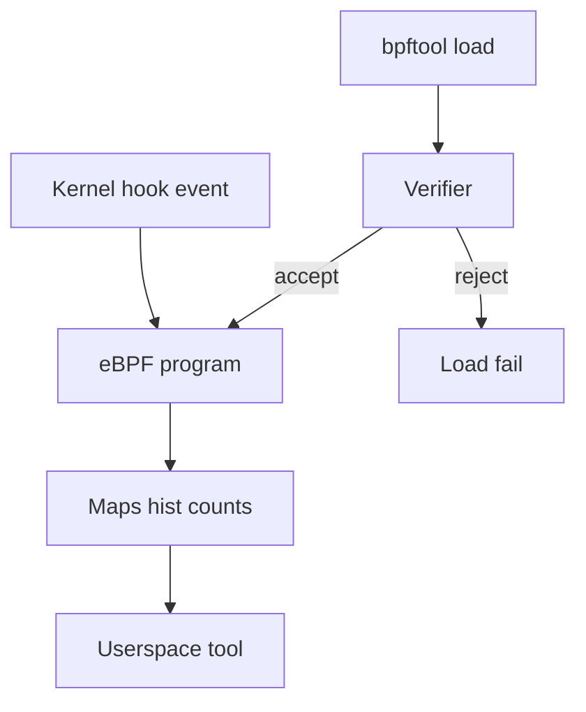
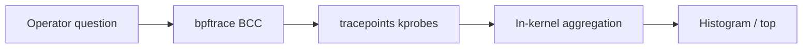
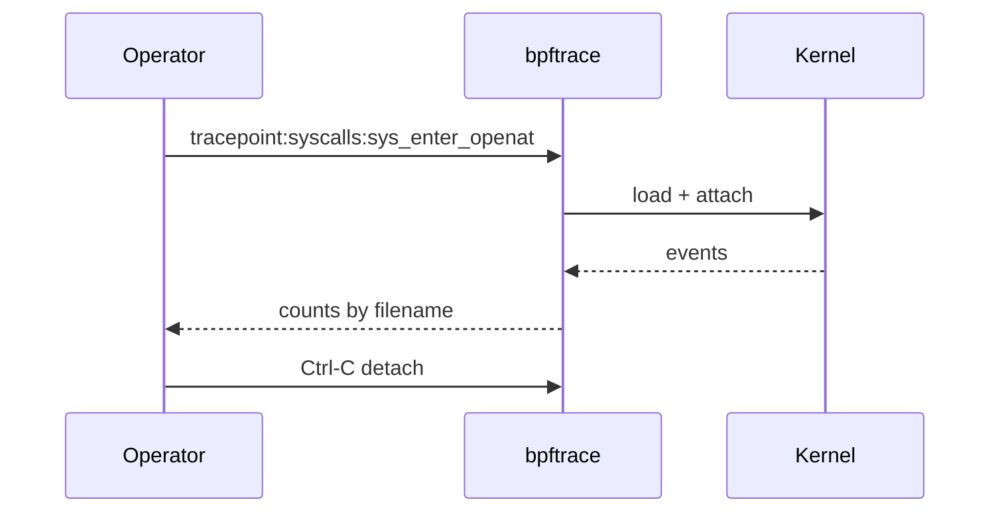

# eBPF Intro for Operators

## Overview

**eBPF** (extended Berkeley Packet Filter) lets sanctioned programs run in the kernel at hook points—syscalls, tracepoints, kprobes, networking—with verification for safety. For **operators**, eBPF is how modern tools answer questions strace cannot afford continuously: “which syscalls are slow?”, “who issues TUNER writes?”, “what is off-CPU?” with lower overhead and richer aggregation.

This note is an **operator intro**, not a compiler course. Writing production BPF agents, CO-RE, and security products → deeper Security/DevOps material; packet datapaths at product scale → System Design.

## Learning Objectives

- Explain eBPF vs strace overhead and safety model (verifier, maps)
- Run existing tools (`bpftrace` one-liners, BCC) for common incidents
- Name major hook classes: tracepoint, kprobe, uprobe, XDP/TC (awareness)
- List operational risks: kernel version skew, privileges, noisy traces
- Know handoff boundaries for custom program development

## Prerequisites

- [[10-Linux/08-Observability-Tracing-and-Profiling/perf CPU Profiles and Flame Graph Intuition|perf CPU Profiles and Flame Graph Intuition]]
- [[10-Linux/08-Observability-Tracing-and-Profiling/strace and lsof First-Aid Tracing|strace and lsof First-Aid Tracing]]

## Difficulty

`advanced`

## Estimated Time

- Reading: 1.5 hours
- Exercises: 2 hours
- Mini project: 3 hours

## History

Classic BPF filtered packets. eBPF generalized the VM, JIT, maps, and helpers; cloud-native observability (Cilium, Pixie, many agents) standardized on it. Distros differ in BTF availability—**CO-RE** reduced rewrite pain across kernels.

## Problem It Solves

| Need | Why eBPF |
| --- | --- |
| Continuous syscall latency hist | Aggregation in-kernel |
| Off-CPU stacks | Sched tracepoints |
| Safe production attach | Verifier vs free ptrace |
| Packet drops visibility | XDP/TC hooks (intro only) |

## Internal Implementation

1. Load program → **verifier** checks bounded loops, memory access, helper use.
2. Attach to hook; events fire → program updates **maps** (histograms, counts).
3. Userspace reads maps / ring buffers.

Privileges: typically `CAP_BPF` / `CAP_PERFMON` / root (evolving). Unprivileged eBPF often disabled.



## Mermaid Diagrams

### Structure



### Sequence / Lifecycle — bpftrace one-liner



## Examples

### Minimal Example — bpftrace

```bash
# Syscall count by process (short run!)
sudo bpftrace -e 'tracepoint:raw_syscalls:sys_enter { @[comm] = count(); }'
# Ctrl-C after a few seconds

# Openat filenames (noisy—filter ASAP)
sudo bpftrace -e 'tracepoint:syscalls:sys_enter_openat /pid==12345/ { printf("%s\n", str(args->filename)); }'
```

### Production-Shaped Example — disciplined use

```bash
# Prefer stable tracepoints over fragile kprobes when available
# Time-box; write to file; avoid printing every event on hot paths
sudo timeout 60 bpftrace -e '
profile:hz:99 /pid == $1/ { @[ustack] = count(); }
' "$PID"

# Inventory loaded programs (ops hygiene)
sudo bpftool prog show
sudo bpftool map show
```

Security note: hostile BPF is a privilege escalation concern—treat load rights like root. Deep model → [[18-Security/README|Security]].

## Trade-offs

| Dimension | Upside | Downside | When it matters |
| --- | --- | --- | --- |
| eBPF aggregations | Low event tax | Kernel/BTF deps | Prod always-on |
| kprobes | Anywhere | Break across builds | Last resort |
| Custom C BPF | Maximum power | Maintenance burden | Platform teams |
| strace | Universal decode | Overhead | Rare attach |

### When to Use

- Repeated questions on live hosts where strace is too heavy
- Off-CPU and run-queue exploration

### When Not to Use

- First minute of a hang (strace may still be faster cognitively)
- Unreviewed one-liners that printk flood production
- As a substitute for fixing missing app metrics

## Exercises

1. Run a syscall count by `comm`; identify the noisiest process under load.
2. Compare strace `-c` summary vs bpftrace counts for the same PID (overhead feel).
3. Use a BCC tool (e.g. `opensnoop`, `execsnoop`) if installed; document privilege needed.
4. `bpftool prog show` before/after attaching; confirm detach cleans up.
5. List three questions better answered by perf flame graphs than eBPF one-liners.

## Mini Project

First-Aid Kit: wrap 3 bpftrace one-liners (syscalls by comm, openat for PID, off-CPU if available) with `timeout` and markdown output.

## Portfolio Project

ADR: approved eBPF tools list + kernel version matrix for the lab fleet.

## Interview Questions

1. What does the eBPF verifier buy you?
2. Tracepoint vs kprobe?
3. Why might bpftrace fail on a host?
4. CAP requirements evolving story?
5. eBPF vs perf for CPU profiles?

### Stretch / Staff-Level

1. Threat-model a multi-tenant node that allows developers to run bpftrace.
2. Design CO-RE agent rollout across mixed 5.x/6.x kernels.

## Common Mistakes

- Printing every event on a busy syscall
- Leaving probes attached
- Copy-pasting kprobes from wrong kernel blogs
- Assuming eBPF works identically inside restricted containers without privileges

## Best Practices

- Prefer tracepoints; time-box; aggregate in-kernel
- Inventory with `bpftool`; change control for permanent agents
- Pair with metrics/logs for correlation IDs
- Document kernel BTF package requirements

## Summary

eBPF gives operators **safe-ish, aggregating kernel visibility** beyond strace. Start with bpftrace/BCC one-liners, respect privileges and detach discipline, and hand deep program development and threat models to platform/Security tracks.

## Further Reading

- bpftrace reference guide, `man bpftool`
- [[10-Linux/08-Observability-Tracing-and-Profiling/Logging Correlation on a Single Host|Logging Correlation on a Single Host]]
- [[18-Security/README|Security]]

## Related Notes

- [[10-Linux/08-Observability-Tracing-and-Profiling/perf CPU Profiles and Flame Graph Intuition|perf CPU Profiles and Flame Graph Intuition]]
- [[10-Linux/05-Networking-Stack-and-Host-Firewall/Packet Capture tcpdump and Wireshark Triage|Packet Capture tcpdump and Wireshark Triage]]
- [[14-Docker/README|Docker]] — privileges for BPF in containers

## Progress Checklist

- [ ] Explained from first principles
- [ ] Drew at least one Mermaid diagram
- [ ] Implemented a minimal version
- [ ] Documented trade-offs and non-goals
- [ ] Completed exercises
- [ ] Practiced interview questions aloud
- [ ] Linked prerequisites and dependents
