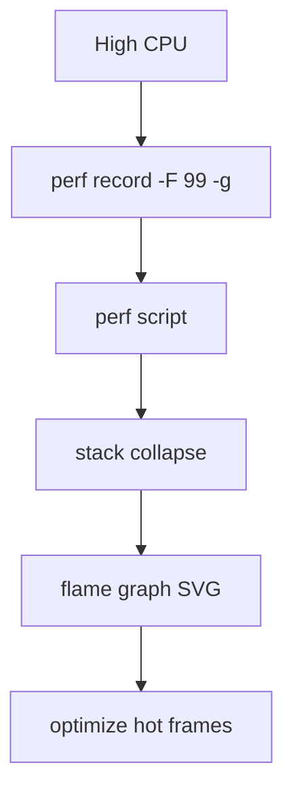
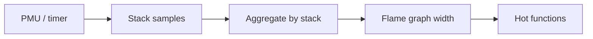
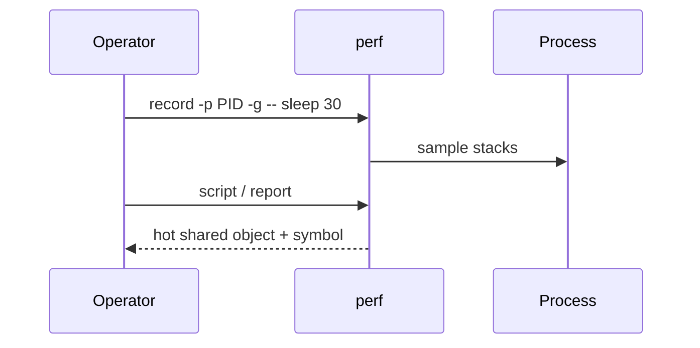

# perf CPU Profiles and Flame Graph Intuition

## Overview

**perf** is the Linux performance toolkit: hardware/software event sampling, tracing, and reporting. For operators, the dominant first skill is **CPU profiling**—sampling the call stack on `cycles` or `cpu-clock`—and reading **flame graphs**: width = sample count ≈ time on CPU (for on-CPU profiles).

This is how you move from “CPU is high” to “function X in library Y.” Language runtime profilers (Node `--cpu-prof`, async stacks) complement but do not replace kernel-aware samples when time is in syscalls, kernel, or native code. Scheduling theory → CS; continuous fleet profiling products → DevOps/System Design.

## Learning Objectives

- Capture a short `perf record` and produce a report or flame graph
- Interpret on-CPU flame graphs (width, plateaus, towers)
- Distinguish CPU-bound vs off-CPU problems (and when perf alone is insufficient)
- Handle symbols: packages debuginfo, JIT, containers
- Avoid profiling myths: sample ≠ exact wall clock for blocked work

## Prerequisites

- [[10-Linux/08-Observability-Tracing-and-Profiling/strace and lsof First-Aid Tracing|strace and lsof First-Aid Tracing]]
- Basic CPU saturation literacy

## Difficulty

`intermediate`

## Estimated Time

- Reading: 1.5 hours
- Exercises: 2.5 hours
- Mini project: 3 hours

## History

oprofile/perf evolved with hardware PMUs. Brendan Gregg popularized **flame graphs** as a visual aggregation of sampled stacks. Modern `perf script` + FlameGraph.pl (or inferno, speedscope) remain the operator lingua franca; eBPF profilers reuse the same visual grammar.

## Problem It Solves

| Question | Approach |
| --- | --- |
| Who burns CPU? | `perf record -g` + flame graph |
| Kernel vs user? | stacks spanning both |
| Regression after deploy? | Compare two folded profiles |
| Is it busy-wait? | Hot `spin`/`poll` frames |

## Internal Implementation

Sampling: on each interrupt (frequency or period), capture IP + stack (frame pointers or DWARF/.eh_frame). Aggregate identical stacks; flame graph sorts siblings and stacks frames vertically (leaf at top or bottom by convention—be consistent).

**Off-CPU:** time blocked in sleep/IO needs off-CPU or wakeup traces (`perf` sched, eBPF `offcputime`)—a thin on-CPU tower with high wall latency means you profiled the wrong mode.



## Mermaid Diagrams

### Structure



### Sequence / Lifecycle — 30-second profile



## Examples

### Minimal Example

```bash
# System-wide brief sample (careful on prod)
perf record -F 99 -g -- sleep 20
perf report --stdio | head -50

# One process
perf record -F 99 -g -p "$PID" -- sleep 30
perf script > /tmp/out.stacks
# Then FlameGraph: stackcollapse-perf.pl | flamegraph.pl > cpu.svg
```

### Production-Shaped Example — container symbols

```bash
# Profile from host with container PID; install debug symbols for libc
perf record -F 99 -g -p "$HOST_PID" -- sleep 30
# If stacks are `[unknown]`: missing frame pointers / stripped binaries / JIT
# Node: often need --perf-basic-prof or typed arrays caveats; hand depth to Node track
perf report --no-children --stdio
```

## Trade-offs

| Dimension | Upside | Downside | When it matters |
| --- | --- | --- | --- |
| Frequency sampling | Low overhead vs strace | Statistical; short spikes missable | Steady CPU |
| DWARF stacks | Works without FP | Heavier unwind | Optimized binaries |
| System-wide | Catch kernel/steal | Noisy multi-tenant | Shared nodes |
| Always-on prod | — | Overhead + privacy | Prefer staging / sampled canaries |

### When to Use

- Sustained CPU saturation or regressions
- Proving kernel time vs user time

### When Not to Use

- Pure IO latency with idle CPU (use off-CPU / block analysis)
- Replacing application traces for distributed request paths

## Exercises

1. Burn CPU with a tight loop; capture flame graph; identify the function.
2. Compare `perf top` live view vs recorded report.
3. Profile a process blocked on `sleep`; explain empty/nearly empty on-CPU graph.
4. Break symbols intentionally (strip); observe `[unknown]`; restore debuginfo.
5. Sketch how K8s would collect the same profile on a node (handoff to K8s/DevOps agents).

## Mini Project

Observability First-Aid Kit: `profile-cpu.sh PID SECONDS` producing `perf report` summary + collapsed stacks artifact.

## Portfolio Project

WorkBench: before/after flame graphs for a deliberate optimization with ADR notes.

## Interview Questions

1. What does flame graph width represent for on-CPU profiles?
2. Why might CPU be low while latency is high?
3. How does perf get stacks?
4. Frame pointers vs DWARF?
5. When prefer strace vs perf?

### Stretch / Staff-Level

1. Design a safe production profiling policy (rate limits, PII in stacks, multi-tenant).
2. Explain bias when sampling without knowing frequency throttling under load.

## Common Mistakes

- Reading flame graphs as timeline sequences (they are not)
- Profiling the wrong PID (launcher vs worker)
- Ignoring kernel frames for syscall-heavy apps
- Overfitting to one 5-second sample

## Best Practices

- Prefer 30–60 s at ~99 Hz for steady issues
- Record environment: binary build ID, container image digest
- Pair with `/proc/pressure` and run-queue metrics
- Store folded profiles for diffing

## Summary

perf sampling plus flame graphs turn CPU saturation into **actionable hot functions**. Know on-CPU vs off-CPU, fix symbols, and keep captures short. Deeper concurrency models belong in CS; fleet continuous profiling belongs with platform tracks.

## Further Reading

- `man perf`, Brendan Gregg flame graph docs
- [[10-Linux/08-Observability-Tracing-and-Profiling/eBPF Intro for Operators|eBPF Intro for Operators]]
- [[10-Linux/10-Performance-Tuning-and-Kernel-Knobs/CPU Saturation Steal and Run Queue|CPU Saturation Steal and Run Queue]]

## Related Notes

- [[10-Linux/08-Observability-Tracing-and-Profiling/Metrics from procfs and sysfs|Metrics from procfs and sysfs]]
- [[06-NodeJS/README|Node.js]] — JS-level profiling handoff
- [[01-Computer-Science/05-Concurrency-Fundamentals/Backpressure and Resource Contention|Backpressure and Resource Contention]]

## Progress Checklist

- [ ] Explained from first principles
- [ ] Drew at least one Mermaid diagram
- [ ] Implemented a minimal version
- [ ] Documented trade-offs and non-goals
- [ ] Completed exercises
- [ ] Practiced interview questions aloud
- [ ] Linked prerequisites and dependents
