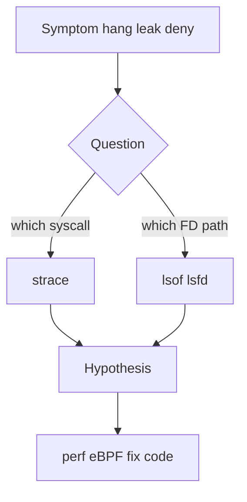
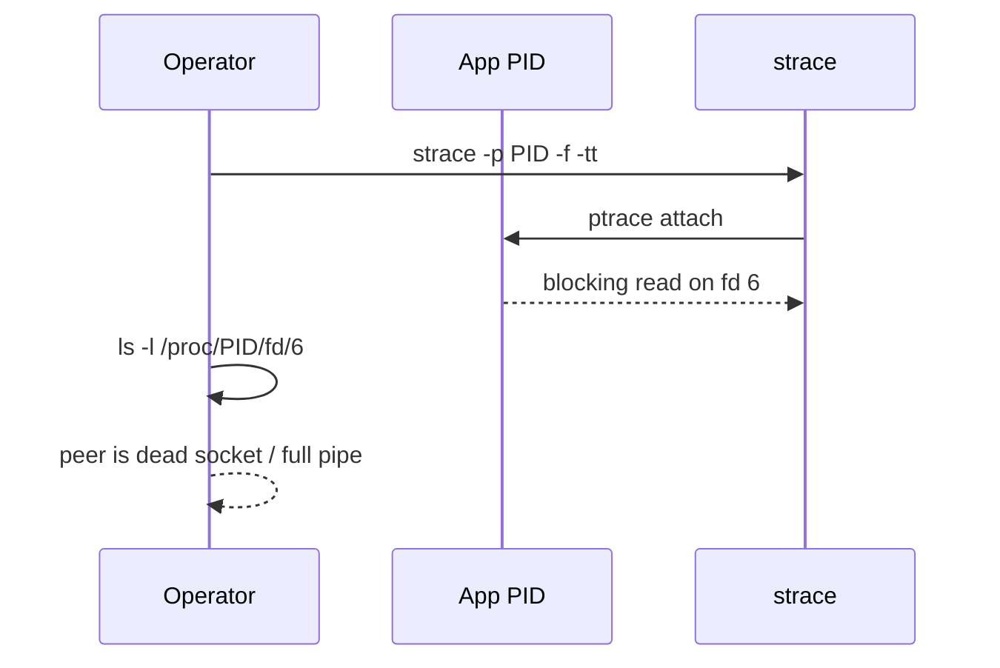

# strace and lsof First-Aid Tracing

## Overview

**strace** intercepts and prints a process’s **system calls** and signals—first aid when an app hangs, spins, or fails with opaque errors. **lsof** (and `ss`/`lsfd`) answers **what files and sockets are open**—first aid for “file in use,” leaked FDs, and surprise listeners.

Neither replaces continuous profiling ([[10-Linux/08-Observability-Tracing-and-Profiling/perf CPU Profiles and Flame Graph Intuition|perf]]) or eBPF; both are **surgical**. Syscall semantics theory → [[01-Computer-Science/04-Processes-and-Execution/System Calls|System Calls]].

## Learning Objectives

- Attach strace safely (`-p`, `-f`, filters, overhead awareness)
- Read common hang patterns: blocking `read`/`futex`/`poll`, restart loops
- Use lsof/`lsfd` to map PID ↔ path ↔ socket
- Know when strace lies (time distortion, multi-thread noise) and when to stop
- Combine with `/proc/PID/fd` for a toolchain without extra packages

## Prerequisites

- [[10-Linux/02-Processes-Signals-and-Job-Control/Process Lifecycle ps and procfs|Process Lifecycle ps and procfs]]
- [[01-Computer-Science/04-Processes-and-Execution/System Calls|System Calls]]

## Difficulty

`intermediate`

## Estimated Time

- Reading: 1 hour
- Exercises: 2 hours
- Mini project: 2 hours

## History

ptrace-based tracers predate Linux branding; strace packaged syscall decoding for operators. lsof aggregated FD tables across Unix flavors. On modern Linux, `lsfd` (util-linux) and `ss -p` often replace parts of lsof, but the *questions* remain identical.

## Problem It Solves

| Symptom | Tool angle |
| --- | --- |
| Process stuck, no logs | strace: last blocking syscall |
| “Too many open files” | lsof / `/proc/PID/fd` counts |
| Who holds this file? | `lsof /path` |
| Unexpected outbound connects | strace `-e connect` / `ss -p` |
| Permission denied mystery | strace shows failing path + errno |

## Internal Implementation

strace uses **ptrace** (or sometimes seccomp-bpf stop machines on newer builds) to stop the tracee at syscall entry/exit, decode args, and resume. Overhead is high; **never leave it on** in production hot paths.

lsof walks kernel structures / procfd; race-prone under rapid open/close—snapshots, not proofs of eternal holds.



## Mermaid Diagrams

### Structure

```mermaid
flowchart LR
    Tracee[Process] --> Syscall[syscall boundary]
    Syscall --> Kernel[Kernel]
    ST[strace ptrace] -.->|observe| Syscall
    LSOF[lsof] -.->|read| FDT[/proc/PID/fd]
```

### Sequence / Lifecycle — hang triage



## Examples

### Minimal Example

```bash
# Trace a command (not attach) with timestamps
strace -tt -f -o /tmp/trace.txt ./myapp --flag

# Attach briefly to running process; follow children; only network + file opens
strace -p "$PID" -f -e trace=network,file,desc -tt

# Who listens / open files
lsof -nP -p "$PID"
lsfd -p "$PID"
ls -l /proc/"$PID"/fd
```

### Production-Shaped Example — disciplined attach

```bash
# 1) Confirm PID and risk (latency-sensitive?)
# 2) Narrow filter; time-box
timeout 15 strace -p "$PID" -f -tt -e trace=openat,connect,recvfrom,futex,poll,ppoll,epoll_wait \
  2>/tmp/strace.$PID.txt || true
# 3) Detach is automatic on timeout; review last syscalls
tail -50 /tmp/strace.$PID.txt

# FD leak suspect
ls /proc/"$PID"/fd | wc -l
lsof -nP -p "$PID" | awk '{print $5}' | sort | uniq -c | sort -n
```

## Trade-offs

| Dimension | Upside | Downside | When it matters |
| --- | --- | --- | --- |
| strace | Immediate syscall truth | Huge slowdown | Hang / errno |
| Continuous strace | — | Melts p99 | Never in steady prod |
| lsof | Cross-process path search | Slow/racy | “who has file” |
| `/proc/PID/fd` | Fast, no deps | Manual decode of sockets | Scripts |

### When to Use

- First 15 minutes of “stuck” or “permission” incidents
- Confirming whether the app is blocked on IO vs CPU

### When Not to Use

- Sampling CPU profiles (use perf)
- Fleet-wide continuous tracing (use eBPF agents carefully)
- Decrypting application-level protocol bugs without logs

## Exercises

1. strace `cat` of a FIFO with no writer; identify blocking syscall.
2. Induce FD leak; watch `/proc/PID/fd` count climb; find type with lsof.
3. Filter strace to `connect` only; launch a curl; capture destination.
4. Compare `ss -tp` vs lsof for a listening port.
5. Explain why strace timestamps are not reliable latency SLIs.

## Mini Project

[[10-Linux/projects/Observability First-Aid Kit/README|Observability First-Aid Kit]] — script `firstaid-trace.sh PID` that time-boxes strace + dumps fd summary + top socket peers.

## Portfolio Project

WorkBench runbook: “Hang / FD leak” decision tree linking strace → perf → eBPF.

## Interview Questions

1. How does strace observe syscalls?
2. Why is strace dangerous on hot processes?
3. How do you find who holds `/var/lib/foo.lock`?
4. strace shows `futex` waits—what next?
5. Difference between lsof and `/proc/PID/fd`?

### Stretch / Staff-Level

1. Design policy: when on-call may attach strace in production.
2. Compare strace overhead to eBPF syscall tracing for the same question.

## Common Mistakes

- Forgetting `-f` and missing worker threads
- Leaving strace attached overnight
- Misreading `EINTR` restart loops as root cause
- Assuming lsof output is atomic

## Best Practices

- Always time-box and filter
- Pair with `/proc/PID/wchan` / `stack` when available
- Prefer `ss` for sockets when lsof is heavy
- Document errno → user-visible failure mapping

## Summary

strace and lsof are **first-aid**: syscall-level and FD-level truth with high cost. Use them briefly, interpret blocking calls and open resources, then move to perf/eBPF or code fixes. Syscall *theory* stays in Computer Science; continuous fleet observability stays in System Design/Backend.

## Further Reading

- `man strace`, `man lsof`, `man lsfd`
- [[10-Linux/08-Observability-Tracing-and-Profiling/perf CPU Profiles and Flame Graph Intuition|perf CPU Profiles and Flame Graph Intuition]]
- [[10-Linux/05-Networking-Stack-and-Host-Firewall/TCP UDP Sockets ss and Conntrack|TCP UDP Sockets ss and Conntrack]]

## Related Notes

- [[10-Linux/08-Observability-Tracing-and-Profiling/eBPF Intro for Operators|eBPF Intro for Operators]]
- [[10-Linux/02-Processes-Signals-and-Job-Control/Process Lifecycle ps and procfs|Process Lifecycle ps and procfs]]
- [[01-Computer-Science/04-Processes-and-Execution/System Calls|System Calls]]

## Progress Checklist

- [ ] Explained from first principles
- [ ] Drew at least one Mermaid diagram
- [ ] Implemented a minimal version
- [ ] Documented trade-offs and non-goals
- [ ] Completed exercises
- [ ] Practiced interview questions aloud
- [ ] Linked prerequisites and dependents
