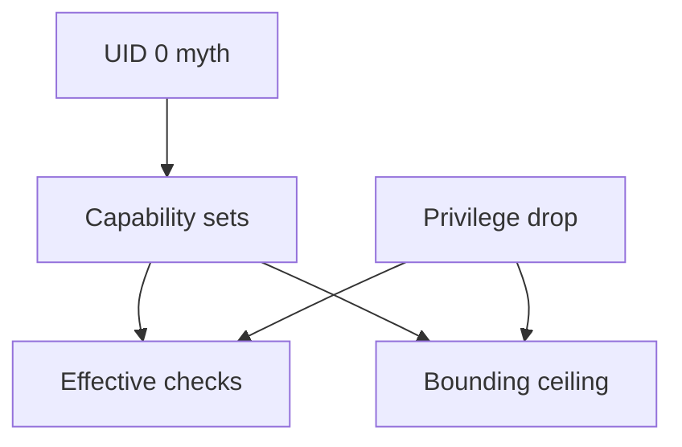
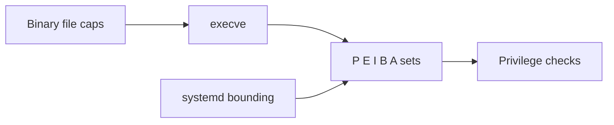

# Capabilities vs root All-Powerful Myth

## Overview

On modern Linux, **UID 0 is not a single boolean god mode**. Privileged operations are split into **capabilities** (`CAP_NET_ADMIN`, `CAP_SYS_ADMIN`, …). Traditional root still starts with a full set, which feeds the myth that “root = all-powerful” as an *indivisible* blob. Operators who understand capability sets can **drop**, **bound**, and **ambient**-grant only what a service needs.

Deep exploit chains and LSM policy → [[18-Security/README|Security]]. Container default cap lists → [[14-Docker/README|Docker]].

## Learning Objectives

- Explain permitted, effective, inheritable, bounding, and ambient sets
- Decode `CapEff` / `CapBnd` from `/proc/PID/status`
- Name high-risk capabilities and why `CAP_SYS_ADMIN` is a kitchen sink
- Apply systemd `CapabilityBoundingSet` / `AmbientCapabilities` sanely
- State that removing UID 0 without dropping caps (and vice versa) is incomplete

## Prerequisites

- [[10-Linux/01-Shell-Filesystem-Hierarchy-and-Permissions/Users Groups and DAC Permissions|Users Groups and DAC Permissions]]
- [[10-Linux/07-Cgroups-Namespaces-and-Isolation/User Namespaces Capabilities and Privilege Drops|User Namespaces Capabilities and Privilege Drops]]

## Difficulty

`intermediate`

## Estimated Time

- Reading: 1.25 hours
- Exercises: 2 hours
- Mini project: 2 hours

## History

POSIX capabilities split root’s powers so daemons could bind low ports without full root. Linux implemented them with nuances (file caps, ambient caps for non-root inheritance). Containers popularized dropping caps; many images still run as UID 0 *with* reduced caps—or worse, UID 0 with almost everything.

## Problem It Solves

| Myth | Reality |
| --- | --- |
| Only UID matters | Caps gate privileged ops |
| Non-root cannot bind :80 | `CAP_NET_BIND_SERVICE` or socket activation |
| Dropped UID ⇒ safe | File caps / ambient can still elevate |
| `CAP_SYS_ADMIN` is one feature | Near-admin kitchen sink |

## Internal Implementation

| Set | Role |
| --- | --- |
| Permitted | Caps the process may raise into effective |
| Effective | Caps currently used for checks |
| Inheritable | Legacy inheritance across exec |
| Bounding | Hard ceiling; cannot regain above |
| Ambient | Non-root keep across exec when conditions met |

File capabilities on binaries (`setcap`) allow specific privileges without setuid root—powerful and easy to get wrong.



## Mermaid Diagrams

### Structure



### Sequence / Lifecycle — bind then drop

```mermaid
sequenceDiagram
    participant Svc as Service
    participant Kern as Kernel
    Svc->>Kern: effective CAP_NET_BIND_SERVICE
    Svc->>Kern: bind :443
    Svc->>Kern: clear ambient/permitted extras
    Svc->>Kern: setuid service user
    Note over Svc,Kern: further bind may fail; existing fd remains
```

## Examples

### Minimal Example — decode

```bash
grep Cap /proc/$$/status
# CapEff CapPrm CapBnd CapInh CapAmb
capsh --decode=$(grep CapEff /proc/$$/status | awk '{print $2}')
```

### Production-Shaped Example

```ini
[Service]
User=api
CapabilityBoundingSet=CAP_NET_BIND_SERVICE
AmbientCapabilities=CAP_NET_BIND_SERVICE
NoNewPrivileges=true
# Prefer socket activation to avoid ambient caps entirely when possible
```

```bash
# Audit file capabilities on a host
getcap -r /usr 2>/dev/null | head
```

## Trade-offs

| Dimension | Upside | Downside | When it matters |
| --- | --- | --- | --- |
| Fine-grained caps | Least privilege | Easy to grant `SYS_ADMIN` “to make it work” | Hardening |
| Ambient caps | Non-root daemons | Inheritance surprises | Reloads/exec |
| Full root | Simplicity | Blast radius | Break-glass only |
| File caps | No setuid root | Persistence on disk attack | Supply chain |

### When to Use

- Every long-running network service
- Container runtime default reviews

### When Not to Use

- As complete isolation (need NS, seccomp, LSM—Security)
- Granting `CAP_SYS_ADMIN` to silence mount errors without analysis

## Exercises

1. Decode CapEff for `sshd` and your hardened API unit; compare.
2. Remove ambient bind cap and show failure mode; restore via socket activation design note.
3. Find any `CAP_SYS_ADMIN` file caps under `/usr`.
4. Explain interaction of `NoNewPrivileges` with file capabilities.
5. Compare Docker’s default dropped caps list to a privileged container (Docker handoff).

## Mini Project

Capability audit script: list processes with non-empty CapEff, decode, flag kitchen-sink caps.

## Portfolio Project

ADR: required bounding set for public-facing units on the workbench host.

## Interview Questions

1. Is root a single privilege? Explain capabilities.
2. Bounding vs effective?
3. Why is `CAP_SYS_ADMIN` dangerous?
4. Ambient capabilities purpose?
5. UID non-zero with file caps—risk?

### Stretch / Staff-Level

1. Design a fleet policy that bans `CAP_SYS_ADMIN` except break-glass roles (with Security).
2. Analyze a past CVEs where retained caps beat UID drops.

## Common Mistakes

- Running as root “temporarily” in production images
- Copy-pasting `AmbientCapabilities=CAP_SYS_ADMIN`
- Ignoring file capabilities in golden images
- Confusing namespace-scoped caps with host root

## Best Practices

- Prefer socket activation / reverse proxy over bind caps
- Bounding set = exact need; empty when possible
- `NoNewPrivileges=true` by default
- Periodic `getcap -r` in image builds

## Summary

Capabilities dismantle the all-powerful root myth into **checkable privilege atoms**. Operators drop and bound them deliberately; Security owns exploit depth; Docker/K8s apply profiles on top of the same kernel checks.

## Further Reading

- `man capabilities`, `man cap_from_text`
- [[10-Linux/09-Security-Primitives-on-the-Host/seccomp and Syscall Filtering Basics|seccomp and Syscall Filtering Basics]]
- [[18-Security/README|Security]]

## Related Notes

- [[10-Linux/06-systemd-Timers-and-Logging/Service Hardening Directives|Service Hardening Directives]]
- [[10-Linux/07-Cgroups-Namespaces-and-Isolation/User Namespaces Capabilities and Privilege Drops|User Namespaces Capabilities and Privilege Drops]]
- [[14-Docker/README|Docker]]

## Progress Checklist

- [ ] Explained from first principles
- [ ] Drew at least one Mermaid diagram
- [ ] Implemented a minimal version
- [ ] Documented trade-offs and non-goals
- [ ] Completed exercises
- [ ] Practiced interview questions aloud
- [ ] Linked prerequisites and dependents
