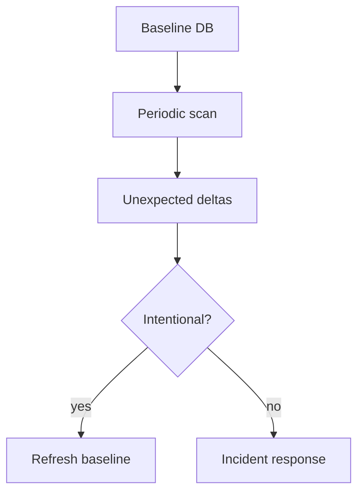
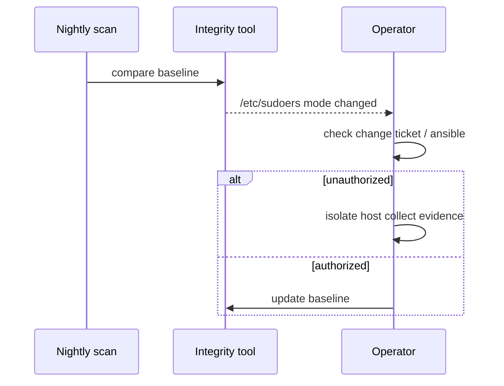

# File Integrity and Permission Drift

## Overview

**File integrity** means detecting unauthorized or unexpected changes to critical paths (binaries, unit files, SSH config, cron). **Permission drift** is the quieter cousin: modes/ownership/ACLs sliding away from policy (`0777` “to fix CI”, setuid bits reappearing, world-writable configs). Together they are host-level **change control evidence**.

Enterprise detection engineering and malware analysis → [[18-Security/README|Security]]. Config management idempotency → [[16-DevOps/README|DevOps]] / packaging module.

## Learning Objectives

- Define integrity baselines (hash + metadata) vs runtime permission policy
- Use practical tools: `rpm -Va`/`dpkg --verify`, `aide`/`tripwire` concepts, `find` permission audits
- Spot high-risk bits: setuid/setgid, world-writable, unexpected capabilities (`getcap`)
- Tie drift to incident timelines and packaging updates
- Know IMA/EVM existence without deep TPM coursework (Security handoff)

## Prerequisites

- [[10-Linux/01-Shell-Filesystem-Hierarchy-and-Permissions/Users Groups and DAC Permissions|Users Groups and DAC Permissions]]
- [[10-Linux/01-Shell-Filesystem-Hierarchy-and-Permissions/ACLs Sticky Bits and Umask|ACLs Sticky Bits and Umask]]

## Difficulty

`intermediate`

## Estimated Time

- Reading: 1 hour
- Exercises: 2 hours
- Mini project: 2.5 hours

## History

Unix trusted local admins; networked multi-user hosts needed tripwires. Package managers gained verify modes; AIDE and commercial FIM industrialized baselines. Kernel IMA appraisal extends trust into measurement—usually out of scope for day-1 ops but operators should know the keyword.

## Problem It Solves

| Failure | Detection |
| --- | --- |
| Replaced `/usr/bin/sshd` | Hash mismatch vs baseline/package |
| `chmod 777 /etc/myapp` | Mode policy scan |
| Rogue cron root job | Integrity on `/etc/cron*` |
| setuid binary planted | Periodic `find -perm` |

## Internal Implementation

Baselines store path → `{digest, mode, owner, mtime/ctime policy}`. Runtime compares filesystem. Challenges: **intentional updates**, **container mutable layers**, **false positives** on frequently changing state dirs—exclude `/var/log`, include `/etc`/`/usr/bin` carefully.



## Mermaid Diagrams

### Structure

```mermaid
flowchart LR
    Pkg[Package verify] --> Binaries[/usr]
    FIM[AIDE-like FIM] --> Crit[/etc ssh systemd]
    Audit[Permission find] --> Bits[setuid world-write]
    Caps[getcap] --> FileCaps[File capabilities]
```

### Sequence / Lifecycle — drift found



## Examples

### Minimal Example — permission hunt

```bash
# setuid/setgid
find /usr -xdev \( -perm -4000 -o -perm -2000 \) -type f -ls 2>/dev/null

# world-writable (exclude sticky dirs carefully)
find /etc /usr -xdev -type f -perm -0002 -ls 2>/dev/null

# package verify (rpm example)
rpm -Va | grep '^..5'   # digest mismatches (syntax varies)
```

### Production-Shaped Example — baseline discipline

```bash
# After golden image bake / intentional patch window:
aide --init && mv /var/lib/aide/aide.db.new /var/lib/aide/aide.db
# Daily:
aide --check
# Alert on unexpected paths only; suppress /var/cache with config
```

```bash
# systemd unit permissions matter
ls -l /etc/systemd/system/api.service
# expect root:root 0644 (not group-writable)
```

## Trade-offs

| Dimension | Upside | Downside | When it matters |
| --- | --- | --- | --- |
| Tight FIM | Fast breach signal | Alert fatigue | Tune excludes |
| Package verify only | Free with distro | Misses `/etc` local edits | Combine tools |
| Immutable OS | Less drift | Ops model change | Fleet strategy |
| IMA enforce | Strong | Breaks legit updates | Security-owned |

### When to Use

- Bastion/jump hosts, CI runners, any SSH-exposed box
- Post-incident “what changed?”

### When Not to Use

- Hashing entire mutable data volumes as “integrity”
- Replacing app authn/z threat models (Security)

## Exercises

1. Create a world-writable file under `/etc`; detect with `find`.
2. Change a package binary deliberately in a VM; show package verify failure; restore.
3. List file capabilities; explain risk vs setuid.
4. Draft exclude list for AIDE on a DB host (`/var/lib/postgres` etc.).
5. Correlate a unit file change with journal `_COMM=systemctl` if available.

## Mini Project

Script `perm-audit.sh` exiting non-zero on setuid outside allowlist or world-writable files under `/etc`.

## Portfolio Project

Workbench: integrity section in incident evidence pack + baseline update ADR.

## Interview Questions

1. Hash vs mode/ownership monitoring?
2. Why exclude `/var/log` from FIM?
3. Package verify vs AIDE?
4. Danger of world-writable cron?
5. What is IMA at a headline level?

### Stretch / Staff-Level

1. Design FIM for immutable + occasional ssh break-glass hosts.
2. False-positive strategy when config management and FIM race.

## Common Mistakes

- Alerting on every `mtime` under `/var`
- Never refreshing baselines after patch Tuesdays
- Ignoring ACL-only grants (`getfacl`)
- Trusting container image scans alone for host `/etc`

## Best Practices

- Baseline after known-good builds; alert on unexpected paths
- Allowlist setuid; eliminate where possible
- Include `getcap` in audits
- Tie findings to change tickets

## Summary

Integrity and permission audits catch **host filesystem lies**—trojaned binaries and sloppy modes—before or during incidents. Keep baselines honest, exclude noisily mutable paths, and escalate advanced measurement (IMA/TPM) to Security while config drift automation lives with DevOps.

## Further Reading

- `man aide`, distro package verify docs
- [[10-Linux/11-Packaging-Config-and-Automation-Basics/Configuration Drift and Idempotency Prelude|Configuration Drift and Idempotency Prelude]]
- [[18-Security/README|Security]]

## Related Notes

- [[10-Linux/09-Security-Primitives-on-the-Host/SSH Hardening Operator Checklist|SSH Hardening Operator Checklist]]
- [[10-Linux/12-Incidents-Runbooks-and-Portfolio/Postmortem Evidence Collection on Linux|Postmortem Evidence Collection on Linux]]
- [[16-DevOps/README|DevOps]]

## Progress Checklist

- [ ] Explained from first principles
- [ ] Drew at least one Mermaid diagram
- [ ] Implemented a minimal version
- [ ] Documented trade-offs and non-goals
- [ ] Completed exercises
- [ ] Practiced interview questions aloud
- [ ] Linked prerequisites and dependents
