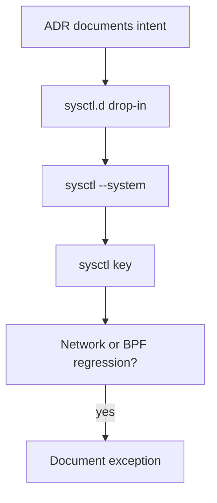
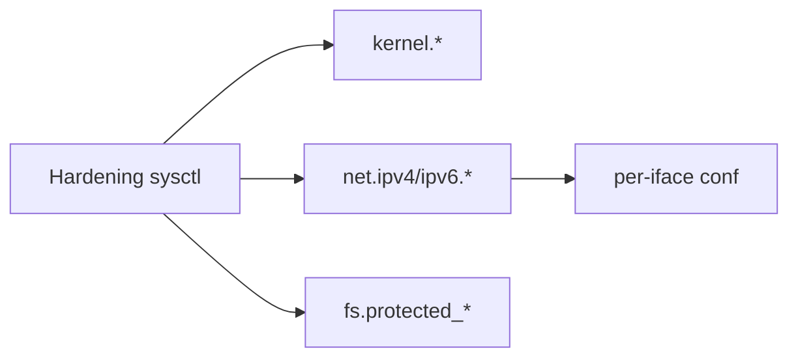
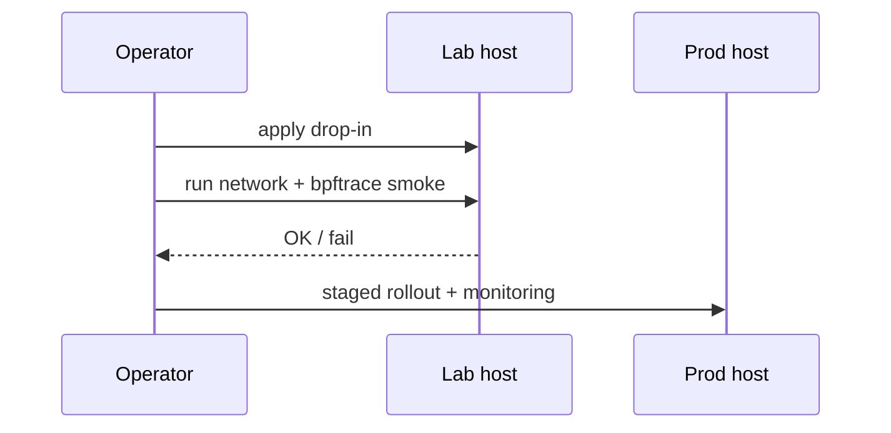

# Kernel Hardening Sysctl Surface

## Overview

Many **host hardening** knobs are **sysctls**: runtime kernel parameters under `/proc/sys` (persisted via `sysctl.d`). This note covers the **security-relevant surface** operators commonly set—ASLR, dmesg restrict, kptr, BPF/unprivileged, and common network anti-spoof/redirect settings—with explicit trade-offs.

Performance-oriented sysctls (somaxconn, TCP buffers) live in module 10. Deep exploit mitigations and distro security modules → [[18-Security/README|Security]]. Blind copying of “100 hardenings” without ADRs is an anti-pattern.

## Learning Objectives

- Navigate `/proc/sys` and `sysctl -a` for hardening families
- Apply a minimal secure baseline and document exceptions
- Explain risks of `rp_filter`, redirects, `accept_source_route`
- Restrict unprivileged BPF / dmesg / kernel pointers where appropriate
- Prefer drop-in files + reboot/test discipline over ad-hoc `sysctl -w`

## Prerequisites

- [[10-Linux/09-Security-Primitives-on-the-Host/Capabilities vs root All-Powerful Myth|Capabilities vs root All-Powerful Myth]]
- Comfort with networking basics from module 05

## Difficulty

`intermediate`

## Estimated Time

- Reading: 1.25 hours
- Exercises: 2 hours
- Mini project: 2 hours

## History

sysctl exposed tuning forever; security teams published expanding “cis benchmarks” lists. Containers and eBPF forced new knobs (`kernel.unprivileged_bpf_disabled`, etc.). Distros differ on defaults—always **measure current**, don’t assume.

## Problem It Solves

| Risk | Example knob family |
| --- | --- |
| Info leak for exploits | `kernel.kptr_restrict`, `kernel.dmesg_restrict` |
| Spoofing / evil redirects | `net.ipv4.conf.*.accept_redirects`, `rp_filter` |
| Unprivileged kernel abuse | `kernel.unprivileged_bpf_disabled`, `kernel.yama.ptrace_scope` |
| Weak ASLR | `kernel.randomize_va_space` |

## Internal Implementation

Settings are typed (int/string); many are per-interface under `net.ipv4.conf.{all,default,IFACE}.*`. Persistence: `/etc/sysctl.d/*.conf` then `sysctl --system`. Some require reboot or conflict with routers/Kubernetes CNI—**test on lab nodes**.



## Mermaid Diagrams

### Structure



### Sequence / Lifecycle — change safely



## Examples

### Minimal Example — inspect and set

```bash
sysctl kernel.randomize_va_space kernel.kptr_restrict kernel.dmesg_restrict
sysctl net.ipv4.conf.all.accept_redirects net.ipv4.conf.all.rp_filter

# Ephemeral
sudo sysctl -w kernel.dmesg_restrict=1

# Persistent
# /etc/sysctl.d/99-hardening.conf
# kernel.dmesg_restrict = 1
# kernel.kptr_restrict = 2
# kernel.yama.ptrace_scope = 1
# net.ipv4.conf.all.accept_redirects = 0
# net.ipv4.conf.default.accept_redirects = 0
# net.ipv6.conf.all.accept_redirects = 0
# net.ipv4.conf.all.secure_redirects = 0
# net.ipv4.conf.all.accept_source_route = 0
sudo sysctl --system
```

### Production-Shaped Example — exception for routers/K8s

```text
# ADR-0xx: rp_filter=2 (loose) on iface X because asymmetric routing
# Do NOT copy strict rp_filter=1 fleet-wide without validation
net.ipv4.conf.eth0.rp_filter = 2
```

```bash
# Unprivileged BPF policy (values differ by kernel—read docs)
sysctl kernel.unprivileged_bpf_disabled
# fs.protected_hardlinks / protected_symlinks usually 1 on modern distros
sysctl fs.protected_hardlinks fs.protected_symlinks fs.protected_fifos
```

Performance sysctl discipline → [[10-Linux/10-Performance-Tuning-and-Kernel-Knobs/sysctl Trade-offs Documentation Discipline|sysctl Trade-offs Documentation Discipline]].

## Trade-offs

| Dimension | Upside | Downside | When it matters |
| --- | --- | --- | --- |
| Strict `rp_filter` | Anti-spoof | Breaks asymmetric routes | Multi-homed / some clouds |
| `dmesg_restrict` | Less leak | Harder unprivileged debug | Dev workstations vs prod |
| Disable unpriv BPF | Smaller attack surface | Blocks rootless bpftrace | Policy choice |
| CIS megadumps | Coverage feel | Undiagnosed breakage | Prefer minimal + ADR |

### When to Use

- Golden images for prod/bastion
- After reading each knob’s failure mode

### When Not to Use

- Pasting internet “sysctl mega harden” into DB routers blindly
- As substitute for patching and seccomp/caps

## Exercises

1. Diff `sysctl -a` on a fresh VM vs after hardening drop-in.
2. Toggle `accept_redirects`; document who can send redirects on your LAN model.
3. Set `ptrace_scope=1`; show impact on strace as non-root same-uid vs other users.
4. Identify three sysctls that are performance not security; exclude them from this ADR.
5. Check whether your K8s node CNI documents required sysctls (handoff note).

## Mini Project

`hardening-sysctl.conf` + markdown ADR listing each key, value, reason, rollback.

## Portfolio Project

Workbench: sysctl compliance check script comparing live vs desired security set.

## Interview Questions

1. Where do sysctls live on disk vs runtime?
2. Why per-iface `net.ipv4.conf` matters?
3. What does `kptr_restrict` reduce?
4. Give a sysctl that can break networking.
5. Security sysctl vs performance sysctl—how do you separate ownership?

### Stretch / Staff-Level

1. Build a distro-specific baseline with automated drift detection.
2. Evaluate `kernel.unprivileged_userns_clone` / related user NS toggles for rootless risk (Security).

## Common Mistakes

- Applying only `all` and forgetting `default` for new interfaces
- No rollback plan
- Mixing latency tuning into “security” commits
- Assuming cloud images are already locked down

## Best Practices

- Drop-ins with numbered prefixes; one topic per file
- ADR every exception; stage rollouts
- Re-verify after kernel upgrades
- Cross-link firewall and SSH checklists

## Summary

Kernel hardening via sysctl is a **documented, tested subset** of `/proc/sys`—ASLR, pointer/dmesg leaks, ptrace, BPF privilege, and network redirect/spoof knobs. Measure impact, especially on routing and tooling, and leave deep mitigations plus threat models to Security while performance knobs stay in module 10.

## Further Reading

- `man sysctl.d`, kernel `Documentation/admin-guide/sysctl/`
- CIS / distro security guides (pin versions; don’t cargo-cult)
- [[18-Security/README|Security]]

## Related Notes

- [[10-Linux/09-Security-Primitives-on-the-Host/SSH Hardening Operator Checklist|SSH Hardening Operator Checklist]]
- [[10-Linux/10-Performance-Tuning-and-Kernel-Knobs/sysctl Trade-offs Documentation Discipline|sysctl Trade-offs Documentation Discipline]]
- [[10-Linux/05-Networking-Stack-and-Host-Firewall/nftables and Firewalld Operator Model|nftables and Firewalld Operator Model]]
- [[15-Kubernetes/README|Kubernetes]] — node sysctl exceptions

## Progress Checklist

- [ ] Explained from first principles
- [ ] Drew at least one Mermaid diagram
- [ ] Implemented a minimal version
- [ ] Documented trade-offs and non-goals
- [ ] Completed exercises
- [ ] Practiced interview questions aloud
- [ ] Linked prerequisites and dependents
