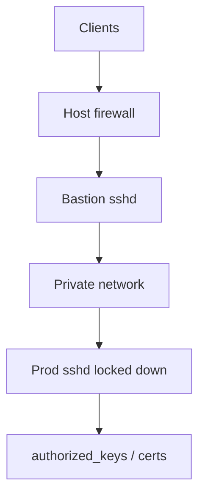
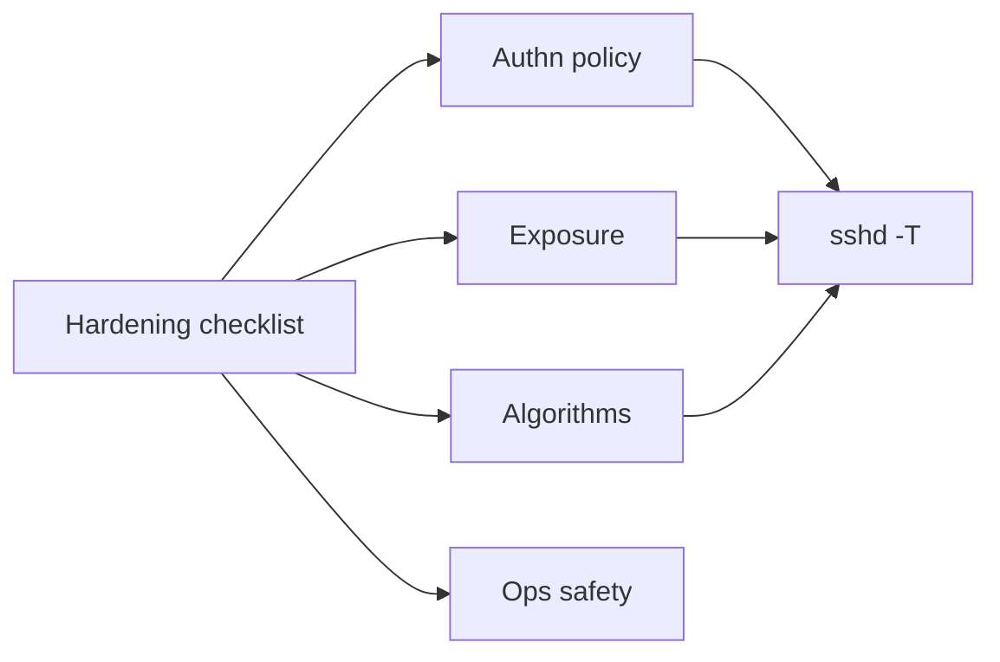
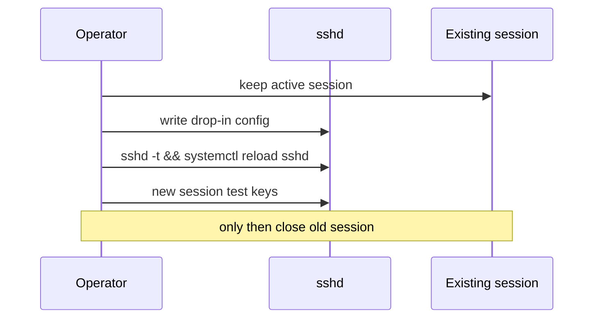

# SSH Hardening Operator Checklist

## Overview

**SSH** is still the dominant break-glass and admin channel on Linux hosts. Hardening is mostly **sshd_config policy + key hygiene + exposure reduction**—not clever crypto trivia. This note is an **operator checklist** with rationale and verification commands.

Identity providers, zero-trust SSH certificates at enterprise scale, and threat modeling of lateral movement → [[18-Security/README|Security]] / [[16-DevOps/README|DevOps]]. Cryptographic protocol theory → CS/Security as appropriate.

## Learning Objectives

- Apply a baseline sshd hardening set and verify with `sshd -T`
- Enforce key-only auth, disable root login patterns appropriately
- Reduce exposure (ListenAddress, firewall, AllowUsers/Groups)
- Manage host keys and known_hosts without TOFU nightmares in fleets
- Test changes in a rescue-safe way (do not lock yourself out)

## Prerequisites

- [[10-Linux/01-Shell-Filesystem-Hierarchy-and-Permissions/Users Groups and DAC Permissions|Users Groups and DAC Permissions]]
- [[10-Linux/05-Networking-Stack-and-Host-Firewall/nftables and Firewalld Operator Model|nftables and Firewalld Operator Model]]
- [[10-Linux/09-Security-Primitives-on-the-Host/File Integrity and Permission Drift|File Integrity and Permission Drift]]

## Difficulty

`intermediate`

## Estimated Time

- Reading: 1 hour
- Exercises: 1.5 hours
- Mini project: 2 hours

## History

Password auth and permissive root login matched small trusted LANs. Internet-facing sshd without keys became a botnet free-for-all. Modern practice: keys/certs, MFA at bastion, no direct prod SSH when possible (SSM/session managers)—yet sshd remains, so checklists remain.

## Problem It Solves

| Weak default | Hardened posture |
| --- | --- |
| Password auth | `PasswordAuthentication no` |
| Root password login | `PermitRootLogin no` or `prohibit-password` |
| Wide open :22 world | Firewall + bastion + Allowlists |
| Stale users’ keys | `authorized_keys` ownership + automation |
| Weak ciphers | Modern `Ciphers`/`MACs`/`KexAlgorithms` |

## Internal Implementation

sshd reads config (plus drop-ins under `sshd_config.d/`). Effective config: `sshd -T`. Authentication order and Match blocks complicate mental models—**always verify effective**.



## Mermaid Diagrams

### Structure



### Sequence / Lifecycle — safe config rollout



## Examples

### Minimal Example — checklist (baseline)

```text
# /etc/ssh/sshd_config.d/hardening.conf (verify on your distro!)
Protocol 2
PermitRootLogin no
PasswordAuthentication no
KbdInteractiveAuthentication no
PubkeyAuthentication yes
X11Forwarding no
AllowAgentForwarding no
AllowTcpForwarding no   # or restrict via Match/permitopen
ClientAliveInterval 30
ClientAliveCountMax 3
MaxAuthTries 3
LoginGraceTime 30
DebianBanner no         # if applicable
# AllowUsers alice deploy
# ListenAddress 10.0.0.5
```

```bash
sudo sshd -t && sudo sshd -T | egrep 'passwordauthentication|permitrootlogin|pubkeyauthentication'
```

### Production-Shaped Example — permissions

```bash
chmod 700 /home/alice/.ssh
chmod 600 /home/alice/.ssh/authorized_keys
chown -R alice:alice /home/alice/.ssh
# Host keys
ls -l /etc/ssh/ssh_host_*
# expect root:root 0600 private keys
```

Firewall: only bastion CIDR to `:22`. MFA/pam modules: Security/DevOps depth.

## Trade-offs

| Dimension | Upside | Downside | When it matters |
| --- | --- | --- | --- |
| No TCP forwarding | Less pivot | Breaks some workflows | Use short Match exceptions |
| Key-only | Stops password sprays | Key sprawl | Certs/SSH CA |
| Bastion hop | Smaller prod surface | Extra latency/ops | Fleet SSH |
| Disable root login | Forces sudo audit | Break-glass process needed | Document |

### When to Use

- Every host with sshd enabled
- Before exposing any cloud security group to 0.0.0.0/0:22

### When Not to Use

- As replacement for patching sshd CVEs
- Cargo-cult cipher lists that break your fleet clients without testing

## Exercises

1. Snapshot `sshd -T`; apply hardening drop-in; diff effective config.
2. Attempt password login; confirm rejection; keep key session alive.
3. Mis-set `authorized_keys` to 0644; observe sshd behavior; fix.
4. Add `AllowUsers`; prove other users denied.
5. Sketch certificate auth migration notes (handoff to Security/DevOps).

## Mini Project

Ansible/script checklist that fails CI if `sshd -T` shows `passwordauthentication yes` on golden images.

## Portfolio Project

Workbench bastion ADR: who can SSH where, key issuance, and break-glass root procedure.

## Interview Questions

1. How do you print effective sshd config?
2. Why keep an open session while reloading sshd?
3. `PermitRootLogin prohibit-password` vs `no`?
4. Which file permissions matter for `authorized_keys`?
5. Why block agent forwarding on shared bastions?

### Stretch / Staff-Level

1. Design SSH CA + short-lived certs for contractors.
2. Compare SSM Session Manager vs hardened sshd exposure.

## Common Mistakes

- Locking out the only key
- Editing main config without `sshd -t`
- Leaving `0.0.0.0/0` on :22 “temporarily”
- World-writable homedir disabling key auth mysteriously

## Best Practices

- Drop-ins + validate + reload + test + then disconnect
- Integrity-monitor `sshd_config` and host keys
- Prefer bastion + MFA; minimize prod SSH
- Document break-glass with dual control

## Summary

SSH hardening is a **verified checklist**: key-only auth, tight exposure, sane forwards, correct permissions, safe rollout. Cryptographic fashion and IdP integration deepen in Security/DevOps; this track keeps operators from shipping open password sshd.

## Further Reading

- `man sshd_config`, Mozilla OpenSSH guidelines (review dates)
- [[10-Linux/05-Networking-Stack-and-Host-Firewall/nftables and Firewalld Operator Model|nftables and Firewalld Operator Model]]
- [[18-Security/README|Security]]

## Related Notes

- [[10-Linux/09-Security-Primitives-on-the-Host/File Integrity and Permission Drift|File Integrity and Permission Drift]]
- [[10-Linux/09-Security-Primitives-on-the-Host/Kernel Hardening Sysctl Surface|Kernel Hardening Sysctl Surface]]
- [[16-DevOps/README|DevOps]]

## Progress Checklist

- [ ] Explained from first principles
- [ ] Drew at least one Mermaid diagram
- [ ] Implemented a minimal version
- [ ] Documented trade-offs and non-goals
- [ ] Completed exercises
- [ ] Practiced interview questions aloud
- [ ] Linked prerequisites and dependents
