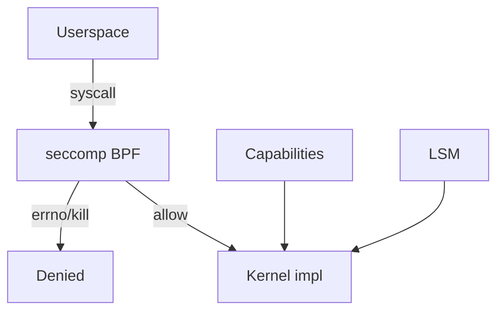
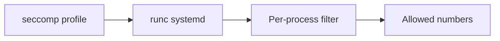
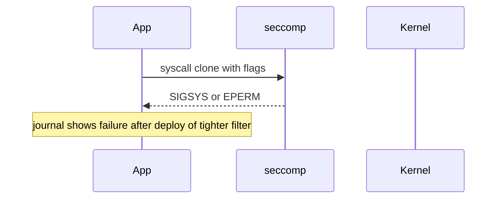

# seccomp and Syscall Filtering Basics

## Overview

**seccomp** (secure computing) restricts which **syscalls** a process may invoke. Mode 1 is brutal (`read`/`write`/`exit`/`sigreturn` only). **seccomp-BPF** installs a Berkeley Packet Filter program on the syscall path to allow, deny, errno, or trap specific numbers/args—core to container sandboxes and systemd `SystemCallFilter=`.

This note teaches operator-level mental models and failure symptoms (`SIGSYS`, errno). Writing production filters and bypass analysis → [[18-Security/README|Security]]; default Docker/K8s profiles → [[14-Docker/README|Docker]] / [[15-Kubernetes/README|Kubernetes]].

## Learning Objectives

- Contrast seccomp mode 1 vs seccomp-BPF
- Apply and debug systemd `SystemCallFilter=` / `SystemCallArchitectures=`
- Recognize app breaks caused by over-tight filters
- Place seccomp in the stack: NS + cgroups + caps + seccomp + LSM
- Avoid treating seccomp as a complete sandbox

## Prerequisites

- [[10-Linux/09-Security-Primitives-on-the-Host/Capabilities vs root All-Powerful Myth|Capabilities vs root All-Powerful Myth]]
- [[01-Computer-Science/04-Processes-and-Execution/System Calls|System Calls]]

## Difficulty

`intermediate`

## Estimated Time

- Reading: 1.25 hours
- Exercises: 2 hours
- Mini project: 2.5 hours

## History

seccomp began as a demoscene-like compute jail. BPF filtering made it practical for Chrome and then containers: allow ~300 Linux syscalls selectively instead of ambient kernel API. OCI runtimes ship default profiles; operators customize carefully.

## Problem It Solves

| Risk | Mitigation |
| --- | --- |
| Compromised process calls `mount`/`ptrace`/`reboot` | Deny syscall numbers |
| Broad `CAP_SYS_ADMIN` residual | Reduce usable kernel entry points |
| Accidental dangerous APIs in deps | Filter unused calls |

## Internal Implementation

On each syscall, the filter returns actions such as `SECCOMP_RET_ALLOW`, `SECCOMP_RET_ERRNO`, `SECCOMP_RET_KILL_THREAD`, `SECCOMP_RET_TRAP`. Argument filtering is possible but architecture-sensitive and easy to get wrong—defaults usually filter by number.

`PR_SET_NO_NEW_PRIVS` is typically required before unprivileged filter install; systemd sets related hardening together.



## Mermaid Diagrams

### Structure



### Sequence / Lifecycle — denied syscall



## Examples

### Minimal Example — systemd filter

```ini
[Service]
NoNewPrivileges=true
SystemCallArchitectures=native
SystemCallFilter=@system-service
SystemCallFilter=~@privileged @mount @reboot
# ~ means deny listed groups after allow baseline—check man systemd.exec carefully
```

```bash
# See filter presence (seccomp mode)
grep Seccomp /proc/$(pidof api)/status
# 0 disabled, 1 strict, 2 filter
```

### Production-Shaped Example — debug breakage

```bash
# Reproduce under strace after filter: look for = -1 SIGSYS or unexpected errno
# Temporarily relax filter in override, confirm root cause, then re-tighten with exception
systemctl edit api.service
# SystemCallErrorNumber=EPERM  # make denies visible as errno sometimes preferred
```

## Trade-offs

| Dimension | Upside | Downside | When it matters |
| --- | --- | --- | --- |
| Default container profile | Blocks many attacks | Breaks niche syscalls | Databases, debuggers |
| Custom allowlist | Minimal surface | Maintenance / arch | High assurance |
| Kill vs errno | Fail closed clear | Harder app UX | Prefer errno in some apps |
| Arg filtering | Precision | Fragility | Rare; Security depth |

### When to Use

- All production services via systemd or OCI defaults
- Multi-tenant runtimes

### When Not to Use

- As sole defense on privileged containers (`--privileged` disables meaningful seccomp)
- Blind copy of profiles without testing under load/features

## Exercises

1. Read `Seccomp:` for a Docker container vs `docker run --privileged`.
2. Apply `@system-service` to a unit; run its test suite; note failures.
3. Intentionally deny `openat`; observe symptom; restore.
4. Explain why ptrace-based debugging conflicts with some profiles.
5. Map K8s `securityContext.seccompProfile` to runtime behavior (K8s handoff).

## Mini Project

Document a minimal allowlist for a static Go HTTP binary vs a Node app; justify differences.

## Portfolio Project

Workbench ADR: seccomp profile choice for lab agents + break-glass debug profile.

## Interview Questions

1. What does seccomp filter?
2. Mode 1 vs BPF?
3. How do you detect a seccomp deny in production?
4. Relation to capabilities?
5. Why do privileged containers weaken this control?

### Stretch / Staff-Level

1. Critique argument-based filtering for `socket` domain allowlists.
2. Compare seccomp to Landlock/LSM for filesystem restriction (Security).

## Common Mistakes

- Deploying filters only in prod, never staging
- Disabling seccomp to “fix” CI
- Forgetting multi-arch (`SystemCallArchitectures`)
- Assuming deny stops all kernel attacks (shared kernel remains)

## Best Practices

- Start from vendor defaults; subtract rarely
- Use `NoNewPrivileges` with filters
- Log/monitor sudden `SIGSYS` crashes after releases
- Pair with read-only rootfs and cap drops

## Summary

seccomp shrinks the **syscall attack surface** of a process. Operators apply profiles, debug denials, and refuse privileged escape hatches without ADRs. Exploit completeness and profile authoring depth belong to Security; fleet defaults to Docker/K8s.

## Further Reading

- `man seccomp`, `man systemd.exec` (SystemCallFilter)
- OCI runtime seccomp section
- [[18-Security/README|Security]]

## Related Notes

- [[10-Linux/09-Security-Primitives-on-the-Host/Capabilities vs root All-Powerful Myth|Capabilities vs root All-Powerful Myth]]
- [[10-Linux/07-Cgroups-Namespaces-and-Isolation/From Host Primitives to Containers Handoff|From Host Primitives to Containers Handoff]]
- [[10-Linux/06-systemd-Timers-and-Logging/Service Hardening Directives|Service Hardening Directives]]

## Progress Checklist

- [ ] Explained from first principles
- [ ] Drew at least one Mermaid diagram
- [ ] Implemented a minimal version
- [ ] Documented trade-offs and non-goals
- [ ] Completed exercises
- [ ] Practiced interview questions aloud
- [ ] Linked prerequisites and dependents
