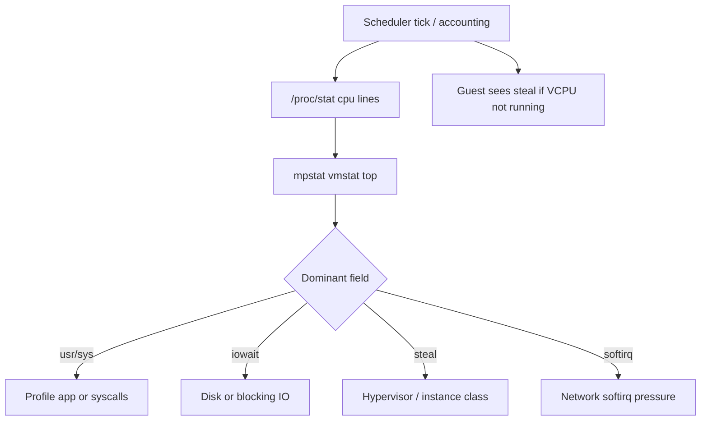
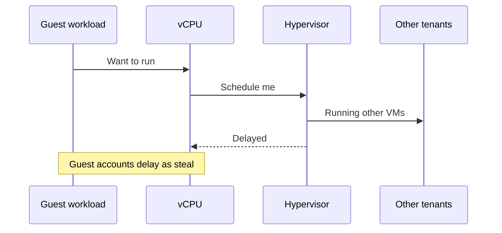
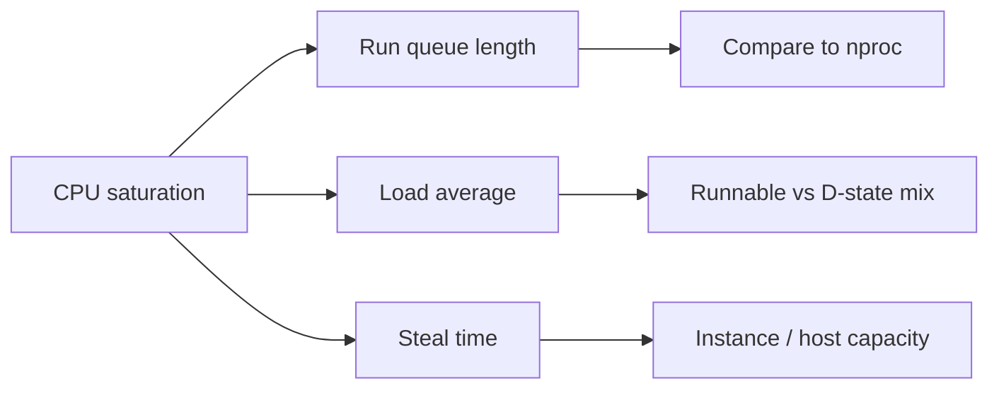
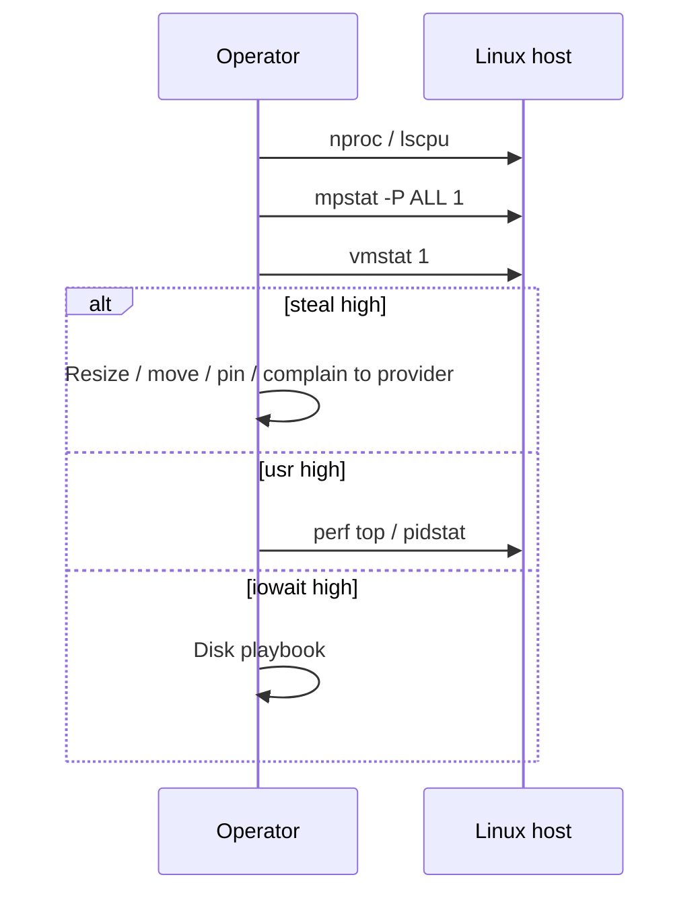

# CPU Saturation Steal and Run Queue

## Overview

**CPU saturation** means runnable work exceeds usable CPU time. On bare metal that is usually user + system + softirq + irq + wait; on virtual machines an extra fraction appears as **steal** (`%st`): time the guest wanted to run but the hypervisor scheduled elsewhere. The **run queue** (runnable + uninterruptible count feeding load average) is the queueing signal; high load with low `%usr` often means I/O wait or steal, not "compute heavy."

This note teaches host-level diagnosis: `vmstat`, `mpstat`, `/proc/stat`, `pidstat`, and how steal/run-queue interact with cgroups and multi-tenant clouds—before buying larger instances or blaming application code.

## Learning Objectives

- Distinguish user, system, iowait, irq/softirq, idle, and steal from `/proc/stat` and `mpstat`
- Interpret load average and run-queue length relative to logical CPU count
- Diagnose steal as a capacity and noisy-neighbor problem, not an app bug
- Separate CPU saturation from memory thrashing and disk wait that inflate load
- Hand off fleet autoscaling intents to DevOps and multi-service SLO budgets to System Design

## Prerequisites

- [[10-Linux/02-Processes-Signals-and-Job-Control/Process Lifecycle ps and procfs|Process Lifecycle ps and procfs]]
- [[10-Linux/02-Processes-Signals-and-Job-Control/Job Control Nice and Affinity Ops|Job Control Nice and Affinity Ops]]
- [[10-Linux/08-Observability-Tracing-and-Profiling/Metrics from procfs and sysfs|Metrics from procfs and sysfs]]
- [[01-Computer-Science/04-Processes-and-Execution/Scheduling Basics|Scheduling Basics]] (if present) or CS process model

## Difficulty

`intermediate`

## Estimated Time

- Reading: 1.5 hours
- Exercises: 1.5 hours
- Mini project: 2 hours

## History

Unix load average counted runnable processes; Linux extended it to include uninterruptible sleep (`D` state), which couples load to disk/NFS stalls. Virtualization (Xen, KVM, cloud hypervisors) added **steal time** so guests could see when the host oversubscribed vCPUs. Operators who only watched `%usr` missed "the box is waiting on the hypervisor."

## Problem It Solves

| Symptom | Wrong conclusion | Correct first check |
| --- | --- | --- |
| p99 latency up, CPU "low" | App bug only | Steal + run queue + iowait |
| Load average 40 on 4 CPUs | Need bigger box | Which states? runnable vs D |
| Burst CPU on shared VM | Code regression | Noisy neighbor / oversubscribe |
| One core hot, others idle | "CPU fine" | Affinity, single-thread bottleneck |

## Internal Implementation

### Accounting path



Linux exposes cumulative jiffies in `/proc/stat`. Tools sample deltas. Load average is an exponentially damped average of runnable + uninterruptible tasks—not "percent CPU."

### Steal intuition



## Mermaid Diagrams

### Structure



### Sequence / Lifecycle — triage order



## Examples

### Minimal Example — parse steal fraction

```typescript
/** Educational: jiffies deltas → steal ratio */
export type CpuSample = {
  user: number; nice: number; system: number; idle: number;
  iowait: number; irq: number; softirq: number; steal: number;
};

export function stealRatio(a: CpuSample, b: CpuSample): number {
  const d = (k: keyof CpuSample) => b[k] - a[k];
  const total =
    d("user") + d("nice") + d("system") + d("idle") +
    d("iowait") + d("irq") + d("softirq") + d("steal");
  return total === 0 ? 0 : d("steal") / total;
}
```

### Production-Shaped Example — alert predicates

```typescript
export type HostCpuAlert = {
  logicalCpus: number;
  load1: number;
  stealPct: number;   // 0–100
  iowaitPct: number;
  runnableApprox: number; // from /proc/loadavg fourth field or pressure
};

export function classifyCpuPressure(h: HostCpuAlert): string[] {
  const out: string[] = [];
  if (h.stealPct > 10) out.push("hypervisor-contention");
  if (h.load1 > h.logicalCpus * 1.5 && h.iowaitPct < 5 && h.stealPct < 5) {
    out.push("compute-saturation");
  }
  if (h.iowaitPct > 30) out.push("likely-io-not-cpu");
  return out;
}
```

## Trade-offs

| Dimension | Upside | Downside | When it matters |
| --- | --- | --- | --- |
| Watch steal | Catches oversubscribe | Noise on burstable credits | Cloud VMs |
| Load average alerts | Simple | Couples CPU + D-state | Always normalize by nCPU |
| CPU affinity | Cache locality | Underuses cores | Latency-sensitive pins |
| Bigger instance | More cycles | Cost; may hide app bugs | After steal ruled out |

### When to Use

- Latency or error spikes correlate with host load
- Shared/cloud instances or dense packing
- Before attributing slowness solely to application code

### When Not to Use

- As a substitute for [[09-System-Design/01-Capacity-Latency-and-Bottlenecks/Latency Budgets Percentiles and Tail Behavior|Latency Budgets Percentiles and Tail Behavior]] across services
- Tuning `sched_*` sysctls without evidence (see sysctl discipline note)
- Ignoring memory reclaim that produces D-state load

## Exercises

1. On a lab VM, run `mpstat -P ALL 1` under CPU burn and under `dd` to disk; compare steal/iowait/usr.
2. Explain why load average 8 on an 8-vCPU host can be healthy or critical depending on D-state share.
3. Write a TypeScript function that flags "steal-dominated" vs "compute-dominated" from two `/proc/stat` snapshots.
4. Map a Node.js single-threaded hotspot to one core hot / others idle using `pidstat -u 1`.
5. Document when you escalate steal to cloud provider vs resize the instance class.

## Mini Project

Build a **CPU saturation classifier** in the Linux Host Workbench: ingest fixture `/proc/stat` + `loadavg` samples, emit labels `{compute, steal, iowait, mixed}` with thresholds documented in an ADR.

## Portfolio Project

[[10-Linux/projects/Linux Host Workbench/README|Linux Host Workbench]] — dashboard panel for steal % and run-queue vs nCPU; link runbook steps.

## Interview Questions

1. What is CPU steal time and when do you see it?
2. How does Linux load average differ from "CPU utilization %"?
3. Run queue length 20 on 4 CPUs—what do you check first?
4. Why can `%idle` be high while users still see latency?
5. How do cgroup CPU limits change what `top` shows vs what the app feels?

### Stretch / Staff-Level

1. Design host SLIs for CPU that do not false-page on batch windows, and map them to fleet autoscaling in [[16-DevOps/README|DevOps]].
2. Explain how CFS throttling under cgroup v2 can look like "idle host, slow pod."

## Common Mistakes

- Alerting on raw load average without dividing by CPU count
- Ignoring steal on cloud VMs
- Treating iowait as free CPU capacity for more compute jobs
- Buying hardware before checking single-thread bottlenecks and affinity
- Confusing hypervisor steal with application GC pauses

## Best Practices

- Always report CPU metrics **normalized** by logical CPU count
- Pair `%st` with provider credit/burst metrics on burstable SKUs
- Use `mpstat -P ALL` before declaring "CPU fine"
- Profile (`perf`) only after confirming usr/sys dominance
- Record steal incidents as capacity/packing issues in postmortems

## DevOps Handoff

Fleet automation (autoscaling policies, pack density, instance family selection, node-pool taints) lives in [[16-DevOps/README|DevOps]]. This note supplies **host signals** (steal, runnable pressure) that CI/CD and cluster autoscalers should consume—not the orchestrator YAML itself.

## System Design Handoff

Multi-service SLOs, latency budgets, and "which tier absorbs CPU spikes" are [[09-System-Design/01-Capacity-Latency-and-Bottlenecks/Latency Budgets Percentiles and Tail Behavior|System Design]] concerns. A saturated host is one failure domain; product error budgets span many hosts and dependencies.

## Summary

CPU saturation is queueing for cycles: run-queue and load tell you *how much* wait exists; `mpstat` fields tell you *why*—compute, I/O, softirq, or steal. On VMs, steal is first-class evidence of oversubscription. Diagnose before buying hardware; hand fleet packing to DevOps and product SLOs to System Design.

## Further Reading

- `man 5 proc` (`/proc/stat`, `/proc/loadavg`)
- `man mpstat`, `man vmstat`
- [[10-Linux/10-Performance-Tuning-and-Kernel-Knobs/Capacity Signals Before Buying Hardware|Capacity Signals Before Buying Hardware]]
- [[10-Linux/08-Observability-Tracing-and-Profiling/perf CPU Profiles and Flame Graph Intuition|perf CPU Profiles and Flame Graph Intuition]]

## Related Notes

- [[10-Linux/10-Performance-Tuning-and-Kernel-Knobs/Disk and Network Saturation Playbooks|Disk and Network Saturation Playbooks]]
- [[10-Linux/07-Cgroups-Namespaces-and-Isolation/cgroup v2 Controllers CPU Memory IO|cgroup v2 Controllers CPU Memory IO]]
- [[10-Linux/12-Incidents-Runbooks-and-Portfolio/Host Incident Triage Order CPU Mem Disk Net|Host Incident Triage Order CPU Mem Disk Net]]
- [[09-System-Design/01-Capacity-Latency-and-Bottlenecks/Bottleneck Finding CPU Memory Disk Network|Bottleneck Finding CPU Memory Disk Network]]
- [[16-DevOps/README|DevOps]]

## Progress Checklist

- [ ] Explained from first principles
- [ ] Drew at least one Mermaid diagram
- [ ] Implemented a minimal version
- [ ] Documented trade-offs and non-goals
- [ ] Completed exercises
- [ ] Practiced interview questions aloud
- [ ] Linked prerequisites and dependents
