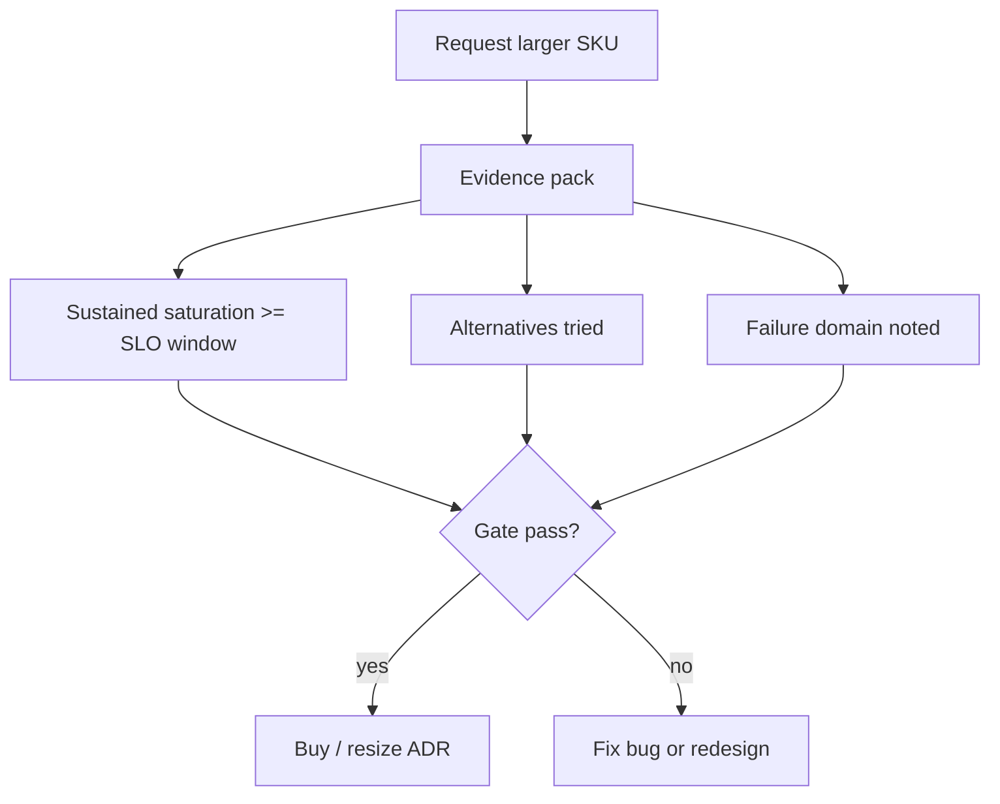
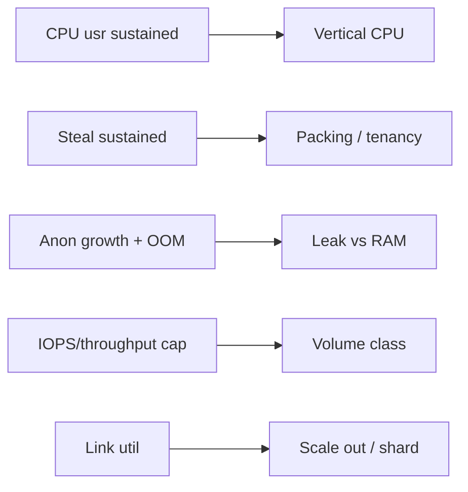
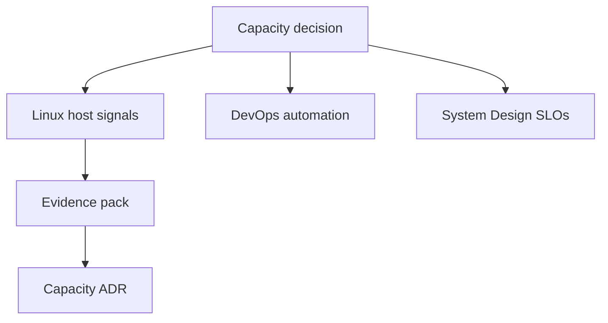
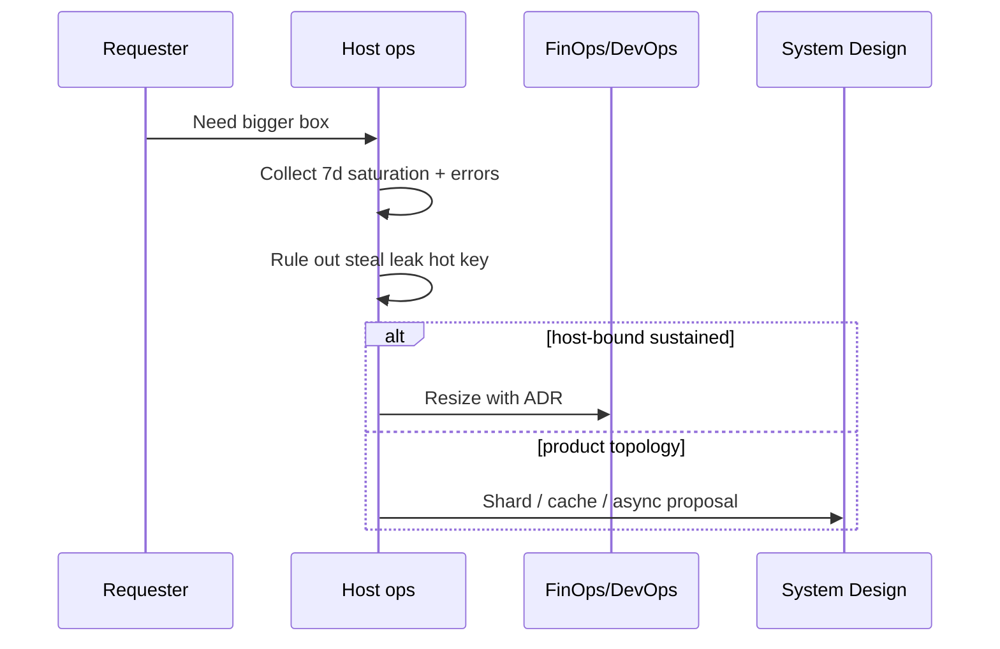

# Capacity Signals Before Buying Hardware

## Overview

Buying a larger instance or more disks is sometimes correct—and often a way to **paper over** steal, hot shards, leaks, missing indexes, or bad packing. This note defines the **evidence pack** an operator should gather before a hardware/SKU change: sustained saturation signals, headroom math, failure-domain impact, and cheaper alternatives already ruled out.

Linux owns host telemetry and interpretation. Fleet purchasing and autoscaling policies hand off to DevOps; whether the product should scale out topologically hands off to System Design.

## Learning Objectives

- Assemble a before-buy evidence pack (CPU, mem, disk, net, errors, saturation duration)
- Distinguish vertical scale needs from bugs, noisy neighbors, and topology problems
- Estimate headroom with simple Little's-law-style and utilization math
- Write a capacity ADR that lists alternatives rejected
- Connect host signals to DevOps autoscaling and System Design cost/SLO trade-offs

## Prerequisites

- [[10-Linux/10-Performance-Tuning-and-Kernel-Knobs/CPU Saturation Steal and Run Queue|CPU Saturation Steal and Run Queue]]
- [[10-Linux/10-Performance-Tuning-and-Kernel-Knobs/Disk and Network Saturation Playbooks|Disk and Network Saturation Playbooks]]
- [[10-Linux/03-Memory-Swap-and-OOM/Swap Pressure and thrashing Symptoms|Swap Pressure and thrashing Symptoms]]

## Difficulty

`intermediate`

## Estimated Time

- Reading: 1.5 hours
- Exercises: 1.5 hours
- Mini project: 2 hours

## History

CapEx-era ops bought servers from peak spreadsheets; cloud made SKU changes instant—and made **impulse upgrades** cheap emotionally, expensive at fleet scale. SRE and FinOps practices pushed "measure, then buy," while system design reminded teams that one hot key will melt any box you purchase.

## Problem It Solves

| Impulse buy | Better first move |
| --- | --- |
| Bigger CPU for steal-heavy VM | Different family / dedicated tenancy / less pack |
| More RAM for leak | Fix leak / cgroup limit / OOM policy |
| Faster disk for fsync storm | App batching / engine settings (DB track) |
| Bigger NIC for chatty mesh | Connection reuse / topology / LB |

## Internal Implementation

### Evidence pack gate



### Signal → decision map



## Mermaid Diagrams

### Structure



### Sequence / Lifecycle — right-size flow



## Examples

### Minimal Example — saturation duration

```typescript
export type SatPoint = { ts: number; cpuUtil: number; steal: number; memAvailPct: number };

export function sustainedCpuNeed(points: SatPoint[], threshold = 0.75, fraction = 0.3): boolean {
  if (points.length === 0) return false;
  const hot = points.filter((p) => p.cpuUtil >= threshold && p.steal < 0.05).length;
  return hot / points.length >= fraction;
}
```

### Production-Shaped Example — alternatives checklist

```typescript
export type CapacityAdr = {
  symptom: string;
  signals: string[];
  ruledOut: Array<"leak" | "steal" | "hot-key" | "lock" | "gc" | "bad-index">;
  options: Array<"resize" | "scale-out" | "sku-family" | "cgroup-budget" | "app-fix">;
  choice: string;
  rollback: string;
};

export const EXAMPLE: CapacityAdr = {
  symptom: "p99 API 800ms during peak",
  signals: ["cpu usr p95 88% 2h/day", "steal <1%", "disk await ok", "no OOM"],
  ruledOut: ["steal", "leak", "hot-key"],
  options: ["resize", "scale-out", "app-fix"],
  choice: "scale-out N+2 stateless replicas first",
  rollback: "revert ASG max; keep dashboards",
};
```

## Trade-offs

| Dimension | Upside | Downside | When it matters |
| --- | --- | --- | --- |
| Vertical scale | Simple | Single bigger blast radius | Stateful sticky hosts |
| Horizontal scale | Headroom + redundancy | More ops/topology | Stateless tiers |
| Faster SKU family | Better $/perf | Migration risk | Steal / NIC limits |
| Wait and optimize | Saves money | Opportunity cost | Clear inefficiency |

### When to Use

- Sustained saturation with alternatives documented
- Hardware limit explicitly hit (IOPS ceiling, RAM ceiling without leak)
- Compliance requires dedicated tenancy

### When Not to Use

- First response to a single incident spike
- When steal or noisy neighbor dominates
- When System Design shows a hot partition one box cannot fix

## Exercises

1. Given a week of CSV metrics, decide resize vs not; write the ADR fields.
2. Invent a case where buying RAM is wrong (leak) and one where it is right (working set).
3. Compute rough headroom: if p95 CPU is 70% at 1.0× load, estimate load at 90% CPU assuming linear (state assumptions).
4. List three signals that belong in DevOps autoscaling, not human purchase tickets.
5. Cross-link a hot-key scenario to [[09-System-Design/04-Partitioning-Sharding-and-Placement/Partition Keys Hotspots and Skew|Partition Keys Hotspots and Skew]].

## Mini Project

Implement `evidencePackPass(pack): boolean` in Workbench with required fields and unit tests over fixtures (pass/fail cases including steal-dominated).

## Portfolio Project

[[10-Linux/projects/Linux Host Workbench/README|Linux Host Workbench]] — capacity gate report attached to portfolio README.

## Interview Questions

1. What evidence do you need before recommending a larger instance?
2. How do you detect that vertical scale will not help?
3. Steal is 20%—do you buy more vCPU on the same family? Why/why not?
4. How does this differ from System Design capacity estimation?
5. What belongs in the capacity ADR vs the incident postmortem?

### Stretch / Staff-Level

1. Design a quarterly right-sizing pipeline with DevOps that proposes downs as well as ups.
2. Explain how error budgets ([[09-System-Design/10-Observability-and-Control-Planes/SLIs SLOs Error Budgets for Multi-Service Systems|SLIs SLOs Error Budgets]]) gate emergency purchases.

## Common Mistakes

- Buying from a single dashboard panel
- Ignoring duration and business peak calendars
- Upsizing stateful nodes forever instead of sharding
- No rollback / no cost record
- Treating cloud "unlimited" as free

## Best Practices

- Require ruled-out list in every capacity ADR
- Prefer scale-out for stateless when SLOs allow
- Separate "incident mitigation" from "permanent SKU change"
- Revisit purchases after 14–30 days with the same signals
- Publish $/hour impact with the technical recommendation

## DevOps Handoff

Autoscaling policies, reserved capacity, node-group creation, and automated right-sizing jobs are [[16-DevOps/README|DevOps]] fleet automation. Feed them **clean host signals**, not tribal "it feels slow."

## System Design Handoff

Back-of-envelope fleet capacity, shard counts, and cost/performance product trade-offs live in [[09-System-Design/01-Capacity-Latency-and-Bottlenecks/Back-of-Envelope Capacity Estimation|Back-of-Envelope Capacity Estimation]] and [[09-System-Design/01-Capacity-Latency-and-Bottlenecks/Cost Performance and Capacity Trade-offs|Cost Performance and Capacity Trade-offs]]. A single host resize does not fix multi-service SLO shape.

## Summary

Hardware purchases should follow sustained, attributed saturation and a written alternatives list. Linux provides the signals; DevOps automates fleet response; System Design decides when the topology—not the SKU—is wrong.

## Further Reading

- [[10-Linux/12-Incidents-Runbooks-and-Portfolio/Golden Signals on a Single Box|Golden Signals on a Single Box]]
- [[09-System-Design/01-Capacity-Latency-and-Bottlenecks/Throughput Queuing and Littles Law Intuition|Throughput Queuing and Littles Law Intuition]]

## Related Notes

- [[10-Linux/10-Performance-Tuning-and-Kernel-Knobs/Transparent Huge Pages and Allocator Footguns|Transparent Huge Pages and Allocator Footguns]]
- [[10-Linux/12-Incidents-Runbooks-and-Portfolio/Host Incident Triage Order CPU Mem Disk Net|Host Incident Triage Order CPU Mem Disk Net]]
- [[16-DevOps/README|DevOps]]
- [[09-System-Design/README|System Design]]

## Progress Checklist

- [ ] Explained from first principles
- [ ] Drew at least one Mermaid diagram
- [ ] Implemented a minimal version
- [ ] Documented trade-offs and non-goals
- [ ] Completed exercises
- [ ] Practiced interview questions aloud
- [ ] Linked prerequisites and dependents
