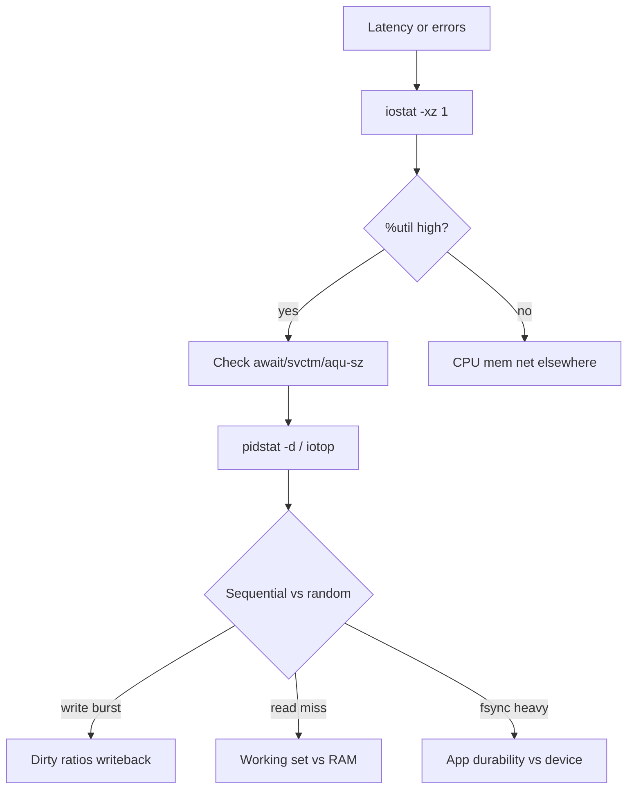
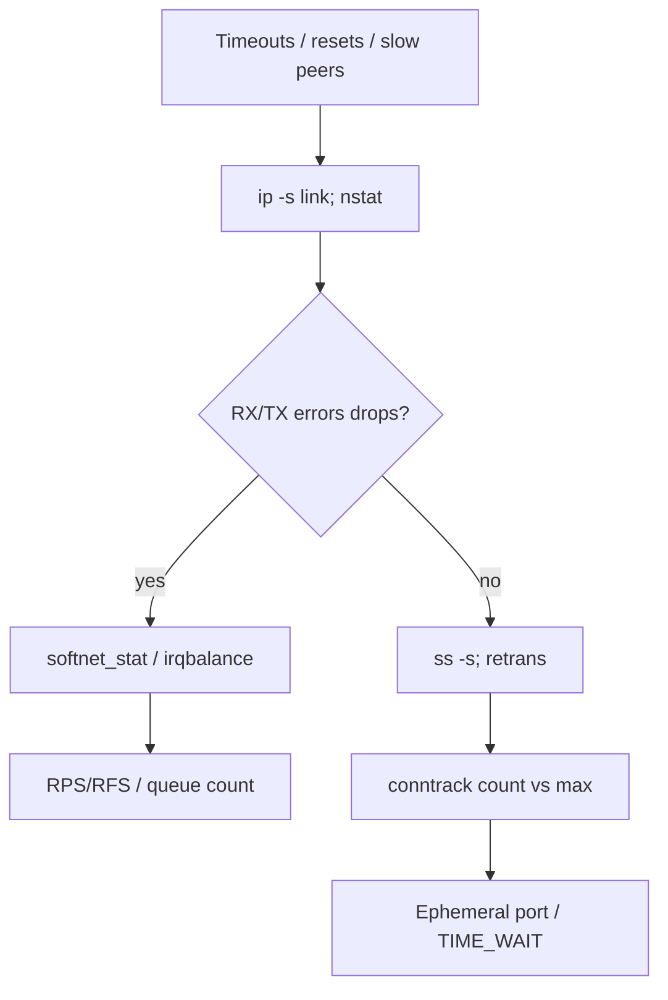
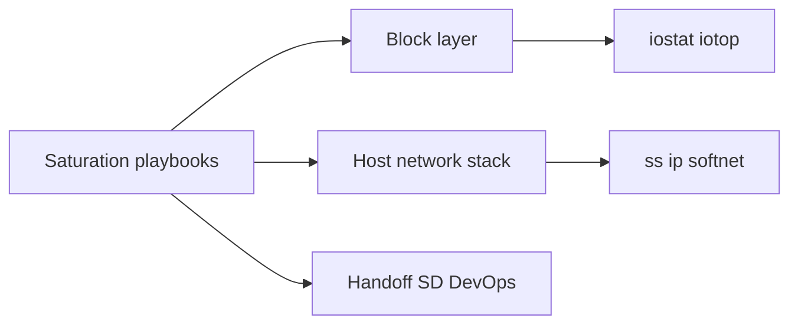

# Disk and Network Saturation Playbooks

## Overview

**Disk saturation** and **network saturation** are the two most common "CPU looks fine, product is dead" host failure modes. Disk saturation shows up as high `%util`, rising await/clat, deep queue depths, and often elevated load via uninterruptible sleep. Network saturation shows up as RX/TX drops, softirq CPU burn, conntrack table full, socket buffer overruns, or link-level pause/credits exhaustion.

This note is an **operator playbook**: ordered checks, decision trees, and when to stop tuning the box and escalate to capacity, application backpressure, or topology changes.

## Learning Objectives

- Run a disk saturation triage with `iostat`, `lsblk`, `iotop`/`pidstat -d`, and mount/SMART context
- Run a network saturation triage with `ip -s`, `ss`, `/proc/net/softnet_stat`, and conntrack
- Separate device limits from filesystem/journal and from application I/O patterns
- Distinguish NIC line-rate limits from host stack limits (softirq, conntrack, ephemeral ports)
- Hand off fleet traffic shaping/autoscaling to DevOps and multi-hop SLOs to System Design

## Prerequisites

- [[10-Linux/04-Filesystems-Disks-and-IO/Disk IO Queuing iostat and Latency|Disk IO Queuing iostat and Latency]]
- [[10-Linux/05-Networking-Stack-and-Host-Firewall/TCP UDP Sockets ss and Conntrack|TCP UDP Sockets ss and Conntrack]]
- [[10-Linux/10-Performance-Tuning-and-Kernel-Knobs/CPU Saturation Steal and Run Queue|CPU Saturation Steal and Run Queue]]

## Difficulty

`intermediate`

## Estimated Time

- Reading: 2 hours
- Exercises: 2 hours
- Mini project: 3 hours

## History

Block I/O tooling matured from `iostat` (sysstat) through blktrace/eBPF (`biolatency`). Network ops shifted from `ifconfig` counters to `ip -s link`, `ss`, and softnet statistics as multi-queue NICs and conntrack became primary bottlenecks under cloud NAT and microservice fan-out. Playbooks exist because random sysctl and `echo 3 > drop_caches` cargo-culting wasted incident time.

## Problem It Solves

| Failure mode | Playbook outcome |
| --- | --- |
| App timeouts, CPU idle, load high | Find D-state + disk await |
| Intermittent 5xx under traffic spikes | Find RX drops / softirq / conntrack |
| "Network slow" after deploy | Separate DNS, TCP retrans, NIC util |
| Database commit latency | fsync path vs device queue (DB track for engine) |

## Internal Implementation

### Disk decision tree



### Network decision tree



## Mermaid Diagrams

### Structure



### Sequence / Lifecycle — joint triage

```mermaid
sequenceDiagram
    participant Oncall
    participant Host
    Oncall->>Host: mpstat + vmstat (rule out CPU/steal)
    Oncall->>Host: iostat -xz 1
    Oncall->>Host: ip -s link; ss -s
    alt disk await rising
        Oncall->>Host: Identify PID + mount + device
    else net drops / softirq
        Oncall->>Host: softnet_stat + conntrack
    end
    Oncall->>Oncall: Mitigate then capacity ADR
```

## Examples

### Minimal Example — classify disk sample

```typescript
export type IoSample = {
  utilPct: number;
  awaitMs: number;
  r_awaitMs: number;
  w_awaitMs: number;
  aquSz: number;
};

export function diskSaturationLabel(s: IoSample): string {
  if (s.utilPct > 80 && s.awaitMs > 20) return "device-saturated";
  if (s.utilPct < 40 && s.awaitMs > 50) return "queueing-or-remote-storage";
  if (s.w_awaitMs > s.r_awaitMs * 3) return "write-path-pressure";
  return "not-disk-primary";
}
```

### Production-Shaped Example — network pressure checklist

```typescript
export type NetPressure = {
  rxDroppedDelta: number;
  softnetDroppedDelta: number;
  conntrackPctFull: number;
  tcpRetransSegsDelta: number;
  linkUtilPct: number;
};

export function networkPlaybookNext(n: NetPressure): string[] {
  const steps: string[] = [];
  if (n.linkUtilPct > 85) steps.push("scale-out-or-bigger-nic");
  if (n.softnetDroppedDelta > 0) steps.push("irq-rps-softirq-cpu");
  if (n.conntrackPctFull > 80) steps.push("conntrack-size-or-reduce-churn");
  if (n.tcpRetransSegsDelta > 0 && n.linkUtilPct < 50) {
    steps.push("path-loss-or-peer-overload");
  }
  return steps;
}
```

## Trade-offs

| Dimension | Upside | Downside | When it matters |
| --- | --- | --- | --- |
| Raise queue depth | Throughput | Latency tails | Batch vs OLTP |
| Larger sock buffers | Absorb bursts | Memory; bufferbloat | Bulk transfer |
| Bigger conntrack | More flows | RAM; hash cost | NAT / LB middleboxes |
| Local SSD vs network disk | Latency | Ops complexity | Databases, journals |

### When to Use

- Host-level latency or drops without clear app exception
- Shared storage / cloud EBS-like volumes with IOPS caps
- High connection churn services (proxies, meshes)

### When Not to Use

- Replacing engine-level buffer pool / WAL analysis ([[08-Databases/README|Databases]])
- Fleet-wide traffic engineering without [[09-System-Design/02-Load-Balancing-and-Edge-Entry/Load Balancer Roles L4 vs L7|edge/LB design]]
- Blind `net.core.*` sysctl increases without documenting risk

## Exercises

1. Generate disk saturation with parallel `fio` or `dd`; capture `iostat -xz 1` and label the phase.
2. Fill conntrack in a lab netns; observe application failures and recovery after raising or reducing churn.
3. Compare softirq CPU with `mpstat` during `iperf3` and during many small HTTP connections.
4. Write a runbook card: "await > Xms for Y minutes → actions."
5. Explain why `%util` near 100 on one disk can coexist with free CPU and dying APIs.

## Mini Project

Author two markdown runbook cards in Workbench `runbooks/`: disk saturation and network saturation, each with SLIs, thresholds, commands, and escalate-when clauses. Validate against fixture metrics in TypeScript.

## Portfolio Project

[[10-Linux/projects/Linux Host Workbench/README|Linux Host Workbench]] — playbook executor that suggests next command from live or fixture counters.

## Interview Questions

1. Walk me through disk saturation diagnosis in five minutes.
2. What do RX drops vs softnet drops imply differently?
3. When is high `%iowait` not a disk problem?
4. How does conntrack exhaustion present to applications?
5. Why can network disk make `iostat` await climb without local `%util` looking "full" in the way you expect?

### Stretch / Staff-Level

1. Design dual SLIs (device latency + app commit latency) that attribute cloud volume throttling vs app fsync storms.
2. Propose a fleet policy in [[16-DevOps/README|DevOps]] that drains nodes with sustained softnet drops.

## Common Mistakes

- Tuning scheduler/`nr_requests` before finding the PID storm
- Ignoring filesystem journal vs data device split
- Raising conntrack without fixing short-lived connection patterns
- Blaming "the network" without checking retrans vs local drops
- Using `drop_caches` as a performance fix

## Best Practices

- Always capture **before** change: `iostat`, `ip -s`, `ss -s`, `dmesg`/`journalctl`
- Prefer identifying **who** (PID/cgroup) before **knob**
- Treat cloud volume IOPS/throughput caps as first-class limits
- Document playbook thresholds in ADRs, not chat lore
- Escalate to topology when single-host NIC is the product bottleneck

## DevOps Handoff

Node drain scripts, daemonsets for NIC tuning, AMI bake of `sysctl.d`, and autoscaling on disk/network saturation signals belong to [[16-DevOps/README|DevOps]] fleet automation. Host playbooks define **signals and safe local mitigations** only.

## System Design Handoff

When many services share a saturated network path or a shared storage pool, the fix is often **sharding, caching, async offload, or admission control**—see [[09-System-Design/01-Capacity-Latency-and-Bottlenecks/Bottleneck Finding CPU Memory Disk Network|Bottleneck Finding]] and [[09-System-Design/05-Caching-at-Product-Scale/Hot Keys Stampede and Thundering Herd at Scale|Hot Keys]]. Single-box playbooks do not replace multi-service SLO design.

## Summary

Disk and network saturation hide behind idle CPU. Use ordered playbooks: quantify device/stack saturation, identify the actor, mitigate safely, then decide capacity vs pattern change. Automate fleet response in DevOps; redesign product topology when the bottleneck is bigger than one host.

## Further Reading

- `man iostat`, `man ss`, `Documentation/networking/scaling.txt` (kernel docs)
- [[10-Linux/04-Filesystems-Disks-and-IO/fsync Durability Contracts for Operators|fsync Durability Contracts for Operators]]
- [[10-Linux/05-Networking-Stack-and-Host-Firewall/Packet Capture tcpdump and Wireshark Triage|Packet Capture tcpdump and Wireshark Triage]]

## Related Notes

- [[10-Linux/10-Performance-Tuning-and-Kernel-Knobs/sysctl Trade-offs Documentation Discipline|sysctl Trade-offs Documentation Discipline]]
- [[10-Linux/12-Incidents-Runbooks-and-Portfolio/Host Incident Triage Order CPU Mem Disk Net|Host Incident Triage Order CPU Mem Disk Net]]
- [[07-Backend/06-Reliability-and-Abuse-Resistance/Circuit Breakers and Bulkheads|Circuit Breakers and Bulkheads]]
- [[09-System-Design/06-Messaging-Streams-and-Async-Topologies/Backpressure Consumer Lag and Load Shedding|Backpressure Consumer Lag and Load Shedding]]

## Progress Checklist

- [ ] Explained from first principles
- [ ] Drew at least one Mermaid diagram
- [ ] Implemented a minimal version
- [ ] Documented trade-offs and non-goals
- [ ] Completed exercises
- [ ] Practiced interview questions aloud
- [ ] Linked prerequisites and dependents
