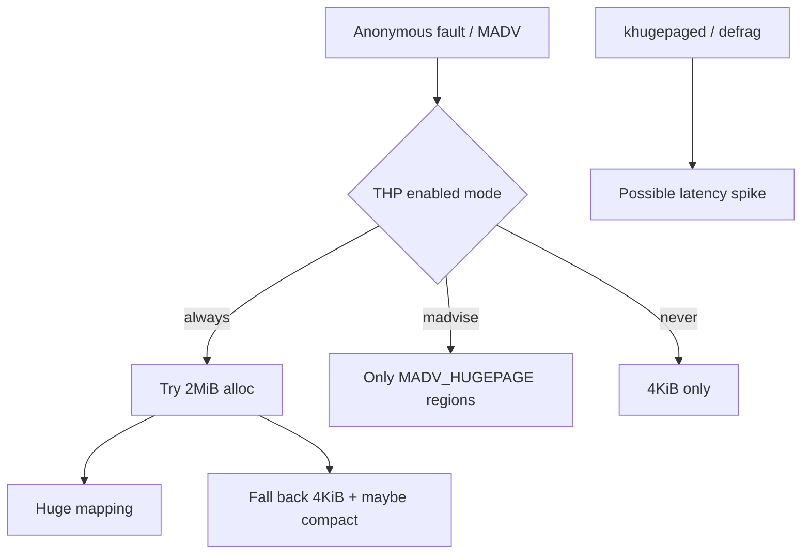
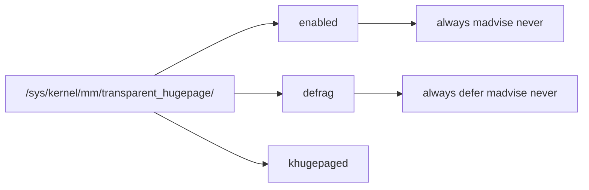
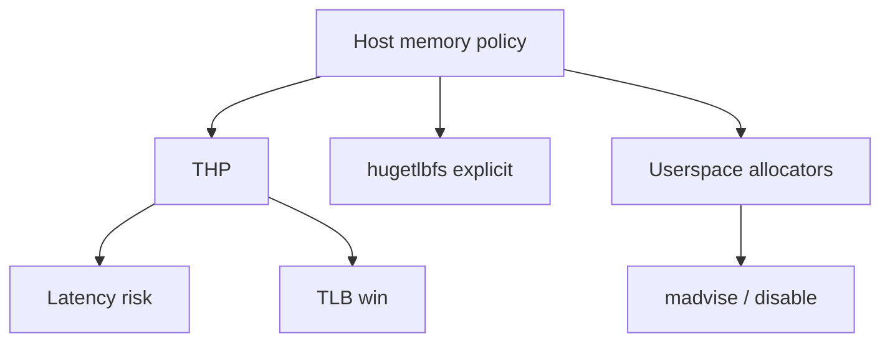
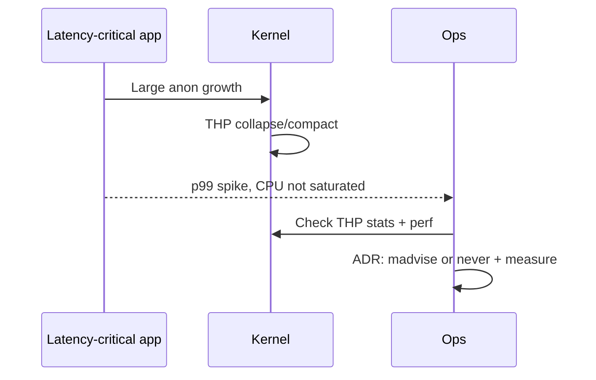

# Transparent Huge Pages and Allocator Footguns

## Overview

**Transparent Huge Pages (THP)** let the kernel promote anonymous (and sometimes file) memory from 4 KiB pages to 2 MiB (or larger) pages without application changes. Fewer page-table entries improve TLB reach and can raise throughput for some workloads. The footguns are **allocation latency** (khugepaged / compaction), **memory bloat**, and **unpredictable p99** for latency-critical services—especially databases, JVMs, and in-memory stores that already manage large heaps carefully.

This note teaches operators when THP helps, when to set `never`/`madvise`, how to verify with `/sys/kernel/mm/transparent_hugepage/`, and how allocator/cgroup interactions amplify surprises.

## Learning Objectives

- Explain huge pages vs transparent huge pages vs `hugetlbfs`
- Read and change THP defrag/enabled modes safely with documentation discipline
- Recognize THP-induced latency (compaction, page faults) in profiles and stalls
- Relate allocator behavior (glibc, jemalloc, tcmalloc) to host THP policy
- Hand off fleet image defaults to DevOps; multi-service latency budgets to System Design

## Prerequisites

- [[10-Linux/03-Memory-Swap-and-OOM/Virtual Memory Ops RSS vs VSZ|Virtual Memory Ops RSS vs VSZ]]
- [[10-Linux/10-Performance-Tuning-and-Kernel-Knobs/sysctl Trade-offs Documentation Discipline|sysctl Trade-offs Documentation Discipline]]
- [[01-Computer-Science/03-Memory-and-Addressing/Virtual Memory|Virtual Memory]]

## Difficulty

`advanced`

## Estimated Time

- Reading: 2 hours
- Exercises: 2 hours
- Mini project: 3 hours

## History

Explicit huge pages (`hugetlbfs`) required app and ops coordination. THP (mainlined ~2010s) automated promotion for anonymous memory to reduce ops burden. Database vendors (Redis, MongoDB, PostgreSQL guidance historically) often recommended disabling THP because background compaction caused multi-millisecond stalls under load. Cloud images still disagree on defaults—hence fleet discipline matters.

## Problem It Solves

| Failure mode | Mechanism |
| --- | --- |
| Random multi-ms stalls | Compaction / khugepaged collapsing |
| RSS higher than expected | Promotion + fragmentation waste |
| "Works on my laptop" | Different THP defaults per distro/image |
| Mixed latency after migrate | Host THP ≠ container expectation |

## Internal Implementation

### Promotion path (simplified)



### Operator control surface



## Mermaid Diagrams

### Structure



### Sequence / Lifecycle — incident pattern



## Examples

### Minimal Example — read desired mode

```typescript
export type ThpMode = "always" | "madvise" | "never";

/** Parse bracketed current mode from sysfs-style string */
export function parseThpEnabled(raw: string): ThpMode {
  const m = raw.match(/\[(always|madvise|never)\]/);
  if (!m) throw new Error(`unparseable THP enabled: ${raw}`);
  return m[1] as ThpMode;
}
```

### Production-Shaped Example — policy matrix

```typescript
export type WorkloadClass = "oltp-db" | "batch-analytics" | "stateless-api" | "jvm-heap";

export function recommendedThp(w: WorkloadClass): {
  enabled: ThpMode;
  rationale: string;
} {
  switch (w) {
    case "oltp-db":
      return { enabled: "never", rationale: "avoid compaction stalls on commit path" };
    case "batch-analytics":
      return { enabled: "always", rationale: "throughput > tail latency" };
    case "stateless-api":
      return { enabled: "madvise", rationale: "default-safe; apps opt in" };
    case "jvm-heap":
      return { enabled: "madvise", rationale: "coordinate with JVM huge-page flags" };
  }
}
```

## Trade-offs

| Dimension | Upside | Downside | When it matters |
| --- | --- | --- | --- |
| THP always | TLB / throughput | Tail latency, bloat | HPC, batch |
| THP never | Predictable latency | More PTEs | OLTP, Redis-like |
| madvise | Opt-in | App must cooperate | Mixed hosts |
| Explicit hugetlb | Strong control | Ops complexity | Specialized DBs |

### When to Use

- Measured TLB misses dominate and tails are acceptable
- Batch / analytics nodes isolated from OLTP
- Explicit vendor guidance after your own benchmarks

### When Not to Use

- Blindly enabling `always` on shared latency-critical hosts
- Changing THP mid-incident without capture/rollback
- Assuming containers ignore host THP (they usually do not for anon)

## Exercises

1. On a lab host, read `enabled` and `defrag`; record defaults.
2. Run a microbenchmark allocating large anonymous regions under `always` vs `never`; compare p99.
3. Find THP counters under `/proc/vmstat` (`thp_*`) and explain two of them.
4. Write an ADR choosing THP mode for a Redis-like fixture service.
5. Explain why disabling THP is not a substitute for fixing a memory leak.

## Mini Project

Workbench module: parse sysfs THP files + `/proc/vmstat` thp counters from fixtures; emit a recommendation for workload class with ADR stub.

## Portfolio Project

[[10-Linux/projects/Linux Host Workbench/README|Linux Host Workbench]] — host policy report including THP mode and "latency-critical workload present?" heuristic.

## Interview Questions

1. What problem do huge pages solve?
2. Why do many databases recommend disabling THP?
3. Difference between THP and `hugetlbfs`?
4. What does `madvise` mode change for operators vs developers?
5. How would you prove THP caused a latency spike?

### Stretch / Staff-Level

1. Design per-node-pool THP defaults in a Kubernetes fleet ([[16-DevOps/README|DevOps]] / [[15-Kubernetes/README|Kubernetes]]) without snowflake apps.
2. Relate THP stalls to [[09-System-Design/01-Capacity-Latency-and-Bottlenecks/Latency Budgets Percentiles and Tail Behavior|tail latency budgets]] when one noisy pod shares a node with OLTP.

## Common Mistakes

- Changing THP without before/after percentile metrics
- Confusing file-backed huge page support with anon THP
- Ignoring defrag mode (`always` defrag is especially sharp)
- One global policy for batch and OLTP node pools
- Blaming THP for GC issues without profiles

## Best Practices

- Default latency-critical fleets to `madvise` or `never` with ADR
- Benchmark with production-like allocation patterns, not only STREAM
- Track `thp_fault_alloc`, `thp_collapse_alloc`, compact stalls
- Coordinate JVM/DB vendor flags with host policy
- Document in image bake notes (DevOps)

## DevOps Handoff

AMI/image defaults, daemon policy, and node-pool labels for THP are fleet automation in [[16-DevOps/README|DevOps]]. Linux track explains **mechanism and footguns**; do not leave THP as SSH tribal knowledge.

## System Design Handoff

THP-induced tails on shared nodes are a **colocation / failure-domain** problem: see [[09-System-Design/00-Orientation-and-Boundaries/Failure Domains and Blast Radius Budgets|Failure Domains]] and latency SLO design. Fixing product SLOs may require pool isolation, not only a sysfs echo.

## Summary

THP trades page-table efficiency for potential compaction latency and bloat. Treat it as a documented host policy tied to workload class—measure percentiles, prefer `madvise`/`never` for OLTP, and enforce defaults through fleet automation while keeping multi-service latency ownership in System Design.

## Further Reading

- Kernel docs: `vm/transhuge.rst`
- [[10-Linux/03-Memory-Swap-and-OOM/Page Cache Dirty Writeback and Drop Caches Myths|Page Cache Dirty Writeback and Drop Caches Myths]]
- [[08-Databases/00-Orientation/Why Databases Exist|Why Databases Exist]] (engine memory vs OS)

## Related Notes

- [[10-Linux/10-Performance-Tuning-and-Kernel-Knobs/Capacity Signals Before Buying Hardware|Capacity Signals Before Buying Hardware]]
- [[10-Linux/07-Cgroups-Namespaces-and-Isolation/Resource Budgets and Noisy Neighbor Containment|Resource Budgets and Noisy Neighbor Containment]]
- [[09-System-Design/01-Capacity-Latency-and-Bottlenecks/Cost Performance and Capacity Trade-offs|Cost Performance and Capacity Trade-offs]]

## Progress Checklist

- [ ] Explained from first principles
- [ ] Drew at least one Mermaid diagram
- [ ] Implemented a minimal version
- [ ] Documented trade-offs and non-goals
- [ ] Completed exercises
- [ ] Practiced interview questions aloud
- [ ] Linked prerequisites and dependents
