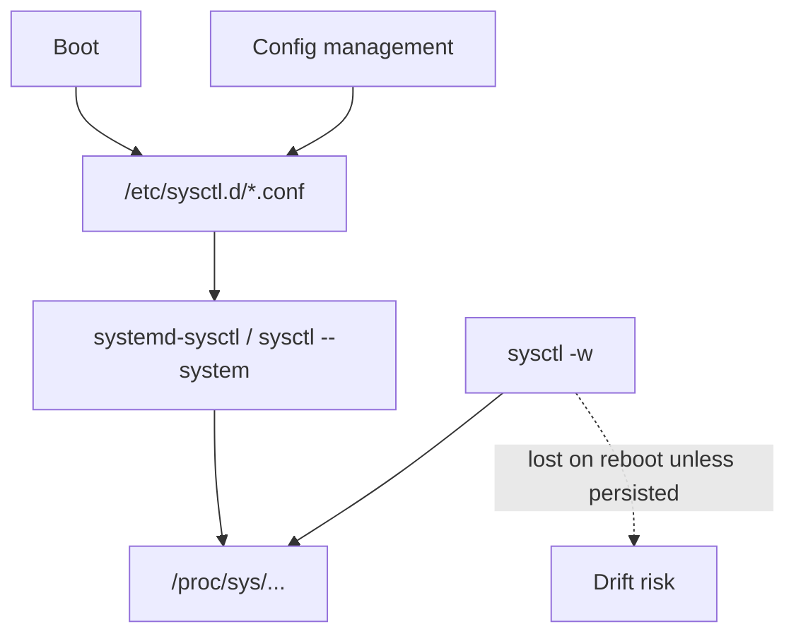
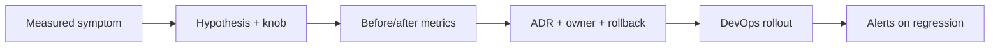
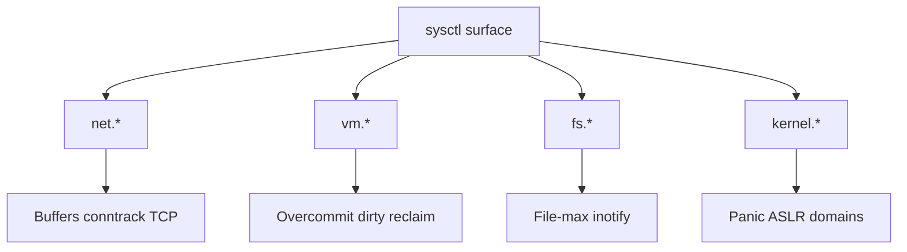
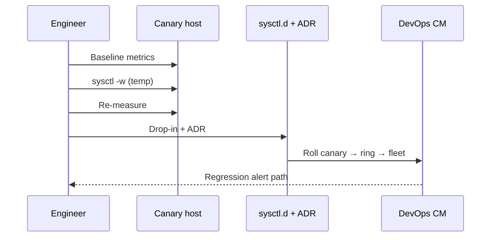

# sysctl Trade-offs Documentation Discipline

## Overview

`sysctl` exposes kernel tunables under `/proc/sys`. They are powerful, poorly remembered six months later, and frequently copied from blog posts into production. **Documentation discipline** means every non-default knob has: owner, symptom that justified it, measured effect, rollback, and interaction risks (security, memory, latency tails).

This note is not a catalog of "best" values. It is the **process and mental model** for changing `net.*`, `vm.*`, `fs.*`, and `kernel.*` without creating undiagnosable snowflakes.

## Learning Objectives

- Explain how `sysctl` / `/etc/sysctl.d` apply and persist across boots
- Classify knobs by risk domain: network, VM/reclaim, FS, kernel/security
- Write an ADR-quality change record for a sysctl (hypothesis → measure → rollback)
- Recognize common footguns (`swappiness`, `tcp_tw_reuse`, `ip_local_port_range`, overcommit)
- Hand off fleet-wide sysctl enforcement to DevOps; product latency effects to System Design

## Prerequisites

- [[10-Linux/09-Security-Primitives-on-the-Host/Kernel Hardening Sysctl Surface|Kernel Hardening Sysctl Surface]]
- [[10-Linux/00-Orientation-and-Boundaries/ADR Discipline for Host Decisions|ADR Discipline for Host Decisions]]
- [[10-Linux/10-Performance-Tuning-and-Kernel-Knobs/Disk and Network Saturation Playbooks|Disk and Network Saturation Playbooks]]

## Difficulty

`intermediate`

## Estimated Time

- Reading: 1.5 hours
- Exercises: 1.5 hours
- Mini project: 2 hours

## History

Early Unix had compile-time limits; Linux moved many limits to runtime sysctls as workloads diversified (web servers, routers, databases). Cloud images and "performance tuning" guides spread unverified defaults. Distros responded with `/etc/sysctl.d/*.conf` drop-ins and, in fleets, configuration management—yet undocumented live `sysctl -w` during incidents still creates drift.

## Problem It Solves

| Failure mode | Discipline response |
| --- | --- |
| Mystery latency after reboot | Persist + document or lose the change |
| Security hardening undone by perf paste | Separate profiles; review both |
| Conntrack "fix" that hides app leaks | Cap + alert, don't only raise |
| Different values per host | Fleet source of truth (DevOps) |

## Internal Implementation

### Application pipeline



### Change control loop



## Mermaid Diagrams

### Structure



### Sequence / Lifecycle — safe change



## Examples

### Minimal Example — typed change record

```typescript
export type SysctlChange = {
  key: string;                 // e.g. net.core.somaxconn
  from: string;
  to: string;
  symptom: string;
  evidenceMetric: string;      // "accept queue overflows"
  riskDomain: "net" | "vm" | "fs" | "kernel" | "security";
  rollback: string;
  owner: string;
  expiresReview?: string;      // ISO date for revisit
};
```

### Production-Shaped Example — reject undocumented apply

```typescript
export function assertDocumented(
  change: SysctlChange,
  allowLiveOnly: boolean
): void {
  if (!change.symptom || !change.evidenceMetric || !change.rollback) {
    throw new Error("sysctl change missing ADR fields");
  }
  if (!allowLiveOnly && !change.key.includes(".")) {
    throw new Error("invalid sysctl key");
  }
}
```

## Trade-offs

| Dimension | Upside | Downside | When it matters |
| --- | --- | --- | --- |
| Raise somaxconn | Absorb accept bursts | Hides slow workers | LB → app |
| tcp_tw_reuse | Port recycling | Rare protocol edge cases | High churn clients |
| Lower swappiness | Less anon swap | More reclaim pressure elsewhere | Latency-critical RAM |
| Strict rp_filter | Anti-spoof | Breaks asymmetric routing | Multi-homed hosts |

### When to Use

- Confirmed metric proves a kernel limit is hit
- Hardening baselines with security review
- Documented canary in a controlled ring

### When Not to Use

- As first response before identifying the saturating PID
- Copying cloud vendor "perf" gists without measurement
- Diverging one prod host permanently without fleet intent

## Exercises

1. List five sysctls on a lab host that differ from distro defaults; invent missing ADR fields for each.
2. Apply a temporary `somaxconn` change; prove persistence gap across reboot.
3. Conflict drill: security wants `rp_filter=1`, networking needs asymmetric routes—write the ADR decision.
4. Classify `vm.overcommit_memory` modes and name one workload that breaks under each wrong choice.
5. Draft a DevOps checklist item: "sysctl.d managed only via CM."

## Mini Project

Create `docs/adr/ADR-sysctl-template.md` and one filled ADR for a fictional `net.netfilter.nf_conntrack_max` increase, including memory cost estimate and alert on table utilization.

## Portfolio Project

[[10-Linux/projects/Linux Host Workbench/README|Linux Host Workbench]] — linter that diffs runtime sysctl vs declared desired state fixtures and fails CI on undocumenteds.

## Interview Questions

1. How do sysctl changes persist across reboot?
2. Give an example where raising a limit makes the outage worse.
3. How do you roll back a bad `sysctl.d` drop-in in production?
4. Which knobs are security-sensitive vs pure performance?
5. Why is live `sysctl -w` during an incident dangerous even if it "fixes" the symptom?

### Stretch / Staff-Level

1. Design a progressive delivery policy for kernel tunables across 10k nodes ([[16-DevOps/README|DevOps]]).
2. Explain how sysctl-driven buffer growth can move a bottleneck into [[09-System-Design/01-Capacity-Latency-and-Bottlenecks/Latency Budgets Percentiles and Tail Behavior|tail latency]] without raising average link utilization.

## Common Mistakes

- Undocumented snowflake hosts
- Mixing hardening and performance in one unreviewed paste
- No canary / no rollback file
- Treating blog defaults as universal
- Forgetting containerized workloads may not see host sysctl the same way (namespaced knobs)

## Best Practices

- One concern per drop-in file; named by ticket/ADR id
- Require before/after metrics in the ADR
- Prefer application backpressure over infinite queue growth
- Re-review sysctls on major kernel upgrades
- Keep security profile explicit and separate

## DevOps Handoff

Enforcing `sysctl.d` via Ansible/Puppet/Salt/image bake, canary rings, and drift detection is [[16-DevOps/README|DevOps]] fleet automation. Linux track owns **which knobs mean what on a host** and the ADR quality bar.

## System Design Handoff

Sysctl changes that enlarge queues or connection tables alter **queueing delay and failure amplification** across services. Product SLOs and load-shedding policy remain [[09-System-Design/README|System Design]] / Backend concerns; do not "fix" multi-service overload with bigger kernel queues alone.

## Summary

`sysctl` is a sharp interface: measure, hypothesize, canary, document, persist, fleet-roll, revisit. Undocumented knobs become the next outage's mystery. Discipline beats folklore.

## Further Reading

- `man sysctl`, `man sysctl.d`
- [[10-Linux/00-Orientation-and-Boundaries/ADR Discipline for Host Decisions|ADR Discipline for Host Decisions]]
- [[10-Linux/09-Security-Primitives-on-the-Host/Kernel Hardening Sysctl Surface|Kernel Hardening Sysctl Surface]]

## Related Notes

- [[10-Linux/10-Performance-Tuning-and-Kernel-Knobs/Transparent Huge Pages and Allocator Footguns|Transparent Huge Pages and Allocator Footguns]]
- [[10-Linux/10-Performance-Tuning-and-Kernel-Knobs/Capacity Signals Before Buying Hardware|Capacity Signals Before Buying Hardware]]
- [[16-DevOps/README|DevOps]]
- [[09-System-Design/10-Observability-and-Control-Planes/Progressive Delivery of Distributed Systems|Progressive Delivery of Distributed Systems]]

## Progress Checklist

- [ ] Explained from first principles
- [ ] Drew at least one Mermaid diagram
- [ ] Implemented a minimal version
- [ ] Documented trade-offs and non-goals
- [ ] Completed exercises
- [ ] Practiced interview questions aloud
- [ ] Linked prerequisites and dependents
