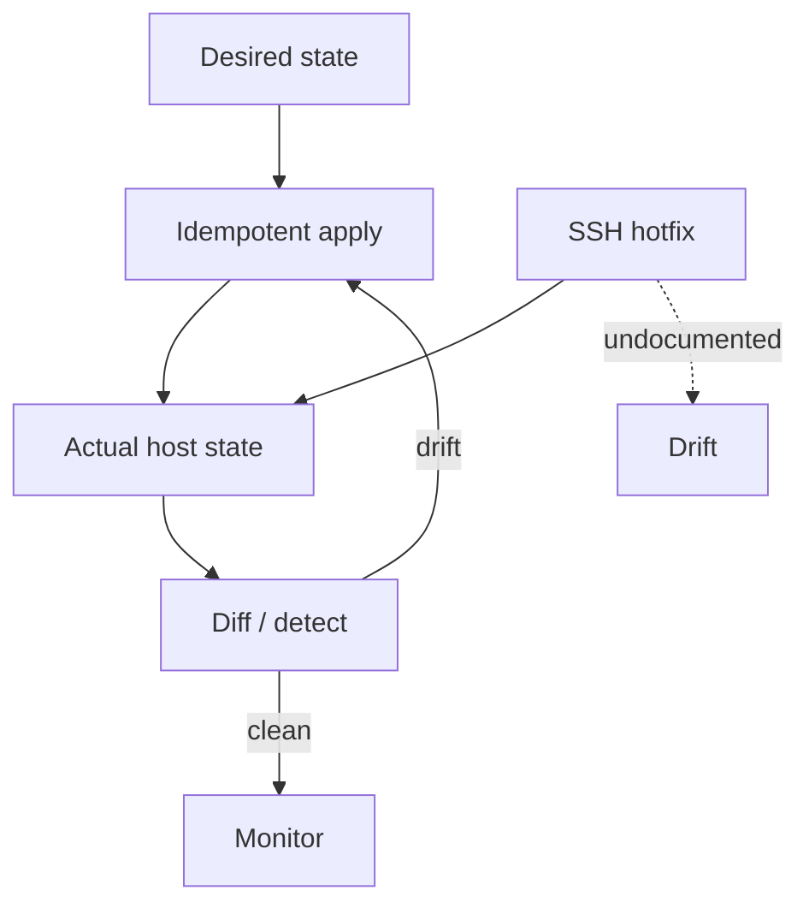
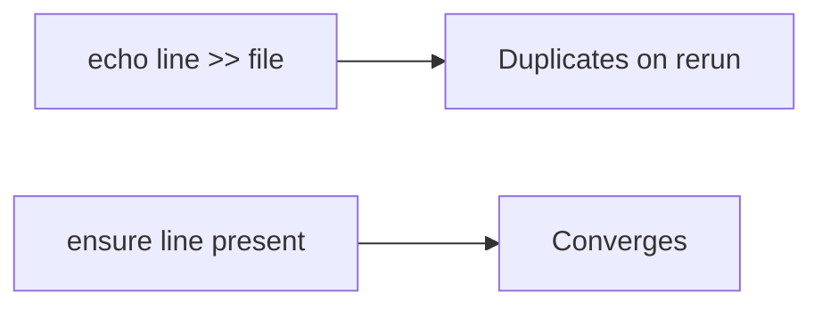
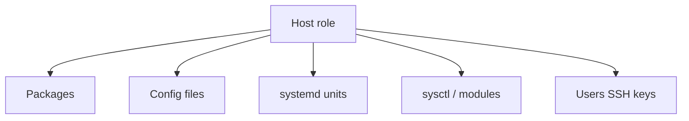
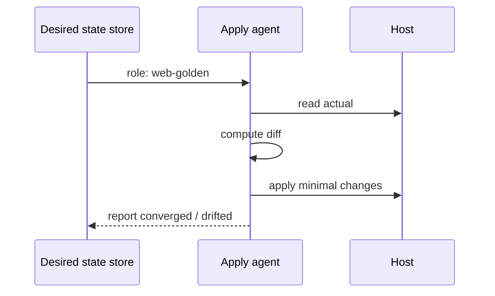

# Configuration Drift and Idempotency Prelude

## Overview

**Configuration drift** is divergence between a host's actual state and the intended state (or divergence across a fleet that should be identical). **Idempotency** for config means applying the same desired state repeatedly converges to that state without compounding side effects—the prelude to Ansible/Puppet/Salt/Chef and to immutable images.

This Linux note stays on the **host**: files under `/etc`, systemd drop-ins, sysctl, packages, and manual SSH edits. Full CM platforms and GitOps belong to DevOps; multi-service progressive delivery belongs to System Design.

## Learning Objectives

- Define drift with examples (packages, sysctl, unit overrides, cron)
- Explain idempotent vs imperative shell change sequences
- Design a minimal desired-state model for a single host role
- Detect drift with checksums/inventory diffs
- Hand off fleet CM to DevOps and rollout SLOs to System Design

## Prerequisites

- [[10-Linux/11-Packaging-Config-and-Automation-Basics/Package Managers Deb Rpm Mental Model|Package Managers Deb Rpm Mental Model]]
- [[10-Linux/06-systemd-Timers-and-Logging/Unit Types Dependencies and Targets|Unit Types Dependencies and Targets]]
- [[10-Linux/00-Orientation-and-Boundaries/ADR Discipline for Host Decisions|ADR Discipline for Host Decisions]]

## Difficulty

`intermediate`

## Estimated Time

- Reading: 1.5 hours
- Exercises: 2 hours
- Mini project: 3 hours

## History

SSH-as-a-service created snowflake servers. Configuration management made desired state explicit; containers and immutable AMIs reduced mutable drift but did not eliminate it (node agents, kernel cmdline, firmware, out-of-band fixes). Idempotency became the contract that made automation safe to re-run.

## Problem It Solves

| Symptom | Cause class |
| --- | --- |
| "Works on node 3 only" | Drift |
| Fix script breaks on second run | Non-idempotent mutate |
| Security baseline mysteriously off | Manual hotfix not recorded |
| Reimage fear | Unknown actual state |

## Internal Implementation

### Drift loop



### Idempotent vs imperative



## Mermaid Diagrams

### Structure



### Sequence / Lifecycle — converge



## Examples

### Minimal Example — idempotent file line

```typescript
export function ensureLine(content: string, line: string): string {
  const lines = content.split("\n");
  if (lines.includes(line)) return content;
  return content.endsWith("\n") || content.length === 0
    ? content + line + "\n"
    : content + "\n" + line + "\n";
}
```

### Production-Shaped Example — drift report

```typescript
export type DesiredHost = {
  packages: Record<string, string>; // name → version
  files: Record<string, string>;    // path → sha256
  sysctl: Record<string, string>;
};

export type Drift = { path: string; kind: "missing" | "hash" | "version" | "sysctl" };

export function diffHost(desired: DesiredHost, actual: DesiredHost): Drift[] {
  const out: Drift[] = [];
  for (const [p, hash] of Object.entries(desired.files)) {
    if (!(p in actual.files)) out.push({ path: p, kind: "missing" });
    else if (actual.files[p] !== hash) out.push({ path: p, kind: "hash" });
  }
  for (const [k, v] of Object.entries(desired.sysctl)) {
    if (actual.sysctl[k] !== v) out.push({ path: k, kind: "sysctl" });
  }
  return out;
}
```

## Trade-offs

| Dimension | Upside | Downside | When it matters |
| --- | --- | --- | --- |
| Mutable CM | Fast hotfix | Drift risk | Legacy fleets |
| Immutable image | Less drift | Rebuild latency | Cattle nodes |
| Enforce on boot | Converges | Can fight emergencies | Policy strength |
| Detect-only | Safer | Requires humans | Early adoption |

### When to Use

- Any host expected to match a role
- Before growing the fleet beyond a handful of boxes
- After incidents caused by "who changed `/etc`?"

### When Not to Use

- Prototyping a single lab VM with no shared role yet
- Replacing application config feature flags ([[07-Backend/README|Backend]])
- Pretending CM replaces secure secret distribution (next note)

## Exercises

1. Write a non-idempotent bash snippet and an idempotent rewrite for enabling a sysctl.
2. List five drift sources on a typical app host.
3. Implement `ensureLine` tests (already present / absent / empty file).
4. Draft a "no SSH prod edits" policy with emergency break-glass.
5. Compare drift on mutable VM vs immutable AMI+userdata model.

## Mini Project

Workbench **drift detector**: fixtures for desired vs actual; CLI prints Drift[]; exit non-zero on drift (CI-friendly).

## Portfolio Project

[[10-Linux/projects/Linux Host Workbench/README|Linux Host Workbench]] — role `golden-web` desired state + detector as portfolio artifact.

## Interview Questions

1. What is configuration drift?
2. What makes a config operation idempotent?
3. How do immutable images change the drift story?
4. How would you detect unauthorized `/etc` changes?
5. Where should the desired state live?

### Stretch / Staff-Level

1. Design break-glass that allows emergency SSH but auto-opens a drift ticket to [[16-DevOps/README|DevOps]].
2. Relate host converge failures to [[09-System-Design/10-Observability-and-Control-Planes/SLIs SLOs Error Budgets for Multi-Service Systems|error budgets]] during a fleet config push.

## Common Mistakes

- Append-only shell in cron "hardening" scripts
- Divergent hotfixes without converging desired state
- CM that restarts services unnecessarily every run
- Ignoring systemd drop-in directories in inventory
- Treating containers as drift-free when node config drifts

## Best Practices

- Desired state in version control
- Converge regularly; alert on persistent drift
- Prefer replace-file over append
- Document break-glass and re-image paths
- Separate detect vs enforce phases when adopting

## DevOps Handoff

Ansible/Puppet/Salt, image pipelines, GitOps for node config, and fleet drift dashboards are [[16-DevOps/README|DevOps]]. This prelude teaches **why idempotency matters on a Linux host** before those tools.

## System Design Handoff

Fleet-wide config pushes are progressive delivery problems: blast radius, canaries, and SLO impact—see [[09-System-Design/10-Observability-and-Control-Planes/Progressive Delivery of Distributed Systems|Progressive Delivery]]. Host idempotency does not define multi-service rollout policy.

## Summary

Drift is the enemy of reproducible hosts; idempotent desired state is the antidote. Model roles, detect diffs, converge safely, and let DevOps automate the fleet while System Design owns rollout risk to product SLOs.

## Further Reading

- [[10-Linux/11-Packaging-Config-and-Automation-Basics/Environment Files Secrets on Disk Anti-Patterns|Environment Files Secrets on Disk Anti-Patterns]]
- [[10-Linux/10-Performance-Tuning-and-Kernel-Knobs/sysctl Trade-offs Documentation Discipline|sysctl Trade-offs Documentation Discipline]]

## Related Notes

- [[10-Linux/09-Security-Primitives-on-the-Host/File Integrity and Permission Drift|File Integrity and Permission Drift]]
- [[16-DevOps/README|DevOps]]
- [[09-System-Design/README|System Design]]

## Progress Checklist

- [ ] Explained from first principles
- [ ] Drew at least one Mermaid diagram
- [ ] Implemented a minimal version
- [ ] Documented trade-offs and non-goals
- [ ] Completed exercises
- [ ] Practiced interview questions aloud
- [ ] Linked prerequisites and dependents
