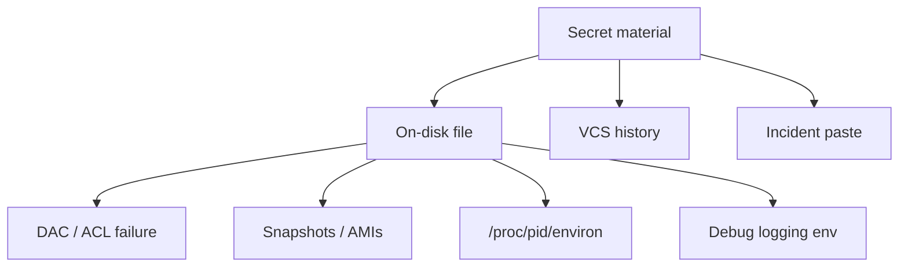
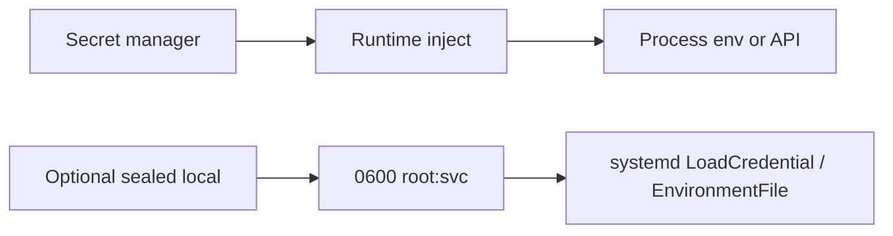
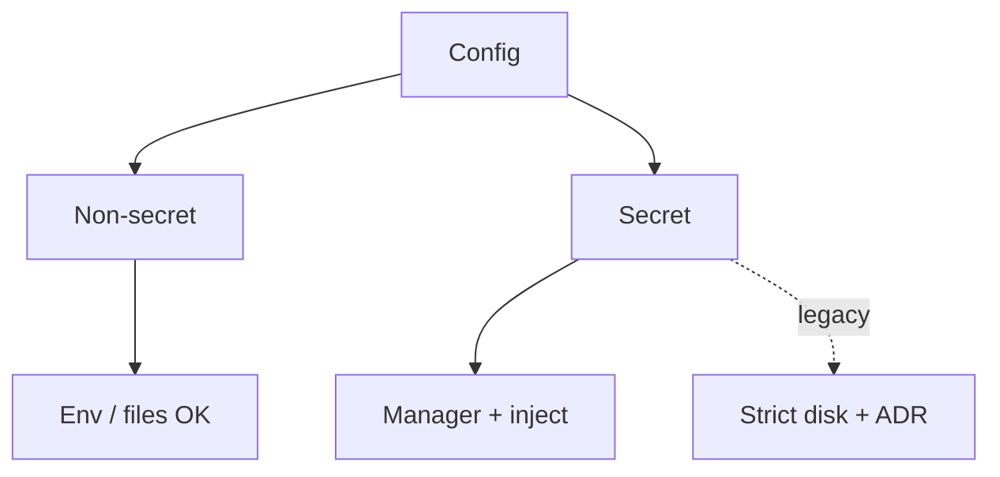
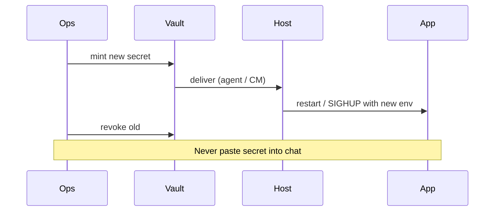

# Environment Files Secrets on Disk Anti-Patterns

## Overview

Processes need configuration; too often that includes **secrets** placed in world-readable `.env` files, bash exports in `~/.bashrc`, or `Environment=` lines committed to git. systemd `EnvironmentFile=` is convenient and still **secrets-on-disk** unless permissions, ownership, backup, and rotation policies are explicit.

This note catalogs **anti-patterns and safer host patterns** (mode `0600`, dedicated user, tmpfs, sealed secrets handoff)—without replacing a full secret manager track. Deep threat modeling → [[18-Security/README|Security]]; fleet injection → [[16-DevOps/README|DevOps]].

## Learning Objectives

- List common secret leakage paths on a Linux host (files, proc, logs, backups)
- Configure systemd `EnvironmentFile` with least privilege and document residual risk
- Contrast env-on-disk vs runtime injection vs encrypted-at-rest managers
- Design rotation and break-glass without copying secrets into ticket systems
- Hand off vault/KMS automation to DevOps; blast-radius of leaked creds to System Design / Security

## Prerequisites

- [[10-Linux/06-systemd-Timers-and-Logging/Service Hardening Directives|Service Hardening Directives]]
- [[10-Linux/01-Shell-Filesystem-Hierarchy-and-Permissions/Users Groups and DAC Permissions|Users Groups and DAC Permissions]]
- [[10-Linux/11-Packaging-Config-and-Automation-Basics/Configuration Drift and Idempotency Prelude|Configuration Drift and Idempotency Prelude]]

## Difficulty

`intermediate`

## Estimated Time

- Reading: 1.5 hours
- Exercises: 1.5 hours
- Mini project: 2 hours

## History

Twelve-factor apps popularized env-based config. systemd adopted `EnvironmentFile` for unit hygiene. Cloud vaults and kube secrets evolved because disk files were copied into AMIs, snapshots, CI logs, and support tarballs. Host operators still inherit legacy `.env` on VMs.

## Problem It Solves

| Anti-pattern | Failure |
| --- | --- |
| `.env` mode 0644 | Any local user reads DB password |
| Secret in unit file in git | History immortalizes leak |
| Printing env in crash dumps | Support tickets leak prod |
| Same secret on all hosts | Blast radius = fleet |

## Internal Implementation

### Leak paths



### Safer layering (host view)



## Mermaid Diagrams

### Structure



### Sequence / Lifecycle — rotate



## Examples

### Minimal Example — reject world-readable secret file

```typescript
export function assertSecretFileMode(mode: number): void {
  // reject if group/other have any bits
  if ((mode & 0o077) !== 0) {
    throw new Error(`secret file mode too open: ${mode.toString(8)}`);
  }
}
```

### Production-Shaped Example — classification

```typescript
export type ConfigItem =
  | { kind: "public"; key: string; value: string }
  | { kind: "secret"; key: string; source: "vault" | "disk-legacy"; path?: string };

export function placementOk(item: ConfigItem): boolean {
  if (item.kind === "public") return true;
  if (item.source === "vault") return true;
  return Boolean(item.path && item.path.startsWith("/etc/svc/"));
}
```

## Trade-offs

| Dimension | Upside | Downside | When it matters |
| --- | --- | --- | --- |
| Env on disk | Simple | Leak via copies | Small legacy VMs |
| LoadCredential | Better isolation | systemd version deps | Modern units |
| Vault inject | Rotation, audit | Agent dependency | Fleet prod |
| Bake into AMI | Fast boot | Immutable leak in image | Avoid for secrets |

### When to Use

- Non-secret config in env files freely
- Legacy disk secrets only with 0600, dedicated user, monitored integrity, rotation ADR
- Prefer vault/Cloud KMS for production fleets

### When Not to Use

- Committing secrets "just for staging"
- Sharing one prod password across all nodes forever
- Logging full environ in verbose mode

## Exercises

1. Demonstrate `/proc/self/environ` visibility for a process you start with a secret; discuss mitigations.
2. Write a unit file sketch using `EnvironmentFile=-/etc/svc/app.env` and correct Ownership.
3. List five places a deleted `.env` might still exist (backup, AMI, CI artifact).
4. Draft rotation steps that do not require Slack-pasting the secret.
5. Compare `Environment=` in git-tracked unit vs `LoadCredential=`.

## Mini Project

Workbench **secret file auditor**: given fixture `stat` results + path list, fail CI if mode/owner violate policy; emit ADR stub for any `disk-legacy` finding.

## Portfolio Project

[[10-Linux/projects/Linux Host Workbench/README|Linux Host Workbench]] — hardening checklist section for secrets-on-disk.

## Interview Questions

1. Why is mode 0644 on a `.env` dangerous?
2. How can secrets leak even with 0600?
3. What does systemd `EnvironmentFile` not solve?
4. How do you rotate a DB password used by a host service?
5. Where should secrets live in a modern fleet?

### Stretch / Staff-Level

1. Design break-glass secret access with audit in [[16-DevOps/README|DevOps]] + [[18-Security/README|Security]].
2. Model blast radius of one leaked cloud IAM key across services using [[09-System-Design/00-Orientation-and-Boundaries/Failure Domains and Blast Radius Budgets|Failure Domains]].

## Common Mistakes

- Secrets in world-readable home directories
- `chmod 777` "to make it work"
- Backing up `/etc` to unencrypted object storage
- Echoing secrets in `ExecStartPre` debug scripts
- Reusing staging secrets in production

## Best Practices

- Classify config: public vs secret
- Never commit secrets; scan history if leaked
- Prefer runtime injection and short-lived credentials
- Restrict `proc` environ exposure where possible; avoid putting secrets in argv
- Document residual risk if disk files remain

## DevOps Handoff

Secret managers, CI injection, sealed-secrets, and rotation automation are [[16-DevOps/README|DevOps]] (with Security). Linux track owns **host residual risk** of files, permissions, and proc visibility.

## System Design Handoff

Credential reuse across many services expands **blast radius** and violates compartmentalization—product topology and trust boundaries are [[09-System-Design/README|System Design]] / Security concerns beyond one box's file mode.

## Summary

Env files are fine for non-secrets; for secrets they are a legacy compromise that must be tightly permissioned, inventoried, and preferably replaced by managed injection. Automate delivery in DevOps; limit blast radius in System Design and Security.

## Further Reading

- `man systemd.exec` (`EnvironmentFile`, `LoadCredential`)
- [[10-Linux/09-Security-Primitives-on-the-Host/SSH Hardening Operator Checklist|SSH Hardening Operator Checklist]]
- [[18-Security/README|Security]]

## Related Notes

- [[10-Linux/11-Packaging-Config-and-Automation-Basics/Configuration Drift and Idempotency Prelude|Configuration Drift and Idempotency Prelude]]
- [[07-Backend/10-Production-Services/Configuration Feature Flags and Secrets for Services|Configuration Feature Flags and Secrets for Services]]
- [[16-DevOps/README|DevOps]]

## Progress Checklist

- [ ] Explained from first principles
- [ ] Drew at least one Mermaid diagram
- [ ] Implemented a minimal version
- [ ] Documented trade-offs and non-goals
- [ ] Completed exercises
- [ ] Practiced interview questions aloud
- [ ] Linked prerequisites and dependents
