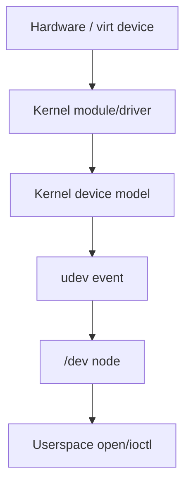
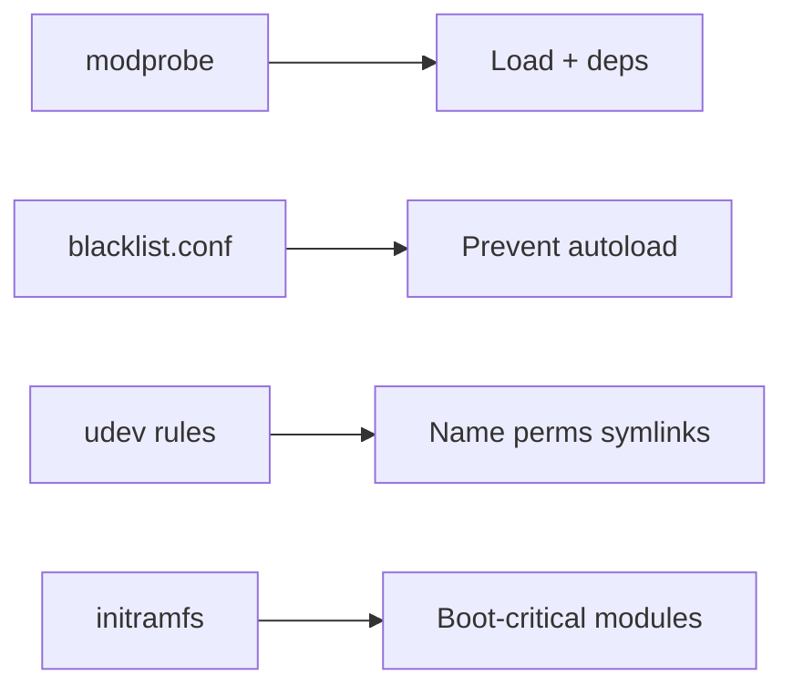
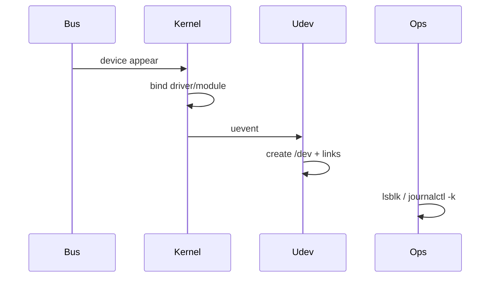

# Kernel Modules and Device Nodes Basics

## Overview

**Kernel modules** (`.ko`) extend a running kernel with drivers and features without a full rebuild. **Device nodes** under `/dev` are the userspace handles (major/minor numbers) through which processes talk to those drivers—managed largely by **udev**. Operators need enough of this model to load/blacklist modules safely, understand missing `/dev` nodes, and know when a problem is firmware/driver vs application.

Deep driver development is out of scope; fleet kernel/module policy hands off to DevOps; multi-service hardware affinity and placement to System Design / cloud topology.

## Learning Objectives

- Explain module lifecycle: `lsmod`, `modprobe`, dependencies, blacklist
- Map device nodes: major/minor, char vs block, udev rules role
- Diagnose "device missing" vs "permission denied" vs "module not loaded"
- Relate initramfs and out-of-tree modules to boot risk
- Hand off signed-module/fleet kernel policy to DevOps; placement SLOs to System Design

## Prerequisites

- [[10-Linux/00-Orientation-and-Boundaries/Distributions Kernel and Userspace|Distributions Kernel and Userspace]]
- [[10-Linux/01-Shell-Filesystem-Hierarchy-and-Permissions/Filesystem Hierarchy Standard and Path Semantics|Filesystem Hierarchy Standard and Path Semantics]]
- [[10-Linux/11-Packaging-Config-and-Automation-Basics/Package Managers Deb Rpm Mental Model|Package Managers Deb Rpm Mental Model]]

## Difficulty

`intermediate`

## Estimated Time

- Reading: 1.5 hours
- Exercises: 1.5 hours
- Mini project: 2 hours

## History

Monolithic kernels grew loadable modules to keep base images smaller and support diverse hardware. `devfs`/`udev` replaced static `/dev` trees so hotplug could create nodes dynamically. Secure Boot and module signing emerged as supply-chain controls—ops now sees signature failures as first-class incidents.

## Problem It Solves

| Symptom | Module/dev angle |
| --- | --- |
| No `/dev/sdX` after attach | udev/driver/module |
| `modprobe: FATAL` | Deps, blacklist, signature |
| Wrong permissions on device | udev rules / groups |
| Boot hangs on root disk | initramfs missing module |

## Internal Implementation

### Module → device path



### Operator controls



## Mermaid Diagrams

### Structure

```mermaid
flowchart TB
    Kernel[Kernel] --> BuiltIn[Built-in]
    Kernel --> Modules[Loadable .ko]
    Modules --> Net[net]
    Modules --> Block[block]
    Modules --> Fs[fs]
    Dev[/dev] --> Char[char]
    Dev --> BlockDev[block]
```

### Sequence / Lifecycle — hotplug disk



## Examples

### Minimal Example — device id tuple

```typescript
export type DevNode = {
  path: string;
  type: "char" | "block";
  major: number;
  minor: number;
  mode: number;
};

export function sameDevice(a: DevNode, b: DevNode): boolean {
  return a.type === b.type && a.major === b.major && a.minor === b.minor;
}
```

### Production-Shaped Example — module policy

```typescript
export type ModulePolicy = {
  requiredAtBoot: string[];
  blacklisted: string[];
  signedOnly: boolean;
};

export function conflict(p: ModulePolicy): string[] {
  return p.requiredAtBoot.filter((m) => p.blacklisted.includes(m));
}
```

## Trade-offs

| Dimension | Upside | Downside | When it matters |
| --- | --- | --- | --- |
| Out-of-tree module | New hardware support | Breaks on kernel upgrade | GPUs, custom NICs |
| Blacklist | Stop bad autoload | Surprise missing features | Stability |
| Static /dev | Predictable | Poor hotplug | Embedded rare |
| Secure Boot signing | Integrity | Blocks unsigned fixes | Regulated fleets |

### When to Use

- Enabling needed drivers intentionally
- Diagnosing missing devices after attach/migrate
- Documenting required modules in golden images

### When Not to Use

- Randomly `rmmod` on production storage drivers
- Loading untrusted out-of-tree modules on Secure Boot fleets
- Treating udev rename fights as app bugs without checking rules

## Exercises

1. `lsmod` and explain one module's `Used by` column.
2. Trace a network interface from `/sys/class/net` to driver module.
3. Read a sample udev rule and predict node permissions.
4. Write a blacklist ADR for a problematic module (lab).
5. Explain why root filesystem drivers must be in initramfs.

## Mini Project

Workbench: fixture sysfs/uevent → predicted `/dev` node + module name map; conflict checker for module policy.

## Portfolio Project

[[10-Linux/projects/Linux Host Workbench/README|Linux Host Workbench]] — "hardware readiness" report for lab fixtures.

## Interview Questions

1. What is a kernel module?
2. How do device major/minor numbers relate to `/dev`?
3. Role of udev?
4. Why can `modprobe x` fail after a kernel update?
5. What is initramfs for?

### Stretch / Staff-Level

1. Design signed-module and kernel upgrade policy for a fleet ([[16-DevOps/README|DevOps]]).
2. When GPU/NIC locality affects latency SLOs, how do you place workloads ([[09-System-Design/04-Partitioning-Sharding-and-Placement/Data Locality Geo Placement and Affinity|Data Locality]])?

## Common Mistakes

- Blacklisting a module to "fix" an error without root-causing
- Forgetting firmware packages (`linux-firmware`)
- Editing `/dev` manually and expecting it to persist
- Out-of-tree drivers without upgrade runbooks
- Ignoring `dmesg`/`journalctl -k` during device incidents

## Best Practices

- Prefer distro packages for modules/firmware
- Record required modules in image ADR
- Use udev for permissions, not ad-hoc `chmod` on `/dev`
- Test kernel upgrades on canaries (DKMS especially)
- Capture `lsmod`, `dmesg`, `udevadm info` in evidence packs

## DevOps Handoff

Kernel package rollout, DKMS build pipelines, Secure Boot keys, and module blacklist at image bake time are [[16-DevOps/README|DevOps]] fleet automation.

## System Design Handoff

Hardware-class nodes (GPU, high-PPS NIC, local SSD) create **placement and affinity** constraints for product SLOs—see [[09-System-Design/04-Partitioning-Sharding-and-Placement/Data Locality Geo Placement and Affinity|Data Locality Geo Placement and Affinity]]. Module loading on one box is not the topology decision.

## Summary

Modules extend the kernel; udev materializes `/dev`; operators load, blacklist, and diagnose with sysfs/dmesg discipline. Automate kernel/module policy in DevOps; treat special hardware as a System Design placement concern.

## Further Reading

- `man modprobe`, `man udev`, `man mknod`
- [[10-Linux/04-Filesystems-Disks-and-IO/Block Devices Partitions and Mounts|Block Devices Partitions and Mounts]]

## Related Notes

- [[10-Linux/09-Security-Primitives-on-the-Host/Kernel Hardening Sysctl Surface|Kernel Hardening Sysctl Surface]]
- [[10-Linux/11-Packaging-Config-and-Automation-Basics/Package Managers Deb Rpm Mental Model|Package Managers Deb Rpm Mental Model]]
- [[16-DevOps/README|DevOps]]

## Progress Checklist

- [ ] Explained from first principles
- [ ] Drew at least one Mermaid diagram
- [ ] Implemented a minimal version
- [ ] Documented trade-offs and non-goals
- [ ] Completed exercises
- [ ] Practiced interview questions aloud
- [ ] Linked prerequisites and dependents
