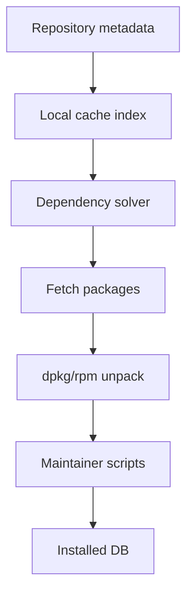
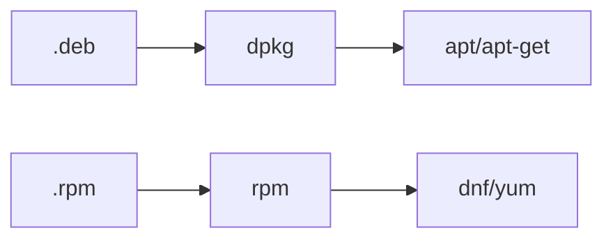
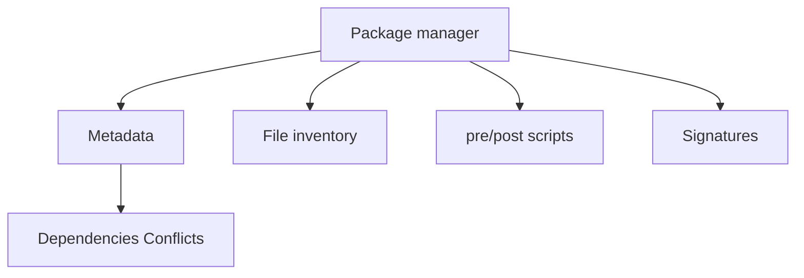
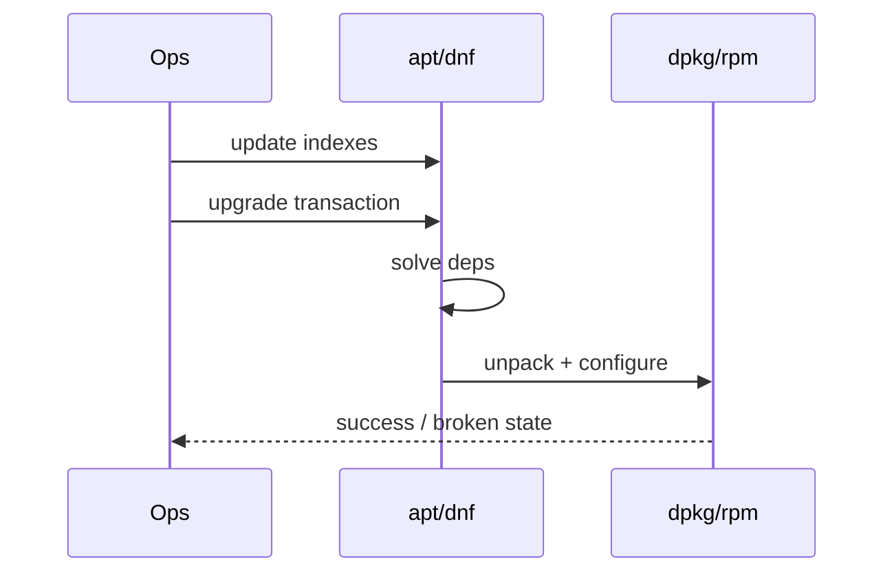

# Package Managers Deb Rpm Mental Model

## Overview

Linux software distribution for hosts centers on **packages**: versioned archives plus metadata (dependencies, files owned, scripts, signatures) installed by a **package manager**. Debian-family systems use `.deb` + `dpkg`/`apt`; Red Hat-family systems use `.rpm` + `rpm`/`dnf`. The mental model is the same: **repos → metadata index → solver → unpack → configure scripts → verify**.

This note teaches operators to reason about upgrades, holds, third-party repos, and "who owns this file" without memorizing every flag—and to hand fleet image baking to DevOps.

## Learning Objectives

- Map deb/rpm components: package, repo, index, transaction, scripts
- Explain dependency solving vs "just download a binary"
- Inspect ownership (`dpkg -S` / `rpm -qf`) and verify installs
- Reason about pin/hold, epoch/version, and third-party repo risk
- Hand off immutable image pipelines to DevOps; multi-service rollout SLOs to System Design

## Prerequisites

- [[10-Linux/01-Shell-Filesystem-Hierarchy-and-Permissions/Filesystem Hierarchy Standard and Path Semantics|Filesystem Hierarchy Standard and Path Semantics]]
- [[10-Linux/00-Orientation-and-Boundaries/Distributions Kernel and Userspace|Distributions Kernel and Userspace]]

## Difficulty

`beginner`

## Estimated Time

- Reading: 1.5 hours
- Exercises: 1.5 hours
- Mini project: 2 hours

## History

Early Unix sites compiled from tarballs. Distros introduced packages to make upgrades and shared libraries tractable. Debian's `dpkg`/`apt` and Red Hat's `rpm`/`yum`/`dnf` converged on metadata-driven dependency resolution. Containers and language package managers (npm, pip) did not remove host package managers—base images and kernels still need them.

## Problem It Solves

| Without packages | With package managers |
| --- | --- |
| Manual library hell | Declared Depends/Requires |
| Unknown file provenance | Package owns path set |
| Undocumented upgrades | Transaction log / history |
| Trust? | Signed repos (when configured) |

## Internal Implementation

### Shared pipeline



### Family mapping



## Mermaid Diagrams

### Structure



### Sequence / Lifecycle — upgrade



## Examples

### Minimal Example — conceptual package record

```typescript
export type Pkg = {
  name: string;
  version: string;
  arch: string;
  depends: string[];
  files: string[];
  scripts?: { postinst?: string; prerm?: string };
};

export function wouldBreak(remove: Pkg, world: Pkg[]): string[] {
  return world
    .filter((p) => p.depends.some((d) => d === remove.name))
    .map((p) => p.name);
}
```

### Production-Shaped Example — third-party repo gate

```typescript
export type RepoTrust = {
  url: string;
  gpgPresent: boolean;
  pinned: boolean;
  ownerTeam: string;
};

export function allowRepo(r: RepoTrust): boolean {
  return r.gpgPresent && r.pinned && r.ownerTeam.length > 0;
}
```

## Trade-offs

| Dimension | Upside | Downside | When it matters |
| --- | --- | --- | --- |
| Distro packages | Integration tested | Older versions | Base toolchain |
| Vendor repo | Newer app | Split-brain deps | Databases, agents |
| Pin/hold | Stability | Missed CVEs | Prod freezes |
| Compile local | Exact version | Undocumented drift | Last resort |

### When to Use

- Installing host agents, kernels, system libraries
- Patching CVEs via distro security updates
- Building golden images with known package sets

### When Not to Use

- Shipping your app exclusively via host packages when containers/CI artifacts are the team standard (coordinate with DevOps)
- Mixing random PPAs on prod without trust model
- Using `apt` inside every running container as a mutable snowflake

## Exercises

1. On Debian or RHEL-like lab: find which package owns `/usr/bin/curl`.
2. Simulate a dependency break: list reverse depends mentally for `openssl`.
3. Compare `apt-cache policy` / `dnf repoquery` for candidate versions.
4. Write a policy: when is a third-party repo allowed?
5. Explain epoch:version-release vs semver for operators.

## Mini Project

TypeScript **package world simulator**: install/remove with Depends/Conflicts; detect broken states; fixture repos for deb-like and rpm-like naming.

## Portfolio Project

[[10-Linux/projects/Linux Host Workbench/README|Linux Host Workbench]] — "provenance" report: path → owning package from fixture dpkg/rpm databases.

## Interview Questions

1. What problem do package managers solve that tarballs do not?
2. Difference between `dpkg` and `apt`?
3. How do you find which package owns a file?
4. Risks of third-party repositories?
5. Why can a partial upgrade leave the system broken?

### Stretch / Staff-Level

1. Design an immutable golden-image pipeline in [[16-DevOps/README|DevOps]] that never SSHs `apt upgrade` on prod.
2. How do host package CVEs interact with multi-service error budgets in [[09-System-Design/10-Observability-and-Control-Planes/SLIs SLOs Error Budgets for Multi-Service Systems|System Design SLOs]]?

## Common Mistakes

- Disabling GPG checks "temporarily"
- Running interactive upgrade on a lone prod snowflake
- Ignoring `dist-upgrade`/`dnf` weak dep behavior
- Mixing language package managers into `/usr` without isolation
- Assuming container base image packages are patched forever

## Best Practices

- Prefer distro security updates for base OS
- Pin intentionally with recorded ADR
- Record package set in image SBOM for fleets
- Separate unattended-upgrades policy from app deploys
- Verify signatures and repo ownership

## DevOps Handoff

Image bake, unattended upgrades at fleet scale, patch orchestration, and SBOM pipelines belong to [[16-DevOps/README|DevOps]]. This note supplies the **host package mental model** those pipelines automate.

## System Design Handoff

Rolling package updates across thousands of nodes affect **availability SLOs** and blast radius. Staged rollouts and canaries are product/fleet concerns aligned with [[09-System-Design/10-Observability-and-Control-Planes/Progressive Delivery of Distributed Systems|Progressive Delivery]]—not a single `apt upgrade`.

## Summary

Deb and RPM systems share one model: signed metadata, dependency solving, unpack, scripts, inventory. Master ownership and trust; automate fleet patching in DevOps; stage rollouts against System Design SLOs.

## Further Reading

- Debian Policy / RPM packaging guides (distro docs)
- [[10-Linux/11-Packaging-Config-and-Automation-Basics/Configuration Drift and Idempotency Prelude|Configuration Drift and Idempotency Prelude]]

## Related Notes

- [[10-Linux/11-Packaging-Config-and-Automation-Basics/Kernel Modules and Device Nodes Basics|Kernel Modules and Device Nodes Basics]]
- [[14-Docker/README|Docker]] (image layers vs host packages)
- [[16-DevOps/README|DevOps]]

## Progress Checklist

- [ ] Explained from first principles
- [ ] Drew at least one Mermaid diagram
- [ ] Implemented a minimal version
- [ ] Documented trade-offs and non-goals
- [ ] Completed exercises
- [ ] Practiced interview questions aloud
- [ ] Linked prerequisites and dependents
