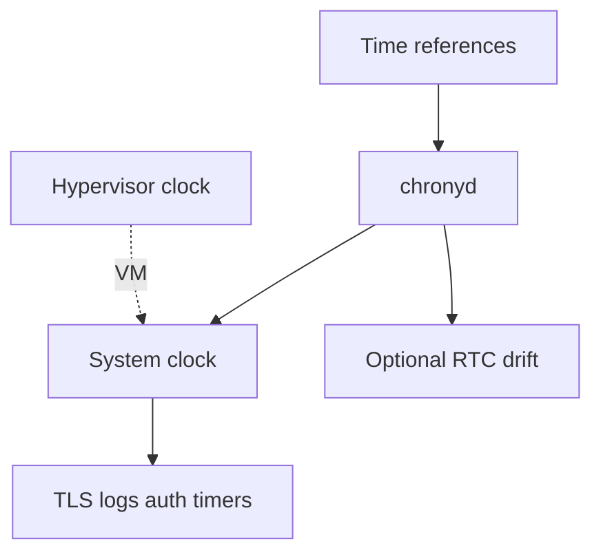
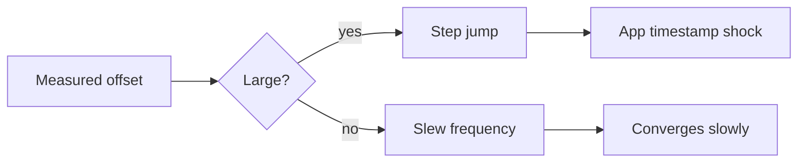
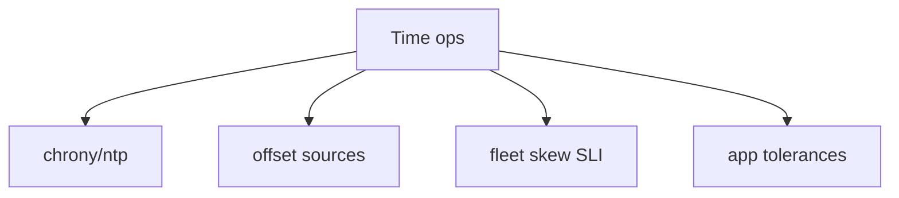
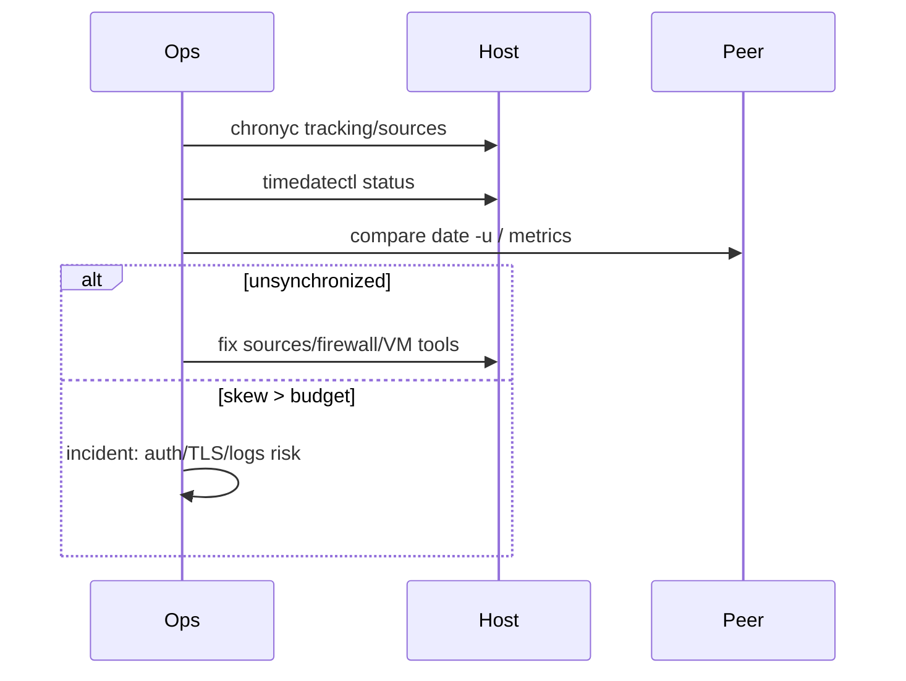

# Time NTP Chrony and Clock Skew Ops

## Overview

Linux hosts depend on **correct-enough time** for TLS validity, log correlation, Kerberos/auth tokens, scheduled jobs, and distributed consensus assumptions. **NTP/chrony** keep the system clock synchronized to reference sources; **clock skew** between hosts breaks debugging and can break protocols.

This note is **ops-focused**: chrony/ntpsec service health, step vs slew, leap seconds awareness, VM time quirks, and how to verify skew—leaving clock theory depth to CS and multi-region ordering products to System Design.

## Learning Objectives

- Explain RTC vs system clock vs synchronized discipline (chrony/NTP)
- Triage chrony: sources, offsets, last sync, unsynchronized state
- Distinguish step (jump) vs slew (gradual) and when each hurts apps
- Quantify skew between hosts and its effect on logs/TLS
- Hand off fleet time config to DevOps; cross-region ordering SLOs to System Design

## Prerequisites

- [[10-Linux/06-systemd-Timers-and-Logging/Timers vs Cron Operational Choice|Timers vs Cron Operational Choice]]
- [[01-Computer-Science/06-IO-and-Persistence/Clocks Time and Ordering|Clocks Time and Ordering]]

## Difficulty

`intermediate`

## Estimated Time

- Reading: 1.5 hours
- Exercises: 1.5 hours
- Mini project: 2 hours

## History

NTP (Mills) made internet clock sync practical. systemd's `timedated` and chrony became common defaults on modern distros for better virtualization behavior than classic `ntpd` in some clouds. Containers often inherit host time; VMs may fight hypervisor ballooning—ops still owns "is this box synced?"

## Problem It Solves

| Symptom | Time-related cause |
| --- | --- |
| TLS handshake failures | Local clock outside cert validity |
| Auth ticket rejected | Skew beyond tolerance |
| Impossible log timelines | Hosts disagree by minutes |
| Split-brain debugging | Jump after long suspend/VM pause |

## Internal Implementation

### Sync control loop



### Step vs slew



## Mermaid Diagrams

### Structure



### Sequence / Lifecycle — triage



## Examples

### Minimal Example — skew budget

```typescript
export function skewOk(localMs: number, peerMs: number, budgetMs: number): boolean {
  return Math.abs(localMs - peerMs) <= budgetMs;
}
```

### Production-Shaped Example — host time SLI

```typescript
export type TimeSli = {
  synchronized: boolean;
  offsetMs: number;
  maxAcceptableOffsetMs: number;
  sourceCount: number;
};

export function timeHealth(s: TimeSli): "ok" | "degraded" | "page" {
  if (!s.synchronized || s.sourceCount === 0) return "page";
  if (Math.abs(s.offsetMs) > s.maxAcceptableOffsetMs) return "page";
  if (Math.abs(s.offsetMs) > s.maxAcceptableOffsetMs / 2) return "degraded";
  return "ok";
}
```

## Trade-offs

| Dimension | Upside | Downside | When it matters |
| --- | --- | --- | --- |
| Allow step | Fast correct | Timestamp discontinuities | DB/queues |
| Slew only | Smooth | Long wrongness after big offset | Strict apps |
| Public NTP pools | Easy | Abuse/trust variability | Prefer org NTP |
| Host TZ local | Human SSH | Ambiguous logs | Prefer UTC everywhere |

### When to Use

- Every production host and image
- Before blaming "random" TLS/auth failures
- Cross-host incident correlation

### When Not to Use

- Using wall clock as monotonic causal order ([[09-System-Design/08-Coordination-Consensus-and-Locks/Clocks Skew Ordering and Happens-Before|Clocks Skew Ordering]])
- Disabling sync "to freeze time" for tests on shared prod
- Assuming container clocks are independently disciplined

## Exercises

1. On lab: `timedatectl` + `chronyc tracking`; interpret fields.
2. Measure skew between two VMs; set an alert threshold ADR.
3. Simulate large offset (lab only) and observe step vs makestep config.
4. Explain why `date` in a container matches the host.
5. List three app classes with explicit skew tolerances (Kerberos, TLS, JWT).

## Mini Project

Workbench time fixture: parse sample `chronyc` output → `TimeSli` → health enum; unit tests for page/degraded/ok.

## Portfolio Project

[[10-Linux/projects/Linux Host Workbench/README|Linux Host Workbench]] — golden signal tile for clock sync/offset.

## Interview Questions

1. Why does clock skew break TLS?
2. Step vs slew—trade-offs?
3. How do you verify chrony is healthy?
4. Who owns time in a container?
5. Why prefer UTC in logs?

### Stretch / Staff-Level

1. Design org NTP hierarchy and monitoring in [[16-DevOps/README|DevOps]].
2. Explain how multi-region event ordering should **not** rely on synced wall clocks alone ([[09-System-Design/08-Coordination-Consensus-and-Locks/Clocks Skew Ordering and Happens-Before|System Design]]).

## Common Mistakes

- No monitoring of `synchronized` flag
- Mixing TZ-local timestamps in distributed logs
- Blocking UDP/123 without providing internal NTP
- Ignoring VM pause/resume jumps
- Using `faketime` on shared infra carelessly

## Best Practices

- Run chrony (or equivalent) on all hosts; alert on unsynced
- Prefer trusted internal NTP strata
- Log in UTC with explicit offsets if needed
- Document makestep policy for VMs
- Include time health in host golden signals

## DevOps Handoff

Fleet chrony config, NTP anycast, image defaults, and skew dashboards are [[16-DevOps/README|DevOps]] automation. Linux track defines **host verification and failure modes**.

## System Design Handoff

Product consistency, happens-before, and multi-region SLOs must assume **bounded skew, not perfect time**—see [[09-System-Design/08-Coordination-Consensus-and-Locks/Clocks Skew Ordering and Happens-Before|Clocks Skew Ordering and Happens-Before]]. Host NTP is necessary but not sufficient for distributed ordering.

## Summary

Keep hosts synchronized, monitor offset and sync state, understand step/slew shocks, and never confuse wall-clock sync with distributed causality. Automate fleet time in DevOps; design ordering for skew in System Design.

## Further Reading

- `man chrony`, `man chronyc`, `man timedatectl`
- [[01-Computer-Science/06-IO-and-Persistence/Clocks Time and Ordering|Clocks Time and Ordering]]

## Related Notes

- [[10-Linux/12-Incidents-Runbooks-and-Portfolio/Golden Signals on a Single Box|Golden Signals on a Single Box]]
- [[10-Linux/08-Observability-Tracing-and-Profiling/Logging Correlation on a Single Host|Logging Correlation on a Single Host]]
- [[09-System-Design/07-Multi-Region-and-Geo/Replica Lag as User-Facing Consistency Budget|Replica Lag as User-Facing Consistency Budget]]

## Progress Checklist

- [ ] Explained from first principles
- [ ] Drew at least one Mermaid diagram
- [ ] Implemented a minimal version
- [ ] Documented trade-offs and non-goals
- [ ] Completed exercises
- [ ] Practiced interview questions aloud
- [ ] Linked prerequisites and dependents
