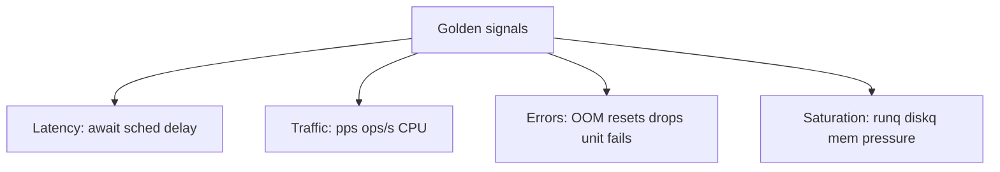
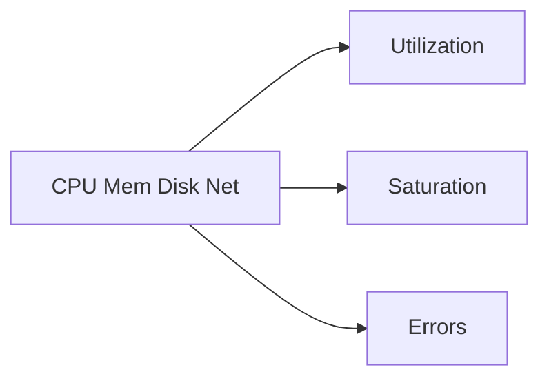
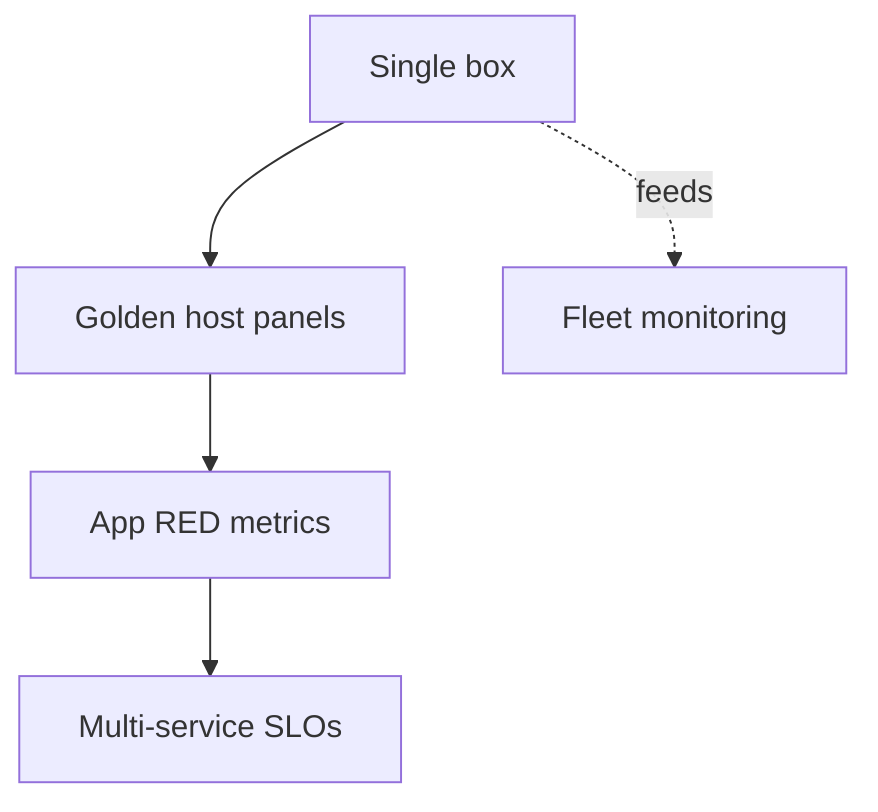
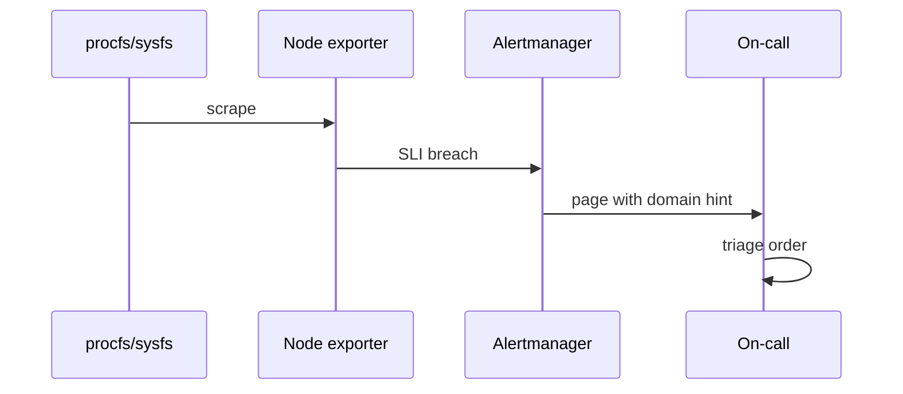

# Golden Signals on a Single Box

## Overview

Google's four **golden signals** (latency, traffic, errors, saturation) were defined for services. On a **single Linux host**, the analogous dashboard answers: is this machine accepting work, how hard is it working, what is failing, and how close is it to limits? This note maps golden signals onto host metrics (load/steal, disk await, network drops, OOM, unit failures, clock sync) and shows how they feed—but do not replace—multi-service SLOs.

## Learning Objectives

- Map latency/traffic/errors/saturation onto host-level measurements
- Apply USE (Utilization, Saturation, Errors) per resource
- Propose alert thresholds that page on user-risk, not noise
- Separate host SLIs from application RED metrics
- Hand off metric pipelines to DevOps; product SLOs to System Design

## Prerequisites

- [[10-Linux/08-Observability-Tracing-and-Profiling/Metrics from procfs and sysfs|Metrics from procfs and sysfs]]
- [[10-Linux/12-Incidents-Runbooks-and-Portfolio/Host Incident Triage Order CPU Mem Disk Net|Host Incident Triage Order CPU Mem Disk Net]]
- [[10-Linux/11-Packaging-Config-and-Automation-Basics/Time NTP Chrony and Clock Skew Ops|Time NTP Chrony and Clock Skew Ops]]

## Difficulty

`intermediate`

## Estimated Time

- Reading: 1.5 hours
- Exercises: 1.5 hours
- Mini project: 2 hours

## History

Golden signals popularized a minimal service dashboard. Brendan Gregg's USE method gave a per-resource checklist for systems. Host operators need both: service golden signals without host saturation panels miss steal and ENOSPC; host panels without traffic/error context miss "box fine, app broken."

## Problem It Solves

| Gap | Host golden panel |
| --- | --- |
| Only CPU% | Add saturation + steal + errors |
| Only app p99 | Add disk/net host pressure |
| Alert storms | Few high-signal pages |
| No clock SLI | Auth/TLS mysteries |

## Internal Implementation

### Mapping



### USE per resource



## Mermaid Diagrams

### Structure



### Sequence / Lifecycle — from metric to page



## Examples

### Minimal Example — host SLI set

```typescript
export type HostGolden = {
  latency: { diskAwaitMsP95: number; schedDelayMsP95?: number };
  traffic: { cpuBusyPct: number; netPps: number };
  errors: { oomEvents: number; rxDrops: number; failedUnits: number };
  saturation: { loadPerCpu: number; memAvailablePct: number; stealPct: number };
  timeSynced: boolean;
};
```

### Production-Shaped Example — page or not

```typescript
export function shouldPage(h: HostGolden): boolean {
  if (!h.timeSynced) return true;
  if (h.errors.oomEvents > 0) return true;
  if (h.saturation.stealPct > 15) return true;
  if (h.saturation.memAvailablePct < 3) return true;
  if (h.latency.diskAwaitMsP95 > 100 && h.saturation.loadPerCpu > 1.5) return true;
  return false;
}
```

## Trade-offs

| Dimension | Upside | Downside | When it matters |
| --- | --- | --- | --- |
| Few golden panels | Clarity | Miss niche faults | Default ops |
| High-cardinality labels | Detail | Cost blowups | Avoid per-PID forever |
| Tight thresholds | Fast detect | Noise | Tune to SLO |
| Host-only alerts | Infra clarity | Miss app bugs | Pair with RED |

### When to Use

- Every production node/VM
- As the left pane of on-call dashboards
- Teaching what "healthy host" means

### When Not to Use

- As the only SLOs for a multi-service product
- Alerting on raw load without per-CPU norm
- Copying cloud provider defaults without steal

## Exercises

1. Build a table mapping each golden signal to concrete Linux metrics.
2. Apply USE to disk on your lab; fill U/S/E columns.
3. Propose three pages and three ticket-only alerts.
4. Explain why host latency ≠ user latency.
5. Add clock sync as a first-class error/availability signal.

## Mini Project

Workbench dashboard fixture: `HostGolden` JSON samples → render markdown panel + `shouldPage` decisions with tests.

## Portfolio Project

[[10-Linux/projects/Linux Host Workbench/README|Linux Host Workbench]] — golden signals module as portfolio demo.

## Interview Questions

1. What are the four golden signals?
2. How do they map to a Linux host?
3. What is the USE method?
4. Why alert on steal?
5. How do host SLIs relate to System Design SLOs?

### Stretch / Staff-Level

1. Design node-exporter recording rules for a fleet in [[16-DevOps/README|DevOps]] with cardinality budgets.
2. Show how host saturation burn contributes to [[09-System-Design/10-Observability-and-Control-Planes/SLIs SLOs Error Budgets for Multi-Service Systems|multi-service error budgets]] without double-paging.

## Common Mistakes

- Alerting on CPU% alone
- Ignoring errors (OOM, resets, failed units)
- No saturation metrics (queues)
- High-cardinality explosion (`pid` labels)
- Treating host green as product green

## Best Practices

- Normalize by CPU count and device
- Always include errors + saturation
- Include time sync
- Document page vs ticket thresholds in ADR
- Cross-link app RED dashboards

## DevOps Handoff

Exporters, scrape configs, recording rules, and alert routing are [[16-DevOps/README|DevOps]] / observability platforms. Linux track defines **which host signals matter**.

## System Design Handoff

Product SLIs/SLOs and error budgets across services are [[09-System-Design/10-Observability-and-Control-Planes/SLIs SLOs Error Budgets for Multi-Service Systems|System Design]]. A single box being saturated is one failure domain inside that story.

## Summary

Host golden signals adapt latency, traffic, errors, and saturation to Linux resources via USE-minded metrics—including steal and clock sync. They page humans usefully and feed fleet automation, while multi-service SLOs remain a System Design concern.

## Further Reading

- Google SRE book — golden signals chapter
- Brendan Gregg — USE method
- [[10-Linux/08-Observability-Tracing-and-Profiling/Metrics from procfs and sysfs|Metrics from procfs and sysfs]]

## Related Notes

- [[10-Linux/12-Incidents-Runbooks-and-Portfolio/Lab Environment and Reproducible Host Fixtures|Lab Environment and Reproducible Host Fixtures]]
- [[07-Backend/09-API-Observability-and-Testing/RED Metrics and SLIs for APIs|RED Metrics and SLIs for APIs]]
- [[09-System-Design/10-Observability-and-Control-Planes/Cardinality and Metric Topology Risks|Cardinality and Metric Topology Risks]]

## Progress Checklist

- [ ] Explained from first principles
- [ ] Drew at least one Mermaid diagram
- [ ] Implemented a minimal version
- [ ] Documented trade-offs and non-goals
- [ ] Completed exercises
- [ ] Practiced interview questions aloud
- [ ] Linked prerequisites and dependents
