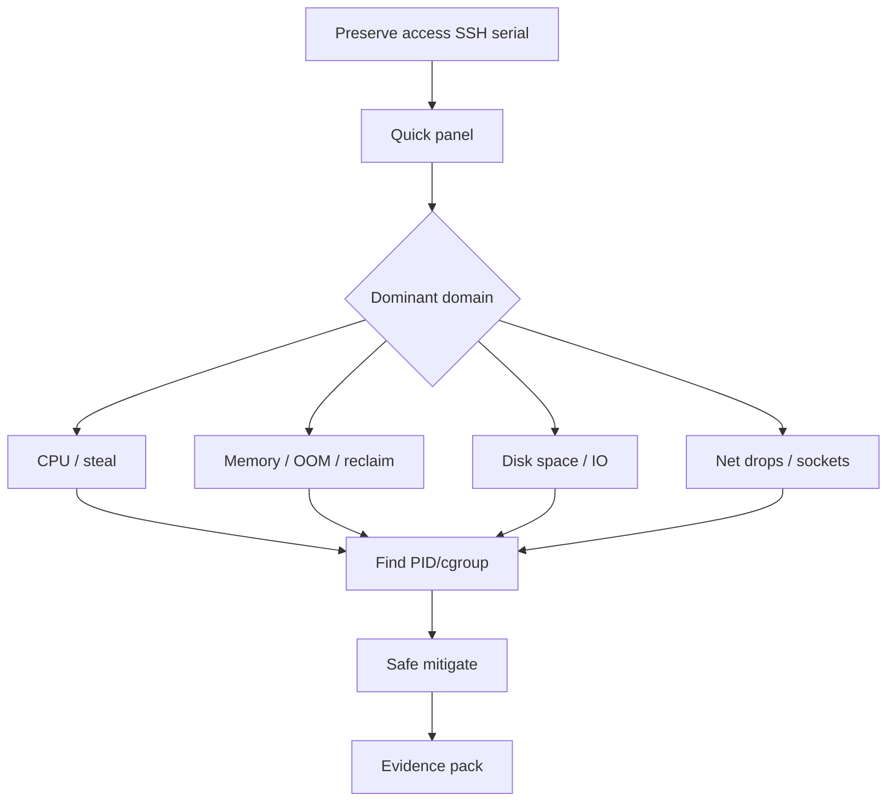
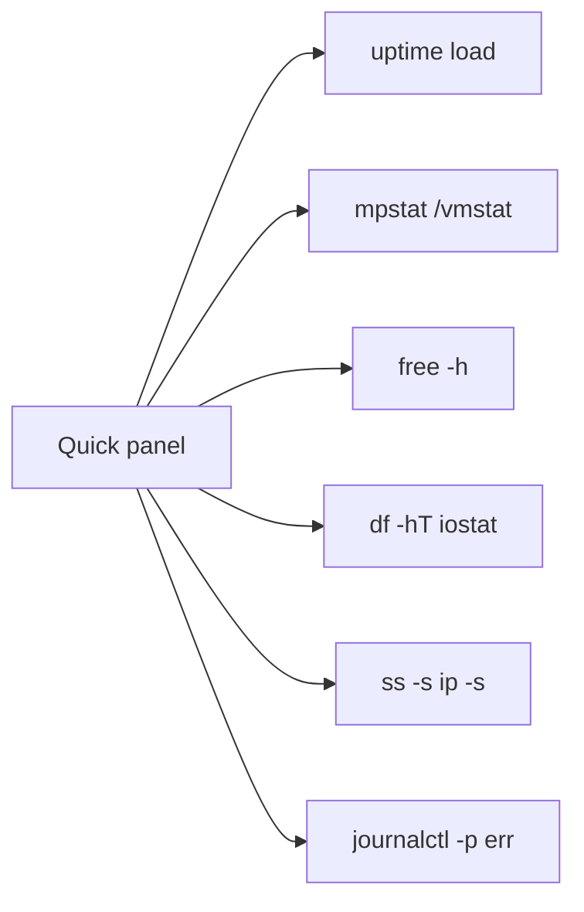
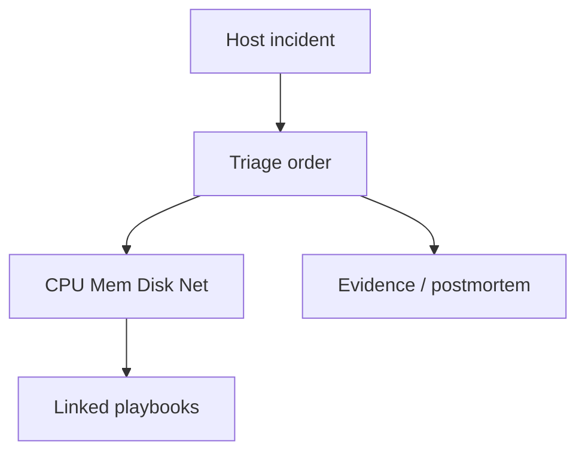

# Host Incident Triage Order CPU Mem Disk Net

## Overview

When a host is "sick," random tool-hopping wastes the incident. This note defines a **default triage order**—stabilize access → classify resource domain (CPU, memory, disk, network) → identify actor → mitigate → capture evidence—using a small, repeatable command set. It synthesizes performance and observability modules into an on-call spine.

Fleet paging/automation → DevOps; multi-service impact and error budgets → System Design.

## Learning Objectives

- Execute a timed first-five-minutes triage on a Linux host
- Classify symptoms into CPU / mem / disk / net (and steal/time)
- Pick first tools per domain without boiling the ocean
- Mitigate safely (cgroup limit, stop runaway, free space) before deep profiling
- Hand off escalations: fleet automation vs product SLO topology

## Prerequisites

- [[10-Linux/10-Performance-Tuning-and-Kernel-Knobs/CPU Saturation Steal and Run Queue|CPU Saturation Steal and Run Queue]]
- [[10-Linux/10-Performance-Tuning-and-Kernel-Knobs/Disk and Network Saturation Playbooks|Disk and Network Saturation Playbooks]]
- [[10-Linux/03-Memory-Swap-and-OOM/OOM Killer Scores and Policy|OOM Killer Scores and Policy]]
- [[10-Linux/08-Observability-Tracing-and-Profiling/strace and lsof First-Aid Tracing|strace and lsof First-Aid Tracing]]

## Difficulty

`intermediate`

## Estimated Time

- Reading: 1.5 hours
- Exercises: 2 hours
- Mini project: 3 hours

## History

Classic "USE method" (Utilization, Saturation, Errors) and Google/SRE on-call practices converged on resource-oriented triage. Linux's `/proc` made a universal first pass possible before specialized eBPF. Runbooks exist so 03:00 on-call does not invent order under stress.

## Problem It Solves

| Anti-pattern | Cost |
| --- | --- |
| Jump to `perf` immediately | Miss ENOSPC |
| Reboot first | Lose evidence |
| Tune sysctl mid-fire | New variables |
| Only watch app dashboard | Miss host steal/OOM |

## Internal Implementation

### Triage spine



### Quick panel (conceptual)



## Mermaid Diagrams

### Structure



### Sequence / Lifecycle — first 5 minutes

```mermaid
sequenceDiagram
    participant OC as On-call
    participant H as Host
    OC->>H: Can I login? serial?
    OC->>H: uptime; mpstat 1 3; free -h
    OC->>H: df -h; iostat -xz 1 3
    OC->>H: ss -s; ip -s link
    OC->>OC: Classify domain + actor hypothesis
    OC->>H: Mitigate (stop storm / free space / drain)
    OC->>H: Snapshot evidence
```

## Examples

### Minimal Example — classifier

```typescript
export type Domain = "cpu" | "mem" | "disk" | "net" | "unknown";

export function classify(s: {
  stealPct: number; cpuUsrPct: number; availMemPct: number;
  diskUtilPct: number; dfInodesPct: number; rxDropDelta: number;
}): Domain {
  if (s.availMemPct < 5 || s.dfInodesPct > 95) return "mem"; // mem or ENOSPC-inode → treat disk space via disk
  if (s.dfInodesPct > 95 || s.diskUtilPct > 85) return "disk";
  if (s.rxDropDelta > 0) return "net";
  if (s.stealPct > 10 || s.cpuUsrPct > 85) return "cpu";
  return "unknown";
}
```

### Production-Shaped Example — mitigate policy

```typescript
export type Mitigation =
  | { type: "nice-or-cpulimit"; pid: number }
  | { type: "free-disk"; path: string }
  | { type: "restart-unit"; unit: string }
  | { type: "drain-and-replace"; host: string };

export function preferNonDestructive(m: Mitigation[]): Mitigation | undefined {
  return m.find((x) => x.type === "nice-or-cpulimit" || x.type === "free-disk") ?? m[0];
}
```

## Trade-offs

| Dimension | Upside | Downside | When it matters |
| --- | --- | --- | --- |
| Fixed order | Speed under stress | May mis-order rare cases | Default on-call |
| Reboot | Quick clear | Evidence loss | Last resort |
| Deep profile early | Root cause | Slow MTTR | After stabilize |
| App-only view | Product context | Miss host | Always pair |

### When to Use

- Host-scoped pages (node NotReady, high load, instance unhealthy)
- "App slow" when metrics implicate one box
- Teaching junior on-call a spine

### When Not to Use

- Pure multi-service cascade with healthy hosts ([[09-System-Design/09-Failure-Modes-at-Product-Scale/Cascading Multi-Service Failure|Cascading Failure]])
- Replacing Security IR for compromise
- As excuse to skip evidence collection

## Exercises

1. Time yourself through the quick panel on a healthy lab host; script it.
2. Inject CPU burn, mem hog, disk fill, and SYN flood (lab); practice classification.
3. Write a one-page runbook card with commands only (no theory).
4. Decide reboot vs not for three scenarios; justify.
5. Map each domain to the matching module-10/03/05 playbook note.

## Mini Project

Workbench **triage CLI**: read fixture metrics → print domain + next three commands + mitigate suggestions.

## Portfolio Project

[[10-Linux/projects/Linux Host Workbench/README|Linux Host Workbench]] — interactive triage simulator with scored scenarios.

## Interview Questions

1. What do you run in the first five minutes on a bad host?
2. Load high, CPU idle—what next?
3. When is reboot acceptable?
4. How do cgroups change triage?
5. How do you know the incident is not host-local?

### Stretch / Staff-Level

1. Automate quick panel into a [[16-DevOps/README|DevOps]] node-problem diagnostic DaemonSet without auto-rebooting.
2. Tie host triage outcomes to [[09-System-Design/10-Observability-and-Control-Planes/SLIs SLOs Error Budgets for Multi-Service Systems|error budget]] burn alerts.

## Common Mistakes

- Rebooting before `journalctl`/`dmesg` capture
- Ignoring steal on cloud
- Clearing logs to "make space" without copying out
- Killing the wrong PID under fork bomb stress
- Tunnel vision on one dashboard

## Best Practices

- Stabilize access first (serial console readiness)
- Snapshot evidence early and often
- Prefer reversible mitigations
- Communicate domain hypothesis in the incident channel
- Link to detailed playbooks after classify

## DevOps Handoff

Auto-remediation, node rotation, and diagnostic bundling at fleet scale are [[16-DevOps/README|DevOps]]. This note defines the **human-viable order** those automations should encode carefully.

## System Design Handoff

If many hosts burn simultaneously, triage the **product dependency graph** and SLOs ([[09-System-Design/09-Failure-Modes-at-Product-Scale/Multi-Service Incident Playbooks|Multi-Service Incident Playbooks]]), not only one Linux box.

## Summary

Default order: access → quick panel → CPU/mem/disk/net classify → actor → mitigate → evidence. Speed comes from discipline, not from knowing every tool. Automate with care in DevOps; escalate multi-host product failure to System Design playbooks.

## Further Reading

- [[10-Linux/12-Incidents-Runbooks-and-Portfolio/Postmortem Evidence Collection on Linux|Postmortem Evidence Collection on Linux]]
- [[10-Linux/12-Incidents-Runbooks-and-Portfolio/Golden Signals on a Single Box|Golden Signals on a Single Box]]

## Related Notes

- [[10-Linux/00-Orientation-and-Boundaries/Failure Domains on a Single Host|Failure Domains on a Single Host]]
- [[09-System-Design/09-Failure-Modes-at-Product-Scale/Multi-Service Incident Playbooks|Multi-Service Incident Playbooks]]
- [[16-DevOps/README|DevOps]]

## Progress Checklist

- [ ] Explained from first principles
- [ ] Drew at least one Mermaid diagram
- [ ] Implemented a minimal version
- [ ] Documented trade-offs and non-goals
- [ ] Completed exercises
- [ ] Practiced interview questions aloud
- [ ] Linked prerequisites and dependents
