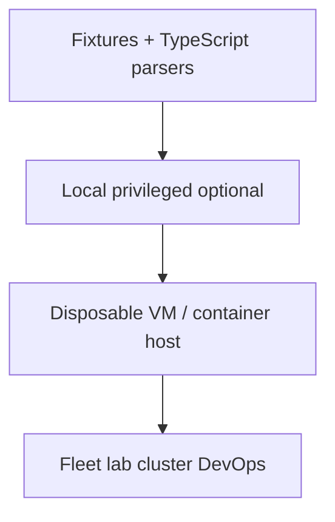
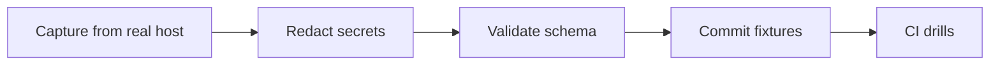
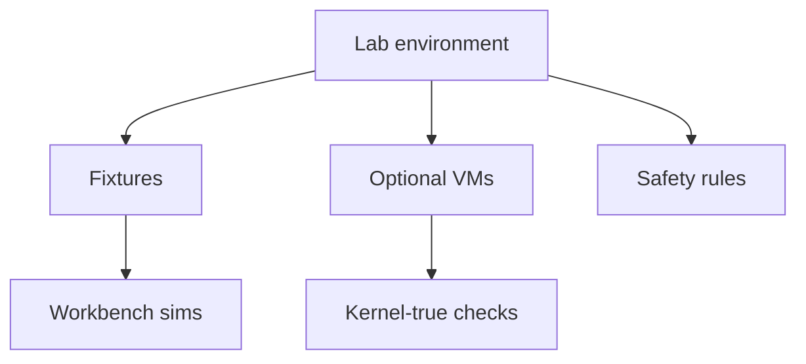
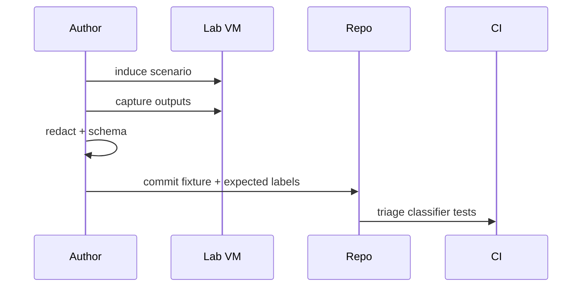

# Lab Environment and Reproducible Host Fixtures

## Overview

Linux ops skill grows faster when failures are **reproducible**. A lab environment plus **fixtures** (canned `/proc`, `sysfs`, `iostat`, journal snippets) lets TypeScript sims and runbook drills run in CI without privileged VMs—while optional real VMs cover kernel-true behavior.

This note specifies how the Linux track builds labs: fixture formats, determinism, isolation, and when to graduate from fixtures to throwaway VMs—handing fleet lab platforms to DevOps and multi-service game days to System Design.

## Learning Objectives

- Design fixture schemas for procfs/sysfs-like data used in Workbench
- Keep labs deterministic (seeded RNG, frozen timestamps)
- Separate unit-testable parsers from integration VM tests
- Document lab safety (no destructive commands on shared hosts)
- Hand off shared lab clusters to DevOps; game-day topology to System Design

## Prerequisites

- [[10-Linux/12-Incidents-Runbooks-and-Portfolio/Golden Signals on a Single Box|Golden Signals on a Single Box]]
- [[10-Linux/11-Packaging-Config-and-Automation-Basics/Configuration Drift and Idempotency Prelude|Configuration Drift and Idempotency Prelude]]
- [[10-Linux/code/README|Linux code labs]]

## Difficulty

`intermediate`

## Estimated Time

- Reading: 1 hour
- Exercises: 2 hours
- Mini project: 3 hours

## History

SRE game days and chaos engineering proved learning needs safe failure injection. Educational tracks historically said "run this on your laptop" and got irreproducible screenshots. Fixture-driven labs + optional Vagrant/cloud VMs mirror how serious platforms test node agents: fake `/proc` in unit tests, VM soak in integration.

## Problem It Solves

| Problem | Fixture/lab approach |
| --- | --- |
| CI cannot mount real disks | Canned iostat JSON |
| Flaky timestamps | Freeze clock in sims |
| Dangerous student commands | Allowlist + VM only |
| "Works on my distro" | Record fixture provenance |

## Internal Implementation

### Lab layers



### Fixture pipeline



## Mermaid Diagrams

### Structure



### Sequence / Lifecycle — author a fixture



## Examples

### Minimal Example — fixture header

```typescript
export type HostFixture = {
  id: string;
  capturedAt: string; // frozen ISO
  kernel: string;
  distro: string;
  scenario: "cpu-burn" | "steal" | "enospc" | "oom" | "rx-drops";
  files: Record<string, string>; // path → content
};
```

### Production-Shaped Example — determinism guard

```typescript
export function assertFrozenTime(fixture: HostFixture, now: string): void {
  if (fixture.capturedAt !== now) {
    // sims must inject fixture time, not wall clock
    throw new Error("lab clock not injected from fixture");
  }
}
```

## Trade-offs

| Dimension | Upside | Downside | When it matters |
| --- | --- | --- | --- |
| Fixtures only | Fast CI | Not kernel-true | Parsers/runbooks |
| Real VMs | Faithful | Cost/slow | IO/scheduler |
| Shared lab cluster | Collaboration | Noisy neighbors | Needs quotas |
| Student cloud accounts | Realistic | Billing risk | Guardrails |

### When to Use

- All parser and classifier unit tests
- Interview drills and portfolio demos offline
- Capturing known-good incident scenarios

### When Not to Use

- Claiming a fixture proves production kernel behavior for exotic drivers
- Running destructive fill-disk scripts on shared login hosts
- Committing secrets inside "realistic" captures

## Exercises

1. Capture `cat /proc/loadavg /proc/stat` into a fixture file; redact hostname if present elsewhere.
2. Write a schema validator for `HostFixture`.
3. Build two fixtures that should classify differently in the triage CLI.
4. List five commands forbidden on shared lab bastions.
5. Propose a VM smoke test matrix (distros × scenarios) for DevOps to host.

## Mini Project

Add `fixtures/README.md` conventions and three scenarios under Workbench; CI job fails if schema invalid or secret regex matches.

## Portfolio Project

[[10-Linux/projects/Linux Host Workbench/README|Linux Host Workbench]] — fixture library as a first-class portfolio artifact.

## Interview Questions

1. Why use fixtures instead of only live `/proc`?
2. How do you keep labs deterministic?
3. When must you use a real VM?
4. How do you sanitize captures?
5. How does this relate to chaos engineering?

### Stretch / Staff-Level

1. Design a disposable lab VPC with quotas in [[16-DevOps/README|DevOps]].
2. Extend fixtures to multi-host scenarios for [[09-System-Design/09-Failure-Modes-at-Product-Scale/Chaos Blast Radius and Dependency Failure|chaos blast radius]] drills without claiming full production fidelity.

## Common Mistakes

- Fixtures without provenance (kernel/distro)
- Wall-clock dependent tests
- Committing production host dumps
- One huge golden file instead of scenario packs
- No expected labels → untestable drills

## Best Practices

- Schema + validator in CI
- One scenario per fixture directory
- Frozen time and seeded RNG
- Redaction checklist
- Document VM-only tests clearly

## DevOps Handoff

Shared lab clusters, ephemeral VMs, and CI runners with KVM are [[16-DevOps/README|DevOps]] platform work. This note defines **fixture contracts** educational automation can consume.

## System Design Handoff

Reproducible **multi-service** failure drills (dependency chaos, region failover) belong to System Design game days. Host fixtures teach the node layer those drills still depend on.

## Summary

Reproducible Linux learning = schema'd fixtures for CI + optional disposable VMs for kernel truth + safety rules. Automate lab platforms in DevOps; stage product-scale chaos in System Design.

## Further Reading

- [[10-Linux/code/README|Linux code labs]]
- [[10-Linux/projects/Linux Host Workbench/README|Linux Host Workbench]]

## Related Notes

- [[10-Linux/12-Incidents-Runbooks-and-Portfolio/Linux Host Workbench Portfolio Map|Linux Host Workbench Portfolio Map]]
- [[10-Linux/12-Incidents-Runbooks-and-Portfolio/Postmortem Evidence Collection on Linux|Postmortem Evidence Collection on Linux]]
- [[16-DevOps/README|DevOps]]

## Progress Checklist

- [ ] Explained from first principles
- [ ] Drew at least one Mermaid diagram
- [ ] Implemented a minimal version
- [ ] Documented trade-offs and non-goals
- [ ] Completed exercises
- [ ] Practiced interview questions aloud
- [ ] Linked prerequisites and dependents
