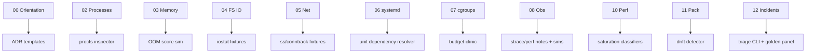
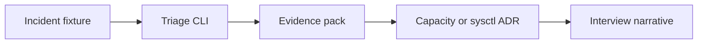
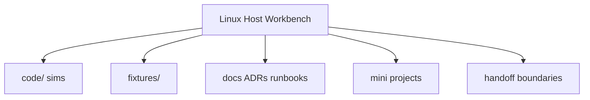
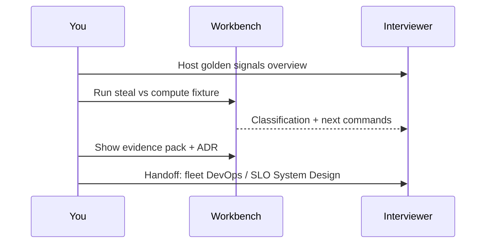

# Linux Host Workbench Portfolio Map

## Overview

The **Linux Host Workbench** is the portfolio spine of this track: TypeScript simulations, fixture-driven drills, ADRs, and runbooks that prove you can operate a host—not only recite man pages. This note maps modules → Workbench components → demo scripts → career talking points, and shows handoffs so the portfolio does not accidentally re-build DevOps platforms or System Design topologies.

## Learning Objectives

- Map each Linux module cluster to Workbench artifacts
- Assemble a demo path suitable for interviews (15 and 45 minutes)
- List ADRs and runbooks that must appear in `docs/`
- Separate host portfolio claims from Docker/K8s/DevOps claims
- Point multi-service SLO work to System Design portfolio pieces

## Prerequisites

- [[10-Linux/README|Linux]]
- [[10-Linux/12-Incidents-Runbooks-and-Portfolio/Lab Environment and Reproducible Host Fixtures|Lab Environment and Reproducible Host Fixtures]]
- [[10-Linux/projects/Linux Host Workbench/README|Linux Host Workbench]]

## Difficulty

`intermediate`

## Estimated Time

- Reading: 1 hour
- Exercises: 2 hours
- Mini project: portfolio assembly (ongoing)

## History

Engineering portfolios shifted from "list technologies" to **demonstrable systems**. Ops portfolios that only show certifications underperform those with runnable triage sims, ADRs, and postmortem samples. The Workbench pattern mirrors other Bible tracks (Algorithm Workbench, Backend Service Toolkit, Distributed Systems Workbench).

## Problem It Solves

| Weak portfolio | Workbench map |
| --- | --- |
| "I know Linux" | Runnable classifiers + fixtures |
| Undocumented sysctls | ADR pack |
| No incident story | Triage sim + evidence pack |
| Scope creep into K8s | Explicit handoff boundaries |

## Internal Implementation

### Module → artifact map



### Portfolio demo flow



## Mermaid Diagrams

### Structure



### Sequence / Lifecycle — interview demo (15 min)



## Examples

### Minimal Example — portfolio checklist type

```typescript
export type PortfolioGate = {
  triageCli: boolean;
  fixturesAtLeast: number;
  adrsAtLeast: number;
  runbooks: Array<"disk" | "net" | "cpu" | "oom">;
  evidencePackDoc: boolean;
  handoffSection: boolean;
};

export function portfolioReady(g: PortfolioGate): boolean {
  return (
    g.triageCli &&
    g.fixturesAtLeast >= 5 &&
    g.adrsAtLeast >= 3 &&
    g.runbooks.length >= 3 &&
    g.evidencePackDoc &&
    g.handoffSection
  );
}
```

### Production-Shaped Example — claim boundaries

```typescript
export const CLAIMS = {
  owns: [
    "host triage order",
    "procfs-driven classifiers",
    "sysctl ADR discipline",
    "single-box golden signals",
  ],
  doesNotOwn: [
    "Kubernetes controllers",
    "multi-region SLO design",
    "org-wide Ansible estate",
  ],
};
```

## Trade-offs

| Dimension | Upside | Downside | When it matters |
| --- | --- | --- | --- |
| Broad Workbench | Complete story | Scope risk | Prefer depth in triage+ADRs |
| Fixtures-only demo | Reliable | Less "wow" | Always have one VM clip optional |
| Many mini projects | Breadth | Shallow | Finish gates over count |
| Cross-link SD/DevOps | Honesty | Less ego | Interview trust |

### When to Use

- Capstone for the Linux track
- Interview prep and public GitHub demo
- Mentoring juniors through a shared map

### When Not to Use

- As a substitute for real on-call experience narratives—combine both
- To claim container orchestration expertise
- To dump every module equally—prioritize incidents + performance

## Exercises

1. Fill the module→artifact table for modules you have completed.
2. Script a 15-minute demo; time it.
3. Write the `CLAIMS.owns / doesNotOwn` section into Workbench README.
4. Pick three ADRs you will actually author next.
5. Link one System Design note and one DevOps note as explicit handoffs in the README.

## Mini Project

Create `docs/PORTFOLIO_MAP.md` in the Workbench copying this note's diagram and a checked gate list (`PortfolioGate`).

## Portfolio Project

[[10-Linux/projects/Linux Host Workbench/README|Linux Host Workbench]] — this map is the index; keep it updated as components land.

## Interview Questions

1. Walk me through your Linux portfolio—what can I run?
2. How do you show incident skill without prod access?
3. What do you explicitly *not* claim?
4. Show an ADR that changed a host default.
5. How does this relate to SRE vs platform engineering?

### Stretch / Staff-Level

1. Design a hiring rubric that scores Workbench demos fairly across candidates.
2. Explain how this host portfolio complements a [[09-System-Design/projects/Distributed Systems Workbench/README|Distributed Systems Workbench]] without overlap theater.

## Common Mistakes

- README screenshots only—no runnable entrypoint
- Scope creep into full observability platform
- No fixtures → flaky live demos
- Missing handoff language (sounds naive)
- ADRs without metrics

## Best Practices

- One `npm test` / `pnpm test` path for fixtures
- Demo script checked into repo
- ADRs + runbooks + evidence standard
- Explicit DevOps and System Design handoffs
- Keep Career track links for narrative polish

## DevOps Handoff

Image bake, fleet CM, CI runners, and lab VPCs are [[16-DevOps/README|DevOps]] portfolio/platform territory. Workbench may **simulate** drift detection; it should not pretend to be the org's Ansible estate.

## System Design Handoff

Multi-service SLOs, cascading failure drills, and topology ADRs live in [[09-System-Design/README|System Design]]. The Linux portfolio proves the **node failure domain** those designs sit on.

## Summary

The Workbench portfolio map ties Linux modules to runnable artifacts, demo scripts, and honest scope boundaries. Ship triage, fixtures, ADRs, and golden signals; automate fleets in DevOps; design product SLOs in System Design.

## Further Reading

- [[10-Linux/projects/Linux Host Workbench/README|Linux Host Workbench]]
- [[10-Linux/README|Linux README]]
- [[Career/README|Career]]

## Related Notes

- [[10-Linux/12-Incidents-Runbooks-and-Portfolio/Host Incident Triage Order CPU Mem Disk Net|Host Incident Triage Order CPU Mem Disk Net]]
- [[10-Linux/12-Incidents-Runbooks-and-Portfolio/Postmortem Evidence Collection on Linux|Postmortem Evidence Collection on Linux]]
- [[10-Linux/12-Incidents-Runbooks-and-Portfolio/Golden Signals on a Single Box|Golden Signals on a Single Box]]
- [[10-Linux/12-Incidents-Runbooks-and-Portfolio/Lab Environment and Reproducible Host Fixtures|Lab Environment and Reproducible Host Fixtures]]
- [[16-DevOps/README|DevOps]]
- [[09-System-Design/README|System Design]]

## Progress Checklist

- [ ] Explained from first principles
- [ ] Drew at least one Mermaid diagram
- [ ] Implemented a minimal version
- [ ] Documented trade-offs and non-goals
- [ ] Completed exercises
- [ ] Practiced interview questions aloud
- [ ] Linked prerequisites and dependents
