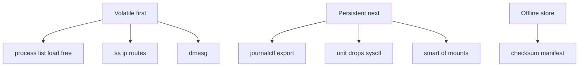
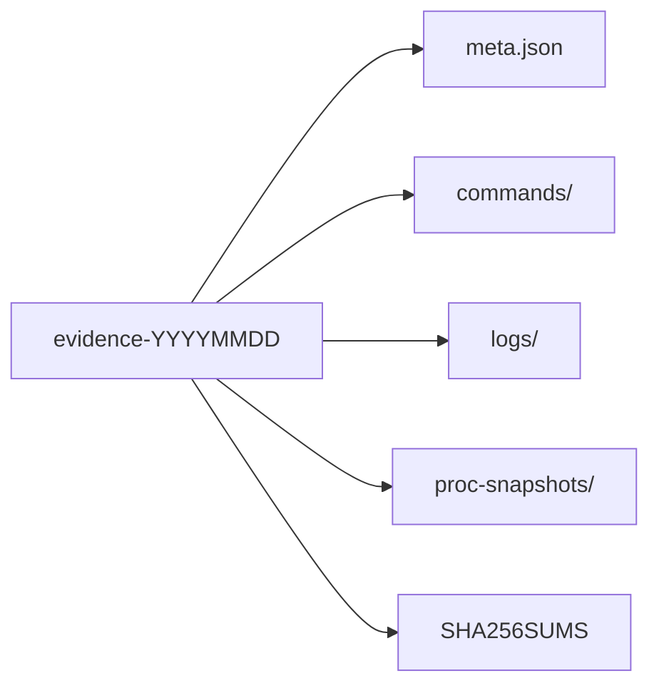
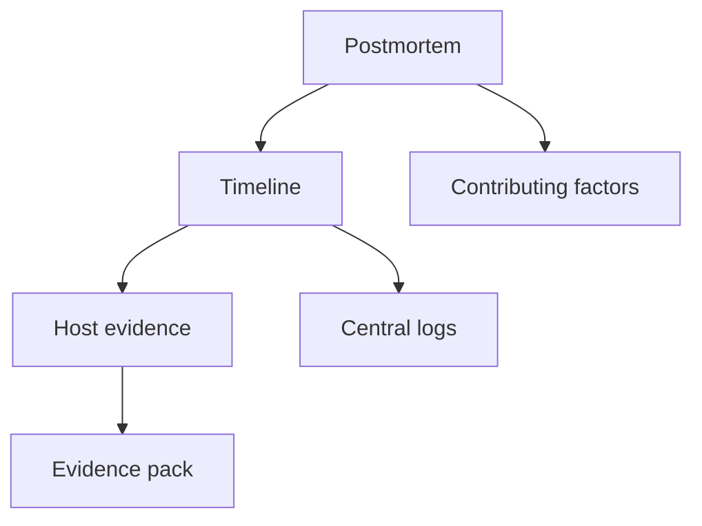
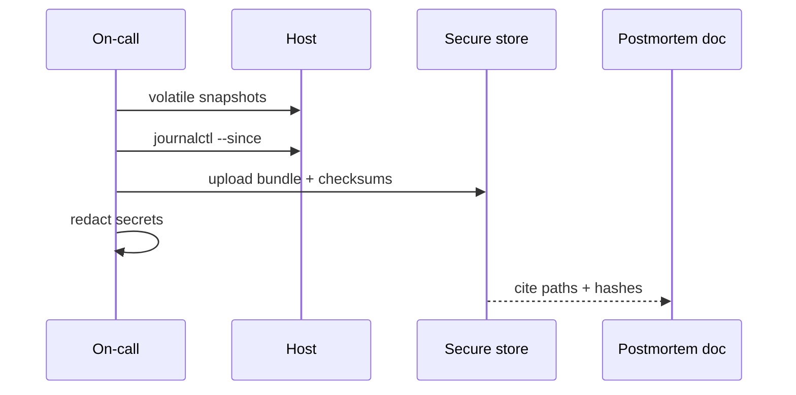

# Postmortem Evidence Collection on Linux

## Overview

A blameless postmortem without **evidence** becomes storytelling. On Linux, evidence is volatile: ring buffers rotate, journals vacuum, PIDs exit, and reboots wipe tmpfs. This note defines a practical **evidence pack**—what to capture, in what order, how to store it, and what not to collect (secrets, PII)—for host incidents.

Full IR/forensics depth → Security; fleet log pipelines → DevOps; multi-service timeline correlation → System Design.

## Learning Objectives

- List volatile vs persistent artifacts and capture order
- Build a repeatable evidence bundle script outline
- Preserve journald/dmesg/`sos`-like reports without leaking secrets
- Tie host artifacts to postmortem timeline and contributing factors
- Hand off central logging to DevOps; cross-service timelines to System Design

## Prerequisites

- [[10-Linux/12-Incidents-Runbooks-and-Portfolio/Host Incident Triage Order CPU Mem Disk Net|Host Incident Triage Order CPU Mem Disk Net]]
- [[10-Linux/06-systemd-Timers-and-Logging/journald Persistence and Rate Limits|journald Persistence and Rate Limits]]
- [[10-Linux/08-Observability-Tracing-and-Profiling/Logging Correlation on a Single Host|Logging Correlation on a Single Host]]

## Difficulty

`intermediate`

## Estimated Time

- Reading: 1.5 hours
- Exercises: 2 hours
- Mini project: 3 hours

## History

`sysreport`/`sosreport` traditions on enterprise Linux encoded "collect everything relevant." Cloud and containers shifted many logs off-box, but node-local evidence remains decisive for OOM, kernel oops, disk failure, and steal. GDPR and secret hygiene forced redaction into the collection culture.

## Problem It Solves

| Failure | Evidence discipline |
| --- | --- |
| Reboot wiped clues | Capture before reboot |
| "I think it was DNS" | Packet/resolv artifacts |
| Argument in postmortem | Shared bundle + hashes |
| Secret in ticket | Redaction checklist |

## Internal Implementation

### Capture priority



### Bundle contents (minimum)



## Mermaid Diagrams

### Structure



### Sequence / Lifecycle — collect → analyze → redact



## Examples

### Minimal Example — manifest entry

```typescript
export type EvidenceFile = {
  relativePath: string;
  sha256: string;
  collectedAt: string;
  command?: string;
};
```

### Production-Shaped Example — redaction gate

```typescript
const SECRETISH = /(PASSWORD|SECRET|TOKEN|AWS_|PRIVATE KEY)/i;

export function redactLine(line: string): string {
  return SECRETISH.test(line) ? "[REDACTED]" : line;
}
```

## Trade-offs

| Dimension | Upside | Downside | When it matters |
| --- | --- | --- | --- |
| Collect everything | Complete | Size, secrets | Prefer targeted + sos |
| Long journal retention | History | Disk | Balance vacuum |
| Live tcpdump | Proof | Overhead/PII | Short bounded capture |
| Immediate reboot | Recovery | Evidence loss | Only after capture |

### When to Use

- SEV host incidents heading to postmortem
- Before planned reboot/reimage
- Handoff between on-call shifts

### When Not to Use

- Replacing legal hold / Security IR when compromise suspected—escalate
- Pasting raw environ into Slack
- Infinite tcpdump on saturated NICs

## Exercises

1. Write a 15-line checklist ordered by volatility.
2. Practice `journalctl --since "1 hour ago" -o export` to a file (lab).
3. Create a fake bundle with SHA256SUMS; verify.
4. Find three secret patterns to redact in sample logs.
5. Map each contributing-factor claim to an artifact path.

## Mini Project

Workbench **evidence packer**: given fixture command outputs, write bundle layout + manifest + redaction pass; unit test that secrets do not appear in packed text.

## Portfolio Project

[[10-Linux/projects/Linux Host Workbench/README|Linux Host Workbench]] — `docs/EVIDENCE.md` standard referenced by postmortems.

## Interview Questions

1. What do you capture before rebooting?
2. How do you preserve journald for a window?
3. Why checksum evidence bundles?
4. How do you avoid secret leakage in collections?
5. Difference between host evidence and Security forensics?

### Stretch / Staff-Level

1. Design automated node diagnostic upload to [[16-DevOps/README|DevOps]] object storage with IAM and retention.
2. Correlate host bundles into a multi-service timeline under [[09-System-Design/09-Failure-Modes-at-Product-Scale/Multi-Service Incident Playbooks|Multi-Service Incident Playbooks]].

## Common Mistakes

- Rebooting first
- No timestamps / timezone confusion (prefer UTC)
- Overwriting the only copy during cleanup
- Collecting home directories wholesale
- Debating causes without artifacts

## Best Practices

- Capture early; label with incident ID
- UTC timestamps everywhere
- Manifest + checksums
- Redact before broad sharing
- Link bundle in postmortem template

## DevOps Handoff

Central logging, diagnostic DaemonSets, and retention buckets are [[16-DevOps/README|DevOps]]. Host collection remains the fallback when pipelines lag or the node cannot ship logs.

## System Design Handoff

Product postmortems need **cross-service causality**, not only one host tarball—see System Design incident playbooks and SLO burn analysis. Host evidence is one lane in the timeline.

## Summary

Order captures by volatility, pack with manifests, redact secrets, and cite artifacts in postmortems. Automate shipping in DevOps; assemble multi-service truth in System Design reviews.

## Further Reading

- `man journalctl`, sosreport/sysreport docs for your distro
- [[00-Templates/Postmortem Template|Postmortem Template]]

## Related Notes

- [[10-Linux/12-Incidents-Runbooks-and-Portfolio/Golden Signals on a Single Box|Golden Signals on a Single Box]]
- [[10-Linux/09-Security-Primitives-on-the-Host/File Integrity and Permission Drift|File Integrity and Permission Drift]]
- [[18-Security/README|Security]]

## Progress Checklist

- [ ] Explained from first principles
- [ ] Drew at least one Mermaid diagram
- [ ] Implemented a minimal version
- [ ] Documented trade-offs and non-goals
- [ ] Completed exercises
- [ ] Practiced interview questions aloud
- [ ] Linked prerequisites and dependents
