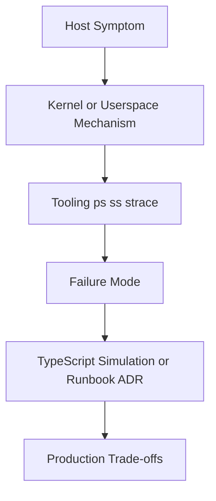
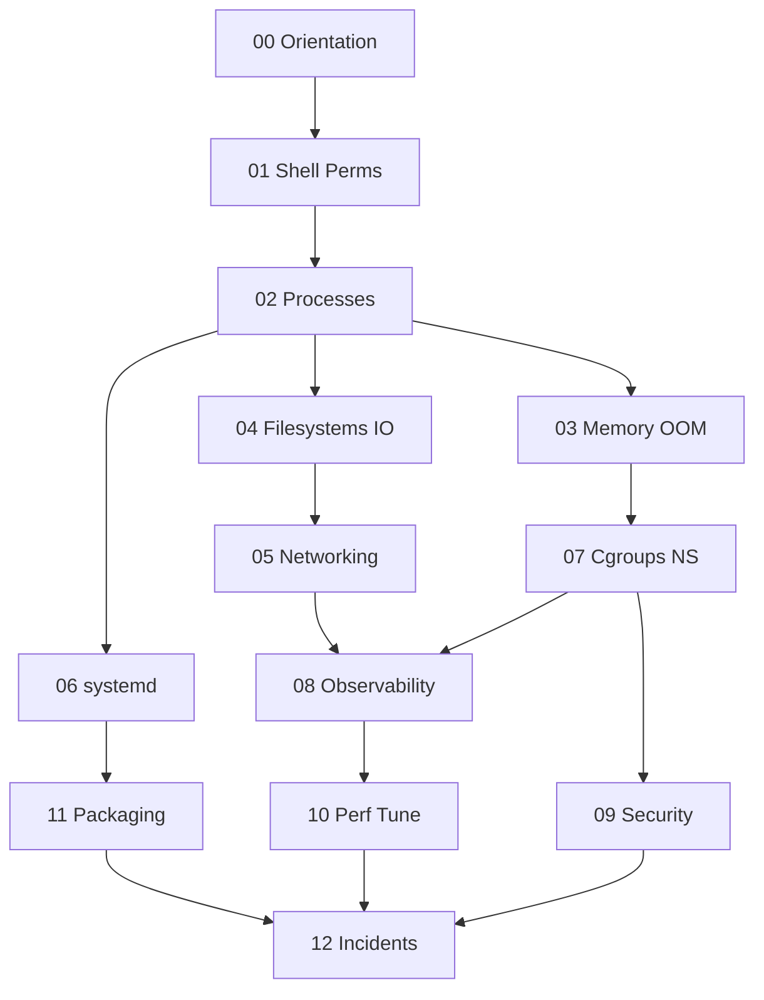

# 10 Linux

A first-principles track for **Linux host operations**: shell and permissions, processes and signals, memory and OOM, filesystems and disk I/O, networking and host firewalls, systemd and logging, cgroups and namespaces, observability (`strace`/`perf`/eBPF intro), host security primitives, performance tuning, packaging basics, and incident runbooks—implemented with TypeScript educational simulations and ADR-heavy ops artifacts.

## Objectives

- Operate a Linux host with explicit mental models for processes, memory, disk, and network
- Read `procfs`/`sysfs` and map symptoms to kernel/userspace mechanisms
- Manage services with systemd, timers, and journald without cargo-cult unit files
- Budget noisy neighbors with cgroup v2 and understand namespace isolation boundaries
- Triage with `strace`, `ss`, `iostat`, `perf`, and packet capture
- Hand off CS models, container orchestration, and CI platforms to their home tracks

## Why This Track Matters

Production outages often land on a box: OOM kills, ENOSPC, socket exhaustion, runaway nice-0 batch jobs, mis-mounted disks, and “it works in Docker” surprises that are really cgroup/namespace misunderstandings. Linux teaches the **host contracts** that Backend, Databases, System Design, and containers sit on.

## Teaching Contract

Every topic note follows:

## Scope Boundaries

| This track owns | Handoff |
| --- | --- |
| `ps`/`procfs`, signals, ulimits, zombies as *ops* | Process/PCB/syscall *models* → [[01-Computer-Science/README\|Computer Science]] |
| Page cache, swap pressure, OOM *policy on host* | Virtual memory *theory* → CS |
| Mounts, ext4/XFS ops, iostat, ENOSPC | DB buffer pool vs page cache depth → [[08-Databases/README\|Databases]] |
| `ss`, routing tables, nftables, tcpdump triage | Protocol layers / TCP theory → CS; product TLS → [[18-Security/README\|Security]] |
| systemd units, journald, timers | Fleet CI/CD / config management platforms → [[16-DevOps/README\|DevOps]] |
| cgroup v2 + namespaces as *host primitives* | Images, Docker Engine, K8s → [[14-Docker/README\|Docker]], [[15-Kubernetes/README\|Kubernetes]] |
| Capabilities, seccomp basics, SSH hardening checklist | Deep threat models / app auth → Security / [[07-Backend/README\|Backend]] |
| Host golden signals and incident triage order | Multi-service SLOs → [[09-System-Design/README\|System Design]] |

## Prerequisites

- [[01-Computer-Science/04-Processes-and-Execution/Processes|Processes]]
- [[01-Computer-Science/04-Processes-and-Execution/System Calls|System Calls]]
- [[01-Computer-Science/03-Memory-and-Addressing/Virtual Memory|Virtual Memory]]
- [[01-Computer-Science/06-IO-and-Persistence/Blocking Nonblocking and Multiplexed IO|Blocking Nonblocking and Multiplexed IO]]
- [[01-Computer-Science/07-Networking-Fundamentals/Layered Network Models|Layered Network Models]]

## Roadmap

## Topics

### 00 — Orientation and Boundaries

- [[10-Linux/00-Orientation-and-Boundaries/Why Linux Exists for Engineers|Why Linux Exists for Engineers]]
- [[10-Linux/00-Orientation-and-Boundaries/CS Models vs Linux Operations Boundaries|CS Models vs Linux Operations Boundaries]]
- [[10-Linux/00-Orientation-and-Boundaries/Distributions Kernel and Userspace|Distributions Kernel and Userspace]]
- [[10-Linux/00-Orientation-and-Boundaries/Failure Domains on a Single Host|Failure Domains on a Single Host]]
- [[10-Linux/00-Orientation-and-Boundaries/ADR Discipline for Host Decisions|ADR Discipline for Host Decisions]]

### 01 — Shell Filesystem Hierarchy and Permissions

- [[10-Linux/01-Shell-Filesystem-Hierarchy-and-Permissions/Shell Pipelines and Exit Status Contracts|Shell Pipelines and Exit Status Contracts]]
- [[10-Linux/01-Shell-Filesystem-Hierarchy-and-Permissions/Filesystem Hierarchy Standard and Path Semantics|Filesystem Hierarchy Standard and Path Semantics]]
- [[10-Linux/01-Shell-Filesystem-Hierarchy-and-Permissions/Users Groups and DAC Permissions|Users Groups and DAC Permissions]]
- [[10-Linux/01-Shell-Filesystem-Hierarchy-and-Permissions/ACLs Sticky Bits and Umask|ACLs Sticky Bits and Umask]]
- [[10-Linux/01-Shell-Filesystem-Hierarchy-and-Permissions/Finding Files Inodes and Links|Finding Files Inodes and Links]]

### 02 — Processes Signals and Job Control

- [[10-Linux/02-Processes-Signals-and-Job-Control/Process Lifecycle ps and procfs|Process Lifecycle ps and procfs]]
- [[10-Linux/02-Processes-Signals-and-Job-Control/Signals Delivery and Common Handlers|Signals Delivery and Common Handlers]]
- [[10-Linux/02-Processes-Signals-and-Job-Control/Job Control Nice and Affinity Ops|Job Control Nice and Affinity Ops]]
- [[10-Linux/02-Processes-Signals-and-Job-Control/Limits ulimit and rlimits|Limits ulimit and rlimits]]
- [[10-Linux/02-Processes-Signals-and-Job-Control/Zombies Orphans and Reaping Failures|Zombies Orphans and Reaping Failures]]

### 03 — Memory Swap and OOM

- [[10-Linux/03-Memory-Swap-and-OOM/Virtual Memory Ops RSS vs VSZ|Virtual Memory Ops RSS vs VSZ]]
- [[10-Linux/03-Memory-Swap-and-OOM/Page Cache Dirty Writeback and Drop Caches Myths|Page Cache Dirty Writeback and Drop Caches Myths]]
- [[10-Linux/03-Memory-Swap-and-OOM/Swap Pressure and thrashing Symptoms|Swap Pressure and thrashing Symptoms]]
- [[10-Linux/03-Memory-Swap-and-OOM/OOM Killer Scores and Policy|OOM Killer Scores and Policy]]
- [[10-Linux/03-Memory-Swap-and-OOM/NUMA Basics for Host Operators|NUMA Basics for Host Operators]]

### 04 — Filesystems Disks and IO

- [[10-Linux/04-Filesystems-Disks-and-IO/Block Devices Partitions and Mounts|Block Devices Partitions and Mounts]]
- [[10-Linux/04-Filesystems-Disks-and-IO/ext4 and XFS Operational Differences|ext4 and XFS Operational Differences]]
- [[10-Linux/04-Filesystems-Disks-and-IO/Disk IO Queuing iostat and Latency|Disk IO Queuing iostat and Latency]]
- [[10-Linux/04-Filesystems-Disks-and-IO/Inodes Quotas and ENOSPC Failure Modes|Inodes Quotas and ENOSPC Failure Modes]]
- [[10-Linux/04-Filesystems-Disks-and-IO/fsync Durability Contracts for Operators|fsync Durability Contracts for Operators]]

### 05 — Networking Stack and Host Firewall

- [[10-Linux/05-Networking-Stack-and-Host-Firewall/Interfaces Addressing and Routing Tables|Interfaces Addressing and Routing Tables]]
- [[10-Linux/05-Networking-Stack-and-Host-Firewall/TCP UDP Sockets ss and Conntrack|TCP UDP Sockets ss and Conntrack]]
- [[10-Linux/05-Networking-Stack-and-Host-Firewall/DNS Resolvers and nsswitch Ops|DNS Resolvers and nsswitch Ops]]
- [[10-Linux/05-Networking-Stack-and-Host-Firewall/nftables and Firewalld Operator Model|nftables and Firewalld Operator Model]]
- [[10-Linux/05-Networking-Stack-and-Host-Firewall/Packet Capture tcpdump and Wireshark Triage|Packet Capture tcpdump and Wireshark Triage]]

### 06 — systemd Timers and Logging

- [[10-Linux/06-systemd-Timers-and-Logging/Unit Types Dependencies and Targets|Unit Types Dependencies and Targets]]
- [[10-Linux/06-systemd-Timers-and-Logging/Service Hardening Directives|Service Hardening Directives]]
- [[10-Linux/06-systemd-Timers-and-Logging/Timers vs Cron Operational Choice|Timers vs Cron Operational Choice]]
- [[10-Linux/06-systemd-Timers-and-Logging/journald Persistence and Rate Limits|journald Persistence and Rate Limits]]
- [[10-Linux/06-systemd-Timers-and-Logging/Boot Rescue Targets and Failed Units|Boot Rescue Targets and Failed Units]]

### 07 — Cgroups Namespaces and Isolation

- [[10-Linux/07-Cgroups-Namespaces-and-Isolation/cgroup v2 Controllers CPU Memory IO|cgroup v2 Controllers CPU Memory IO]]
- [[10-Linux/07-Cgroups-Namespaces-and-Isolation/Namespaces Types and Isolation Boundaries|Namespaces Types and Isolation Boundaries]]
- [[10-Linux/07-Cgroups-Namespaces-and-Isolation/Resource Budgets and Noisy Neighbor Containment|Resource Budgets and Noisy Neighbor Containment]]
- [[10-Linux/07-Cgroups-Namespaces-and-Isolation/User Namespaces Capabilities and Privilege Drops|User Namespaces Capabilities and Privilege Drops]]
- [[10-Linux/07-Cgroups-Namespaces-and-Isolation/From Host Primitives to Containers Handoff|From Host Primitives to Containers Handoff]]

### 08 — Observability Tracing and Profiling

- [[10-Linux/08-Observability-Tracing-and-Profiling/Metrics from procfs and sysfs|Metrics from procfs and sysfs]]
- [[10-Linux/08-Observability-Tracing-and-Profiling/strace and lsof First-Aid Tracing|strace and lsof First-Aid Tracing]]
- [[10-Linux/08-Observability-Tracing-and-Profiling/perf CPU Profiles and Flame Graph Intuition|perf CPU Profiles and Flame Graph Intuition]]
- [[10-Linux/08-Observability-Tracing-and-Profiling/eBPF Intro for Operators|eBPF Intro for Operators]]
- [[10-Linux/08-Observability-Tracing-and-Profiling/Logging Correlation on a Single Host|Logging Correlation on a Single Host]]

### 09 — Security Primitives on the Host

- [[10-Linux/09-Security-Primitives-on-the-Host/Capabilities vs root All-Powerful Myth|Capabilities vs root All-Powerful Myth]]
- [[10-Linux/09-Security-Primitives-on-the-Host/seccomp and Syscall Filtering Basics|seccomp and Syscall Filtering Basics]]
- [[10-Linux/09-Security-Primitives-on-the-Host/File Integrity and Permission Drift|File Integrity and Permission Drift]]
- [[10-Linux/09-Security-Primitives-on-the-Host/SSH Hardening Operator Checklist|SSH Hardening Operator Checklist]]
- [[10-Linux/09-Security-Primitives-on-the-Host/Kernel Hardening Sysctl Surface|Kernel Hardening Sysctl Surface]]

### 10 — Performance Tuning and Kernel Knobs

- [[10-Linux/10-Performance-Tuning-and-Kernel-Knobs/CPU Saturation Steal and Run Queue|CPU Saturation Steal and Run Queue]]
- [[10-Linux/10-Performance-Tuning-and-Kernel-Knobs/Disk and Network Saturation Playbooks|Disk and Network Saturation Playbooks]]
- [[10-Linux/10-Performance-Tuning-and-Kernel-Knobs/sysctl Trade-offs Documentation Discipline|sysctl Trade-offs Documentation Discipline]]
- [[10-Linux/10-Performance-Tuning-and-Kernel-Knobs/Transparent Huge Pages and Allocator Footguns|Transparent Huge Pages and Allocator Footguns]]
- [[10-Linux/10-Performance-Tuning-and-Kernel-Knobs/Capacity Signals Before Buying Hardware|Capacity Signals Before Buying Hardware]]

### 11 — Packaging Config and Automation Basics

- [[10-Linux/11-Packaging-Config-and-Automation-Basics/Package Managers Deb Rpm Mental Model|Package Managers Deb Rpm Mental Model]]
- [[10-Linux/11-Packaging-Config-and-Automation-Basics/Configuration Drift and Idempotency Prelude|Configuration Drift and Idempotency Prelude]]
- [[10-Linux/11-Packaging-Config-and-Automation-Basics/Environment Files Secrets on Disk Anti-Patterns|Environment Files Secrets on Disk Anti-Patterns]]
- [[10-Linux/11-Packaging-Config-and-Automation-Basics/Time NTP Chrony and Clock Skew Ops|Time NTP Chrony and Clock Skew Ops]]
- [[10-Linux/11-Packaging-Config-and-Automation-Basics/Kernel Modules and Device Nodes Basics|Kernel Modules and Device Nodes Basics]]

### 12 — Incidents Runbooks and Portfolio

- [[10-Linux/12-Incidents-Runbooks-and-Portfolio/Host Incident Triage Order CPU Mem Disk Net|Host Incident Triage Order CPU Mem Disk Net]]
- [[10-Linux/12-Incidents-Runbooks-and-Portfolio/Postmortem Evidence Collection on Linux|Postmortem Evidence Collection on Linux]]
- [[10-Linux/12-Incidents-Runbooks-and-Portfolio/Golden Signals on a Single Box|Golden Signals on a Single Box]]
- [[10-Linux/12-Incidents-Runbooks-and-Portfolio/Lab Environment and Reproducible Host Fixtures|Lab Environment and Reproducible Host Fixtures]]
- [[10-Linux/12-Incidents-Runbooks-and-Portfolio/Linux Host Workbench Portfolio Map|Linux Host Workbench Portfolio Map]]

## Suggested Study Order

1. Orientation (00) and Shell/Permissions (01) before processes
2. Processes (02) and Memory (03) before filesystems and networking
3. Filesystems (04), Networking (05), systemd (06) as core host ops
4. Cgroups/Namespaces (07) before containers handoff and security
5. Observability (08), Security (09), Performance (10) as diagnosis depth
6. Packaging (11) and Incidents (12) as production synthesis

## Mini Projects

- [[10-Linux/projects/Procfs Inspector Lab/README|Procfs Inspector Lab]]
- [[10-Linux/projects/Cgroup Budget Clinic/README|Cgroup Budget Clinic]]
- [[10-Linux/projects/Host Network Triage Toolkit/README|Host Network Triage Toolkit]]
- [[10-Linux/projects/systemd Unit Workshop/README|systemd Unit Workshop]]
- [[10-Linux/projects/Observability First-Aid Kit/README|Observability First-Aid Kit]]

## Portfolio Project

- [[10-Linux/projects/Linux Host Workbench/README|Linux Host Workbench]]

## Exercises

Module sets live under [[10-Linux/_exercises/README|Linux Exercises]].

## Interview Questions

Module sets live under [[10-Linux/_interview/README|Linux Interview Questions]].

## Implementation Checklist

- [x] procfs status/stat parser
- [x] permission/ACL evaluator
- [x] signal disposition + rlimit checker
- [x] page-cache / dirty-ratio sketch + OOM score selector
- [x] mount table + ENOSPC simulator
- [x] socket/ss-like connection table fixture
- [x] cgroup v2 budget enforcer + namespace isolation sketch
- [x] systemd unit dependency resolver
- [x] journal-like ring log with rate limit
- [x] Five mini projects + Linux Host Workbench

## Code Labs

See [[10-Linux/code/README|Linux code labs]].

## References

- [[00-References/Linux/README|Linux References]]

## Related Tracks

- [[01-Computer-Science/README|Computer Science]]
- [[06-NodeJS/README|Node.js]]
- [[07-Backend/README|Backend]]
- [[08-Databases/README|Databases]]
- [[09-System-Design/README|System Design]]
- [[14-Docker/README|Docker]]
- [[15-Kubernetes/README|Kubernetes]]
- [[16-DevOps/README|DevOps]]
- [[18-Security/README|Security]]
- [[Career/README|Career]]

## Stage Gate Checklist

- [ ] Can map host symptoms to CPU/mem/disk/net and pick first tools
- [ ] Can read procfs/cgroup/systemd artifacts without cargo-culting
- [ ] Can explain namespace+cgroup handoff to containers without conflating Docker
- [ ] Labs green; at least three mini projects and portfolio docs completed
- [ ] Interview sets practiced with diagrams and production failure modes
