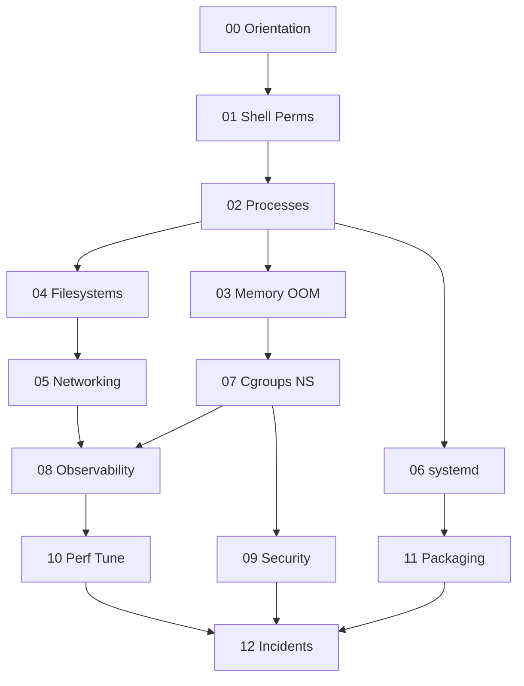

# Linux Exercises

Thirteen module sets move from host boundaries and ADRs through shell/permissions, processes and signals, memory/OOM, filesystems and disk I/O, networking and firewalls, systemd and journald, cgroups/namespaces, observability, host security, performance knobs, packaging/config drift, and incident runbook portfolio synthesis.

## Learning Path

## Exercise Sets

1. [[10-Linux/_exercises/00-Orientation-and-Boundaries|00 Orientation and Boundaries]] — separate Linux ops from CS models, map single-host failure domains, draft host ADRs before cargo-cult commands
2. [[10-Linux/_exercises/01-Shell-Filesystem-Hierarchy-and-Permissions|01 Shell Filesystem Hierarchy and Permissions]] — pipelines and exit status, FHS paths, DAC/ACL/umask, inodes and links
3. [[10-Linux/_exercises/02-Processes-Signals-and-Job-Control|02 Processes Signals and Job Control]] — procfs lifecycle, signals, nice/affinity, rlimits, zombies and reaping
4. [[10-Linux/_exercises/03-Memory-Swap-and-OOM|03 Memory Swap and OOM]] — RSS vs VSZ, page cache myths, swap thrashing, OOM scores, NUMA ops basics
5. [[10-Linux/_exercises/04-Filesystems-Disks-and-IO|04 Filesystems Disks and IO]] — mounts, ext4/XFS ops, iostat latency, inodes/ENOSPC, fsync durability contracts
6. [[10-Linux/_exercises/05-Networking-Stack-and-Host-Firewall|05 Networking Stack and Host Firewall]] — routing, ss/conntrack, DNS/nsswitch, nftables/firewalld, packet capture triage
7. [[10-Linux/_exercises/06-systemd-Timers-and-Logging|06 systemd Timers and Logging]] — units/targets, hardening directives, timers vs cron, journald limits, rescue/failed units
8. [[10-Linux/_exercises/07-Cgroups-Namespaces-and-Isolation|07 Cgroups Namespaces and Isolation]] — cgroup v2 controllers, namespace boundaries, noisy neighbors, capabilities, containers handoff
9. [[10-Linux/_exercises/08-Observability-Tracing-and-Profiling|08 Observability Tracing and Profiling]] — procfs/sysfs metrics, strace/lsof, perf flames, eBPF intro, host log correlation
10. [[10-Linux/_exercises/09-Security-Primitives-on-the-Host|09 Security Primitives on the Host]] — capabilities, seccomp, permission drift, SSH hardening, kernel sysctl surface
11. [[10-Linux/_exercises/10-Performance-Tuning-and-Kernel-Knobs|10 Performance Tuning and Kernel Knobs]] — CPU steal/run queue, disk/net saturation, sysctl discipline, THP footguns, capacity before hardware
12. [[10-Linux/_exercises/11-Packaging-Config-and-Automation-Basics|11 Packaging Config and Automation Basics]] — deb/rpm model, config drift, secrets anti-patterns, chrony skew, modules/device nodes
13. [[10-Linux/_exercises/12-Incidents-Runbooks-and-Portfolio|12 Incidents Runbooks and Portfolio]] — triage order, evidence collection, golden signals, lab fixtures, Host Workbench portfolio

## Completion Standard

- State host symptom, mechanism, and first tool before changing knobs.
- Progress through **Understand → Observe → Model → Stress Failure → Production Scenario** with diagrams and ADRs.
- Prefer host contracts over cargo-cult commands; hand off CS theory, containers, and fleet platforms where appropriate.
- Stress drills must name blast radius on the box, degradation path, and rollback.
- Production scenarios include telemetry, change control, and evidence for postmortems.

## Related Notes

- [[10-Linux/README|Linux]]
- [[10-Linux/code/README|Linux code labs]]
- [[10-Linux/_interview/README|Linux Interview Questions]]
- [[Career/README|Career]]
