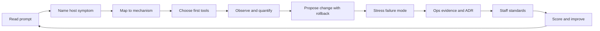

# Linux Interview Questions

Thirteen interview sets assess host boundary judgment, shell/permissions contracts, process and signal ops, memory/OOM policy, filesystem and disk triage, networking/firewall first aid, systemd/journald, cgroup/namespace isolation, observability tooling, host security primitives, performance knobs, packaging/drift discipline, and staff-level incident portfolio judgment.

## Practice Loop

## Interview Sets

1. [[10-Linux/_interview/00-Orientation-and-Boundaries|00 Orientation and Boundaries]]
2. [[10-Linux/_interview/01-Shell-Filesystem-Hierarchy-and-Permissions|01 Shell Filesystem Hierarchy and Permissions]]
3. [[10-Linux/_interview/02-Processes-Signals-and-Job-Control|02 Processes Signals and Job Control]]
4. [[10-Linux/_interview/03-Memory-Swap-and-OOM|03 Memory Swap and OOM]]
5. [[10-Linux/_interview/04-Filesystems-Disks-and-IO|04 Filesystems Disks and IO]]
6. [[10-Linux/_interview/05-Networking-Stack-and-Host-Firewall|05 Networking Stack and Host Firewall]]
7. [[10-Linux/_interview/06-systemd-Timers-and-Logging|06 systemd Timers and Logging]]
8. [[10-Linux/_interview/07-Cgroups-Namespaces-and-Isolation|07 Cgroups Namespaces and Isolation]]
9. [[10-Linux/_interview/08-Observability-Tracing-and-Profiling|08 Observability Tracing and Profiling]]
10. [[10-Linux/_interview/09-Security-Primitives-on-the-Host|09 Security Primitives on the Host]]
11. [[10-Linux/_interview/10-Performance-Tuning-and-Kernel-Knobs|10 Performance Tuning and Kernel Knobs]]
12. [[10-Linux/_interview/11-Packaging-Config-and-Automation-Basics|11 Packaging Config and Automation Basics]]
13. [[10-Linux/_interview/12-Incidents-Runbooks-and-Portfolio|12 Incidents Runbooks and Portfolio]]

## Evaluation Standard

- Answers open with symptom → mechanism → first tool—not command laundry lists.
- Observation answers name concrete artifacts (`/proc`, `ss`, `iostat`, journal, cgroup files).
- Resource answers distinguish usage vs pressure (RSS vs reclaim, %util vs await, run queue vs steal).
- Isolation answers separate namespaces from cgroups and hand off containers correctly.
- Failure answers name blast radius on the host, rollback, and evidence trail.
- Staff answers include ADRs, change discipline, and org-level host standards.

## Related Notes

- [[Career/README|Career]]
- [[10-Linux/_exercises/README|Linux Exercises]]
- [[10-Linux/code/README|Linux code labs]]
- [[10-Linux/README|Linux]]
