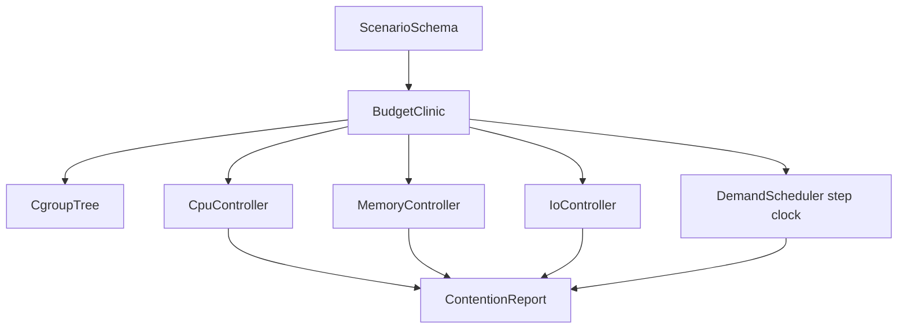

# Architecture — Cgroup Budget Clinic

## Summary

A step-clock TypeScript contention simulator for **cgroup v2 budgets**. Scenario JSON in → throttle/OOM/fairness report out. Target module: `10-Linux/code/src/cgroup-budget-clinic.ts`. Teaching default is unified hierarchy v2 ([[10-Linux/projects/Linux Host Workbench/ADR/ADR-002 cgroup v2 Teaching Default|ADR-002]]).

## Component Diagram

## Formula / Contract Boundaries (Scaffold)

| Controller | Teaching model | Explicit non-claim |
| --- | --- | --- |
| `cpu.max` | quota/period tokens per step; throttle when exhausted | Not full CFS share math |
| `cpu.weight` | optional relative weights among siblings | Not production fair-share proof |
| `memory.max` | hard cap; reclaim budget then OOM kill lowest score | Not kernel reclaim heuristics |
| `io.max` | per-step byte/IOPS caps | Not blk-mq / elevator fidelity |
| Hierarchy | Single unified tree | No v1 dual-hierarchy default |

## Scaffold Notes

1. Reject legacy v1 controller file names in default mode; optional contrast fixture may label itself `legacy-v1` for teaching diffs.
2. Bound tree depth, leaves, and steps; return `LIMIT_EXCEEDED` early.
3. Keep OOM victim selection policy injectable for tests (score ascending).
4. Pair with [[10-Linux/07-Cgroups-Namespaces-and-Isolation/Resource Budgets and Noisy Neighbor Containment|Resource Budgets and Noisy Neighbor Containment]].

## Related Documents

- [[10-Linux/projects/Cgroup Budget Clinic/README|README]]
- [[10-Linux/projects/Linux Host Workbench/API|Workbench API]]
- [[10-Linux/projects/Linux Host Workbench/ADR/ADR-002 cgroup v2 Teaching Default|ADR-002]]
- [[10-Linux/projects/Linux Host Workbench/ADR/ADR-005 Host vs Container Boundary|ADR-005]]
