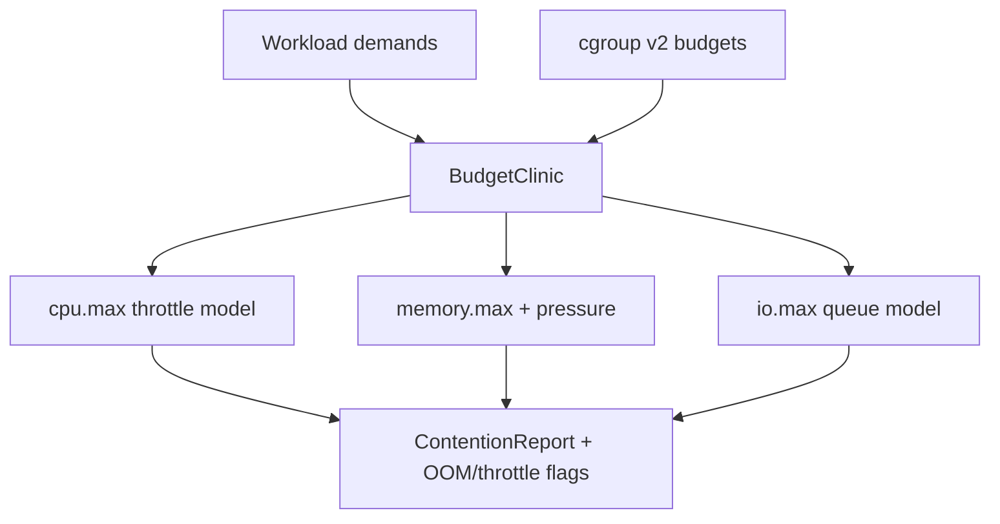

# Cgroup Budget Clinic

## Overview

Simulate **cgroup v2 CPU, memory, and IO budgets** against competing workloads so learners can see noisy-neighbor containment, throttle vs OOM outcomes, and budget math—without requiring Docker, Kubernetes, or live cgroup mounts in CI.

## Goals

- Encode cgroup v2 controller knobs (`cpu.max`, `memory.max`, `io.max`) as typed budgets.
- Run deterministic contention scenarios: fair share, hard cap, memory pressure → reclaim/OOM path.
- Report throttle time, reclaim events, and who got killed under explicit policies.
- Default teaching surface to **cgroup v2 unified hierarchy** (ADR-002).

## Prerequisites

- [[10-Linux/07-Cgroups-Namespaces-and-Isolation/cgroup v2 Controllers CPU Memory IO|cgroup v2 Controllers CPU Memory IO]]
- [[10-Linux/07-Cgroups-Namespaces-and-Isolation/Resource Budgets and Noisy Neighbor Containment|Resource Budgets and Noisy Neighbor Containment]]
- [[10-Linux/07-Cgroups-Namespaces-and-Isolation/Namespaces Types and Isolation Boundaries|Namespaces Types and Isolation Boundaries]]
- [[10-Linux/07-Cgroups-Namespaces-and-Isolation/From Host Primitives to Containers Handoff|From Host Primitives to Containers Handoff]]
- [[10-Linux/projects/Linux Host Workbench/ADR/ADR-002 cgroup v2 Teaching Default|ADR-002]]
- [[10-Linux/code/README|Linux Code Labs]]

## Architecture

See [[10-Linux/projects/Cgroup Budget Clinic/Architecture|Architecture]] for controller boundaries.

## Spec

| Concern | Spec |
| --- | --- |
| Inputs | Hierarchy JSON: cgroup tree, controller max values, per-leaf demand timelines |
| Outputs | Per-cgroup utilization, throttle ticks, reclaim/OOM events, fairness summary |
| Determinism | Step clock only; same scenario → identical JSON |
| Honesty | Not the Linux kernel CFS/mm; teaching model with documented gaps |
| Limits | Cap tree depth, leaf count, and step count |
| Code targets | `cgroup-budget-clinic.ts`; tests under `10-Linux/code/tests` |

## Acceptance Criteria

- [ ] Accepts typed cgroup v2 hierarchy + demand timelines; rejects v1-only controller names by default (ADR-002).
- [ ] CPU model applies `cpu.max` quota/period and records throttle ticks.
- [ ] Memory model enforces `memory.max` with reclaim-then-OOM policy hooks.
- [ ] IO model applies byte/IOPS caps and flags saturation.
- [ ] Noisy-neighbor scenario shows isolation when budgets differ vs shared uncapped parent.
- [ ] Unit tests require no live `/sys/fs/cgroup` (ADR-001).
- [ ] Export wires into [[10-Linux/projects/Linux Host Workbench/README|Linux Host Workbench]] facade.

## Stretch

1. Weighted `cpu.weight` fairness comparison vs hard `cpu.max`.
2. Memory pressure PSI-style synthetic signals for triage demos.
3. Explicit handoff lab: same budget numbers as container runtime limits (ADR-005).

## Related Notes

- [[10-Linux/projects/Cgroup Budget Clinic/Architecture|Architecture]]
- [[10-Linux/projects/Linux Host Workbench/README|Linux Host Workbench]]
- [[10-Linux/README|Linux MOC]]
- [[10-Linux/code/README|Linux Code Labs]]
- [[10-Linux/projects/Linux Host Workbench/ADR/ADR-005 Host vs Container Boundary|ADR-005]]
- [[14-Docker/README|Docker]]
- [[Career/README|Career]]

## Progress Checklist

- [ ] Scaffold `cgroup-budget-clinic` module + Vitest fixtures
- [ ] Wire CLI command `lhw cgroup run --scenario … --json`
- [ ] Golden noisy-neighbor + OOM fixtures
- [ ] Document sim gaps vs real kernel controllers
- [ ] Mark mini project complete in track Implementation Checklist
