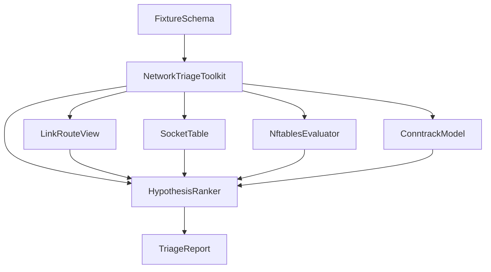

# Architecture — Host Network Triage Toolkit

## Summary

Fixture-driven TypeScript triage for host networking. Dump JSON in → ranked hypotheses + sample packet verdicts out. Target module: `10-Linux/code/src/host-network-triage.ts`. Firewall teaching default is **nftables** ([[10-Linux/projects/Linux Host Workbench/ADR/ADR-004 nftables over Legacy iptables Teaching Default|ADR-004]]).

## Component Diagram

## Formula / Contract Boundaries (Scaffold)

| Concern | Teaching contract | Explicit non-claim |
| --- | --- | --- |
| Routes | Longest-prefix match on fixture table | Not full fib/netlink |
| Sockets | State counts + listen conflicts | Not exact `ss` formatting |
| nftables | Ordered chain rules: ip/tcp/udp match → accept/drop/reject | Not sets/maps/conntrack helpers full surface |
| Conntrack | Entry count vs watermark | Not nf_conntrack hash realism |
| Capture | Optional bounded frame list | Not Wireshark/dissector engine |

## Scaffold Notes

1. Prefer nftables rule DSL in fixtures; mark iptables contrast fixtures explicitly.
2. Cap rows/rules/packets; jail optional file paths.
3. Hypothesis ranker returns stable ordering for golden tests.
4. Pair with [[10-Linux/05-Networking-Stack-and-Host-Firewall/TCP UDP Sockets ss and Conntrack|TCP UDP Sockets ss and Conntrack]].

## Related Documents

- [[10-Linux/projects/Host Network Triage Toolkit/README|README]]
- [[10-Linux/projects/Linux Host Workbench/API|Workbench API]]
- [[10-Linux/projects/Linux Host Workbench/ADR/ADR-004 nftables over Legacy iptables Teaching Default|ADR-004]]
