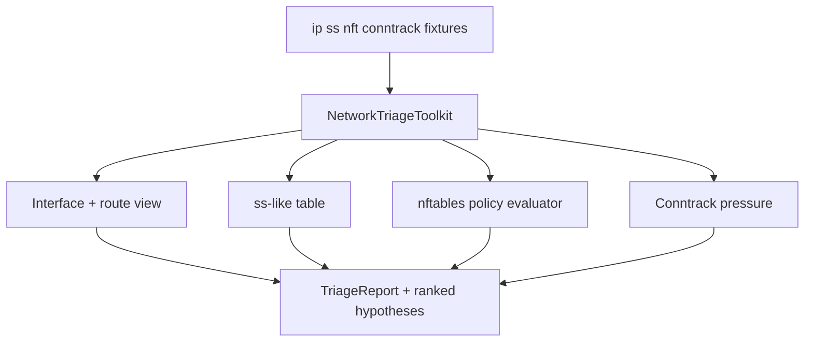

# Host Network Triage Toolkit

## Overview

Classify host network symptoms from **fixtures** resembling `ip`/`ss`/`nft`/conntrack dumps: addressing, routing, listen sockets, conntrack pressure, and firewall policy mismatches—defaulting pedagogy to **nftables** rather than legacy iptables (ADR-004).

## Goals

- Parse interface/route/socket fixture tables into typed triage reports.
- Flag TIME_WAIT/conntrack exhaustion, listening conflicts, and blackhole routes.
- Model nftables chains/rules enough to explain drop vs accept outcomes on sample packets.
- Keep packet-capture depth at triage intuition—not Wireshark product replacement.

## Prerequisites

- [[10-Linux/05-Networking-Stack-and-Host-Firewall/Interfaces Addressing and Routing Tables|Interfaces Addressing and Routing Tables]]
- [[10-Linux/05-Networking-Stack-and-Host-Firewall/TCP UDP Sockets ss and Conntrack|TCP UDP Sockets ss and Conntrack]]
- [[10-Linux/05-Networking-Stack-and-Host-Firewall/nftables and Firewalld Operator Model|nftables and Firewalld Operator Model]]
- [[10-Linux/05-Networking-Stack-and-Host-Firewall/Packet Capture tcpdump and Wireshark Triage|Packet Capture tcpdump and Wireshark Triage]]
- [[10-Linux/projects/Linux Host Workbench/ADR/ADR-004 nftables over Legacy iptables Teaching Default|ADR-004]]
- [[10-Linux/code/README|Linux Code Labs]]

## Architecture

See [[10-Linux/projects/Host Network Triage Toolkit/Architecture|Architecture]] for evaluator boundaries.

## Spec

| Concern | Spec |
| --- | --- |
| Inputs | JSON fixtures: links, routes, sockets, nftables ruleset, conntrack counts |
| Outputs | Ranked hypotheses (routing, socket, firewall, conntrack), sample verdicts |
| Determinism | Same fixtures → identical JSON; no live netlink |
| Honesty | Teaching evaluator; not nftables kernel or firewalld daemon |
| Limits | Cap socket rows, rule count, packet samples |
| Code targets | `host-network-triage.ts`; tests under `10-Linux/code/tests` |

## Acceptance Criteria

- [ ] Parses interface/route/socket fixtures and flags obvious misconfig (no default route, duplicate listen).
- [ ] Conntrack pressure model flags when entries ≥ configured high watermark.
- [ ] nftables evaluator accepts/drops sample packets against a teaching ruleset (ADR-004 default).
- [ ] Legacy iptables syntax is contrast-only, not the default teaching path.
- [ ] Report lists assumptions and tool order for live triage (`ss` → routes → nft → capture).
- [ ] No live interfaces or CAP_NET_ADMIN required in CI (ADR-001).
- [ ] Export wires into [[10-Linux/projects/Linux Host Workbench/README|Linux Host Workbench]] facade.

## Stretch

1. DNS/nsswitch fixture correlating resolver timeouts with socket backlog.
2. tcpdump PCAP subset classifier for SYN flood vs app stall (bounded frames).
3. Cross-link with [[10-Linux/projects/Observability First-Aid Kit/README|Observability First-Aid Kit]] for “port open but hung” playbooks.

## Related Notes

- [[10-Linux/projects/Host Network Triage Toolkit/Architecture|Architecture]]
- [[10-Linux/projects/Linux Host Workbench/README|Linux Host Workbench]]
- [[10-Linux/README|Linux MOC]]
- [[10-Linux/code/README|Linux Code Labs]]
- [[01-Computer-Science/07-Networking-Fundamentals/Layered Network Models|Layered Network Models]]
- [[Career/README|Career]]

## Progress Checklist

- [ ] Scaffold `host-network-triage` module + Vitest fixtures
- [ ] Wire CLI command `lhw net triage --input … --json`
- [ ] Golden nft drop/accept + conntrack exhaustion fixtures
- [ ] Document evaluator gaps vs live nftables
- [ ] Mark mini project complete in track Implementation Checklist
