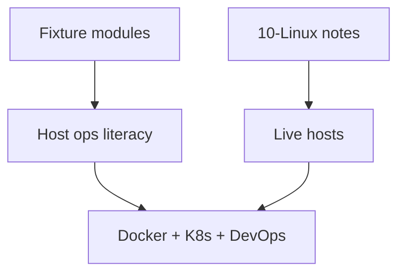

# ADR-001: Simulation Scope

## Status

Accepted on 2026-07-23.

## Context

Learners need inspectable implementations of procfs literacy, cgroup budgets, network triage, systemd graphs, and first-aid playbooks—but requiring **live VMs in CI**, **Docker image builds**, **Kubernetes control planes**, or **cloud IAM** would imply false production parity, break multi-OS CI, and blur handoffs to [[14-Docker/README|Docker]], [[15-Kubernetes/README|Kubernetes]], [[16-DevOps/README|DevOps]], and [[18-Security/README|Security]].

## Decision

Implement **small, testable TypeScript simulation modules** over fixtures with explicit limits: deterministic step clocks, resource ceilings, JSON CLI, and documented gaps.

**Exclude from this workbench and from required CI:**

- Live VM boot / SSH labs as merge gates
- Docker/OCI image builds and registry publishes
- Kubernetes manifests, controllers, or cluster APIs
- Cloud IAM, SSO, or managed-identity products

Optional local experiments on a developer’s own machine remain outside CI and never gate green builds.

## Options Considered

| Option | Pros | Cons |
| --- | --- | --- |
| Fixture simulations (chosen) | Portable, testable, honest | Not live kernel behavior |
| Live VM in CI | Feels “real” | Slow, fragile, non-portable, costly |
| Docker-in-Docker labs as required CI | Container realism | Wrong track ownership; daemon coupling |
| Wiki-only, no code | Low maintenance | No executable evidence |

## Consequences

Tests lock simulation invariants, not vendor release notes. Documentation links Docker/K8s/DevOps/Security for adjacent depth. Portfolio README states non-goals prominently.

## Follow-ups

- Track implemented vs target modules in [[10-Linux/projects/Linux Host Workbench/Known Issues|Known Issues]].
- Revisit scope only via new ADR if adding required live-host or orchestration CI.

## Related Documents

- [[10-Linux/projects/Linux Host Workbench/Architecture|Architecture]]
- [[10-Linux/00-Orientation-and-Boundaries/CS Models vs Linux Operations Boundaries|CS Models vs Linux Operations Boundaries]]
- [[10-Linux/projects/Linux Host Workbench/ADR/ADR-005 Host vs Container Boundary|ADR-005]]
