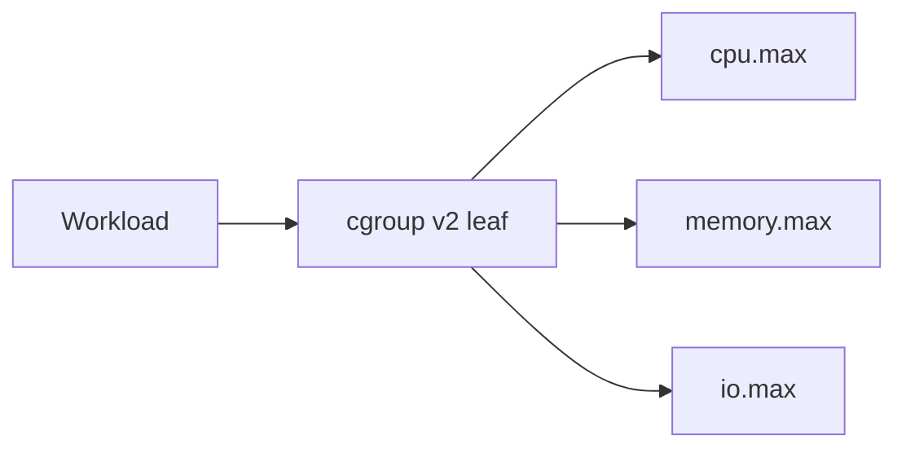

# ADR-002: cgroup v2 Teaching Default

## Status

Accepted on 2026-07-23.

## Context

cgroup v1 dual hierarchies still appear in older fleets and folklore, but modern distributions, container runtimes, and systemd default to the **unified cgroup v2 hierarchy**. The workbench must pick one default so CLI demos, fixtures, and tests stay coherent.

## Decision

Default the budget clinic and related docs to **cgroup v2** controllers (`cpu.max`, `memory.max`, `io.max`, optional `cpu.weight`). Legacy v1 controller paths are contrast-only fixtures, explicitly labeled, never the package default.

## Options Considered

| Option | Pros | Cons |
| --- | --- | --- |
| cgroup v2 default (chosen) | Matches modern hosts + containers | Slightly newer mental model |
| cgroup v1 default | Matches some legacy notes | Teaches obsolete primary path |
| Dual-default both equal | “Complete” | Confuses learners; doubles fixtures |
| Skip controllers; namespaces only | Smaller | Misses noisy-neighbor budgets |

## Consequences

Schemas reject unlabeled v1 controller names in default mode. Noisy-neighbor labs speak v2 knobs first. Container handoff (ADR-005) maps runtime limits onto v2 semantics.

## Follow-ups

- Document controller subset in [[10-Linux/projects/Cgroup Budget Clinic/Architecture|Cgroup Budget Clinic Architecture]].
- Add golden noisy-neighbor + OOM fixtures on v2 trees only for default suite.

## Related Documents

- [[10-Linux/projects/Cgroup Budget Clinic/README|Cgroup Budget Clinic]]
- [[10-Linux/07-Cgroups-Namespaces-and-Isolation/cgroup v2 Controllers CPU Memory IO|cgroup v2 Controllers CPU Memory IO]]
