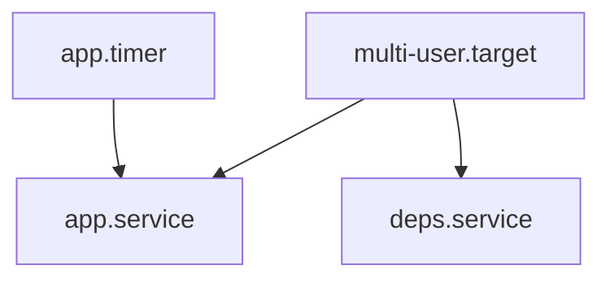

# ADR-003: systemd-as-init Teaching Default

## Status

Accepted on 2026-07-23.

## Context

Linux init history includes SysV, Upstart, OpenRC, and others, but the majority of production server distributions learners will operate use **systemd as PID 1**. Teaching “generic init” first under-prepares operators for unit graphs, targets, timers, and journald.

## Decision

Default the unit workshop narrative and fixtures to **systemd-as-init**: unit types, dependency directives, targets, timers, and hardening checklists. SysV/OpenRC appear only as contrast notes, not as equal default implementations in the Workbench.

## Options Considered

| Option | Pros | Cons |
| --- | --- | --- |
| systemd default (chosen) | Matches common fleets; rich unit model | Less historical breadth |
| SysV default | Simple scripts | Misrepresents modern ops |
| Multi-init equal support | Pluralism | Explodes scope; weak CI |
| Wiki-only init discussion | Cheap | No executable graphs |

## Consequences

CLI scenarios assume `.service`/`.timer`/`.target` fixtures. journald rate-limit stretch labs are systemd-adjacent. Fleet config management depth still hands off to [[16-DevOps/README|DevOps]].

## Follow-ups

- Document directive subset in [[10-Linux/projects/systemd Unit Workshop/Architecture|systemd Unit Workshop Architecture]].
- Golden cycle-detection and hardening-gap fixtures.

## Related Documents

- [[10-Linux/projects/systemd Unit Workshop/README|systemd Unit Workshop]]
- [[10-Linux/06-systemd-Timers-and-Logging/Unit Types Dependencies and Targets|Unit Types Dependencies and Targets]]
