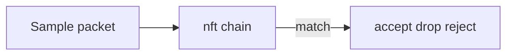

# ADR-004: nftables over Legacy iptables Teaching Default

## Status

Accepted on 2026-07-23.

## Context

Legacy iptables remains in muscle memory and some tooling, but modern distributions and firewalld backends increasingly center on **nftables**. Teaching both as equal defaults doubles cognitive load and fixture surface without improving first-principles triage.

## Decision

Default the Host Network Triage Toolkit firewall evaluator and docs to **nftables** (tables/chains/rules, accept/drop/reject). Legacy iptables syntax is contrast-only, explicitly labeled, never the package or CLI default.

## Options Considered

| Option | Pros | Cons |
| --- | --- | --- |
| nftables default (chosen) | Modern host firewall path | Learners may still meet iptables in the wild |
| iptables default | Familiar commands | Teaches legacy primary path |
| Dual equal evaluators | “Complete” | Double maintenance; confusing defaults |
| firewalld-only API | Distro-friendly | Hides packet-path literacy |

## Consequences

Sample packet verdicts use nftables rule order. firewalld is discussed as an operator UX over nft where relevant in wiki notes—not reimplemented as a daemon. Capture/triage order remains `ss` → routes → nft → capture.

## Follow-ups

- Document teaching rule DSL in [[10-Linux/projects/Host Network Triage Toolkit/Architecture|Host Network Triage Toolkit Architecture]].
- Golden accept/drop fixtures; optional iptables contrast fixture in Ideas.

## Related Documents

- [[10-Linux/projects/Host Network Triage Toolkit/README|Host Network Triage Toolkit]]
- [[10-Linux/05-Networking-Stack-and-Host-Firewall/nftables and Firewalld Operator Model|nftables and Firewalld Operator Model]]
