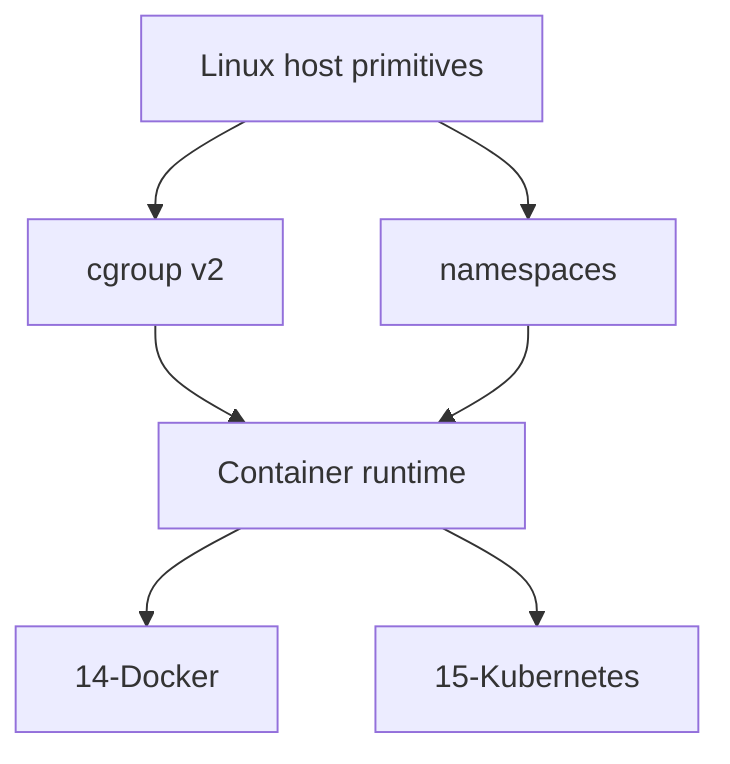

# ADR-005: Host vs Container Boundary

## Status

Accepted on 2026-07-23.

## Context

cgroups and namespaces are the host primitives containers compose. Learners often conflate “Docker” with those primitives—or worse, try to rebuild image builds and orchestrators inside the Linux track. The Workbench must draw a sharp boundary so portfolio claims stay honest.

## Decision

This track and Workbench own **host primitives and operator triage**: procfs, cgroup v2 budgets, namespaces as isolation boundaries, systemd on the host, nftables on the host, and first-aid observability.

**Hand off explicitly:**

| Concern | Home track |
| --- | --- |
| Images, Docker Engine, Compose | [[14-Docker/README\|Docker]] |
| Pods, schedulers, controllers | [[15-Kubernetes/README\|Kubernetes]] |
| Fleet CI/CD, config management platforms | [[16-DevOps/README\|DevOps]] |
| Multi-service topology / SLOs | [[09-System-Design/README\|System Design]] |

Container runtimes may be referenced as *consumers* of cgroup/namespace knobs (teaching handoff), never as required CI image-build or cluster scope (ADR-001).

## Options Considered

| Option | Pros | Cons |
| --- | --- | --- |
| Sharp host/container split (chosen) | Honest portfolio; clear ownership | Learners must follow cross-links |
| Embed Docker labs in Linux Workbench | Feels integrated | Scope explosion; ADR-001 violation |
| Ignore containers entirely | Simple | Misses the most common confusion |
| Reimplement OCI runtime | Deep | Years of wrong-track work |

## Consequences

Cgroup clinic docs map “runtime limit ↔ cgroup knobs” without shipping Dockerfiles as acceptance. Portfolio Map and MOC keep Docker/K8s links visible. Interview answers must name the boundary explicitly.

## Follow-ups

- Keep handoff note [[10-Linux/07-Cgroups-Namespaces-and-Isolation/From Host Primitives to Containers Handoff|From Host Primitives to Containers Handoff]] linked from Cgroup Clinic.
- Reject PRs that add required Docker image builds or K8s manifests to Linux CI.

## Related Documents

- [[10-Linux/projects/Linux Host Workbench/ADR/ADR-001 Simulation Scope|ADR-001]]
- [[10-Linux/projects/Cgroup Budget Clinic/README|Cgroup Budget Clinic]]
- [[10-Linux/12-Incidents-Runbooks-and-Portfolio/Linux Host Workbench Portfolio Map|Linux Host Workbench Portfolio Map]]
