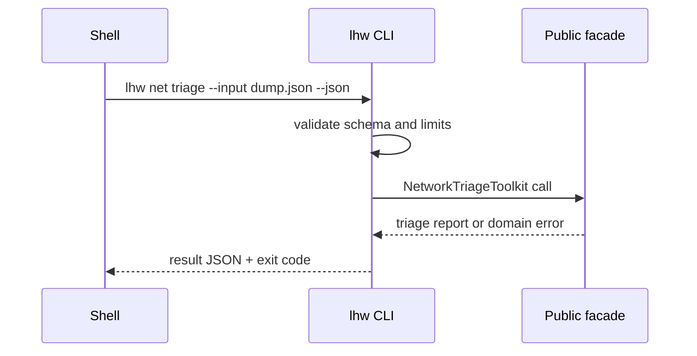

# API — Linux Host Workbench

## Library Surface

| Module | Symbols | Contract summary |
| --- | --- | --- |
| procfs-inspector | `inspectProcfs`, `parseStat`, `parseStatus` | fixture → process report |
| cgroup-budget-clinic | `BudgetClinic`, `runScenario` | v2 budgets → contention report |
| host-network-triage | `NetworkTriageToolkit`, `triage`, `evaluateNft` | fixtures → hypotheses + verdicts |
| systemd-unit-workshop | `SystemdUnitWorkshop`, `validateUnits`, `auditHardening` | units → graph/hardening report |
| observability-first-aid | `FirstAidKit`, `classifySignals`, `buildPlaybook` | signals → ordered first-aid report |

Source: [[10-Linux/code|10-Linux/code]]. Educational APIs—not drop-in replacements for `ps`, `systemctl`, `nft`, or kernel controllers.

## CLI Contract (Target)

Syntax: `lhw <procfs|cgroup|net|systemd|obs> --input <json> --json`

The adapter reads bounded JSON (or fixture roots under a jail), writes one JSON result to stdout, diagnostics to stderr, and never executes input as code.

## Error Model

| Exit | Code | Meaning | Caller action |
| --- | --- | --- | --- |
| 0 | OK | Completed | Consume stdout |
| 2 | INVALID_INPUT | Parse/schema failure | Correct input |
| 3 | DOMAIN_ERROR | Cycle, OOM policy, nft miss, etc. | Inspect details |
| 4 | IO_ERROR | Fixture/path failure | Check paths |
| 5 | LIMIT_EXCEEDED | Caps on PIDs/cgroups/sockets/units/steps | Reduce workload |
| 70 | INTERNAL_ERROR | Unexpected defect | Preserve stderr and report |

## Compatibility

Semantic versioning applies after first tagged release. Export names, JSON fields, exit codes, and scenario names are compatibility surfaces. Live kernel/systemd/nftables parity is not.

## Related Documents

- [[10-Linux/projects/Linux Host Workbench/Requirements|Requirements]]
- [[10-Linux/projects/Linux Host Workbench/Testing|Testing]]
