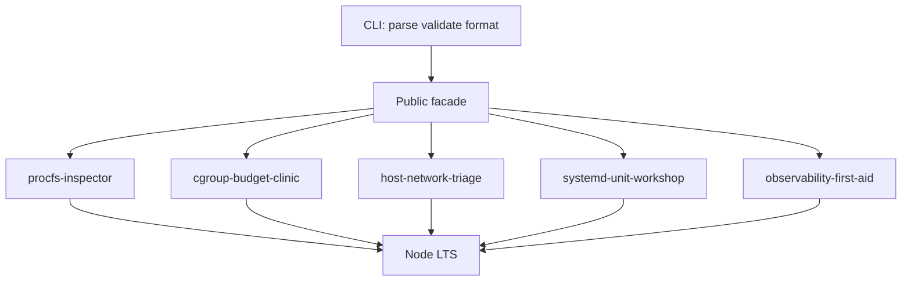
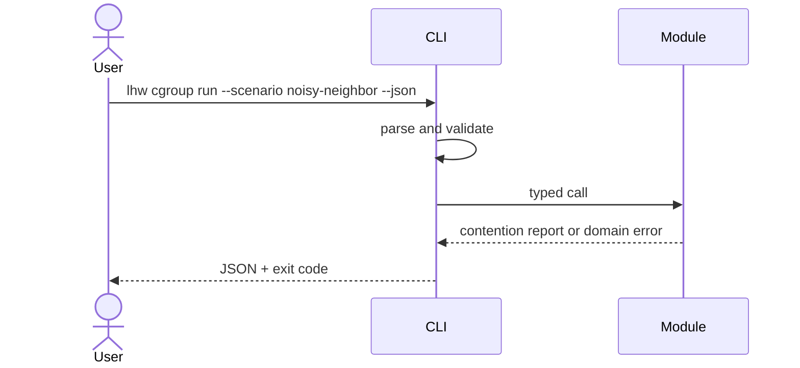

# Architecture — Linux Host Workbench

## Summary

A modular monolith: one installable package (`@seb/linux-host-workbench` target name in [[10-Linux/code|10-Linux/code]]), independent domain modules, no application server and no live host control plane. The CLI validates and serializes input; domain modules own simulation behavior over fixtures.

## Data Flow

## Key Components

| Component | Responsibility | Boundary |
| --- | --- | --- |
| Public facade | Stable exports and semver | No host policy in CLI |
| CLI adapter (`lhw`) | Parsing, limits, JSON, exit codes | No domain logic |
| Procfs inspector | Fixture `/proc` literacy | Not live `ps` |
| Cgroup budget clinic | v2 contention sims | Not kernel CFS/mm |
| Network triage | ss/routes/nft/conntrack fixtures | Not live netlink |
| systemd workshop | Unit graph + hardening | Not PID 1 / dbus |
| Observability first-aid | Golden signals + playbooks | Not APM SaaS |

## Supporting Mini Projects

Each mini project README maps to one module family. Portfolio integrates them under one facade without merging unrelated invariants (procfs field parse ≠ cgroup token math ≠ nft verdicts ≠ unit cycles).

## Quality Attributes

- **Correctness:** deterministic seeds/step clocks; golden scenario fixtures.
- **Security:** no `eval`, no required secrets, no privileged live probes; see [[10-Linux/projects/Linux Host Workbench/Security|Security]].
- **Performance:** bounded PIDs, cgroups, sockets, units, steps; benchmarks gate demonstrated regressions only.
- **Operability:** structured stderr diagnostics; stdout remains machine-readable JSON from CLI.

## Trade-offs

One package simplifies learning but couples releases. cgroup v2 default (ADR-002) prioritizes modern hosts over v1 nostalgia. systemd-as-init (ADR-003) matches most production Linux fleets learners will meet. nftables default (ADR-004) reduces dual-stack firewall confusion. Host-vs-container boundary (ADR-005) keeps Docker/K8s ownership honest.

## Decisions

- [[10-Linux/projects/Linux Host Workbench/ADR/ADR-001 Simulation Scope|ADR-001: Simulation Scope]]
- [[10-Linux/projects/Linux Host Workbench/ADR/ADR-002 cgroup v2 Teaching Default|ADR-002: cgroup v2 Teaching Default]]
- [[10-Linux/projects/Linux Host Workbench/ADR/ADR-003 systemd-as-init Teaching Default|ADR-003: systemd-as-init Teaching Default]]
- [[10-Linux/projects/Linux Host Workbench/ADR/ADR-004 nftables over Legacy iptables Teaching Default|ADR-004: nftables over Legacy iptables]]
- [[10-Linux/projects/Linux Host Workbench/ADR/ADR-005 Host vs Container Boundary|ADR-005: Host vs Container Boundary]]

## Related Documents

- [[10-Linux/projects/Linux Host Workbench/API|API]]
- [[10-Linux/projects/Linux Host Workbench/Testing|Testing]]
- [[10-Linux/projects/Linux Host Workbench/Host State|Host State]]
