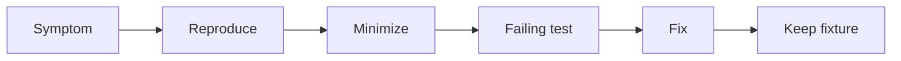

# Debug Diary — Linux Host Workbench

## Investigation Index

| Date | Observation | Finding | Prevention | Status |
| --- | --- | --- | --- | --- |
| 2026-07-23 | Portfolio requested integrated workbench while code tree is greenfield | Facade/CLI not yet present; module docs reference target paths under `10-Linux/code/src` | Mark CLI as target; gate release claims on tarball smoke + contract tests | tracked |
| 2026-07-23 | Temptation to mount live `/proc` in tests for “realism” | Breaks Windows CI and ADR-001 | Fixture trees only; optional local probes never required | tracked |
| 2026-07-23 | cgroup v1 vs v2 fixture naming easy to confuse | Default must reject v1 controller paths | ADR-002 + schema enum | tracked |
| 2026-07-23 | nftables evaluator can flake if rule order unsorted | Need stable rule IDs and deterministic sort | Golden verdict fixtures with fixed order | tracked |
| 2026-07-23 | systemd cycle detection depends on iteration order | Unstable DFS start node | Sort unit names before graph walk | tracked |

## Debug Protocol

Reproduce with smallest fixture, capture Node/Vitest versions and exact command, classify contract versus implementation failure, add failing test, then fix without weakening assertions. Preserve procfs dumps, cgroup step traces, nft verdict logs, unit graphs, and first-aid playbook IDs when relevant.

## Related Documents

- [[10-Linux/projects/Linux Host Workbench/Known Issues|Known Issues]]
- [[10-Linux/projects/Linux Host Workbench/Testing|Testing]]
