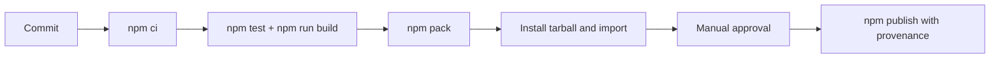

# Deployment — Linux Host Workbench

## Environments

| Environment | Purpose | Promotion rule |
| --- | --- | --- |
| local | implementation and focused tests | `npm install` and `npm test` pass |
| CI | reproducible multi-platform verification on fixtures | required checks and package smoke pass; **no live VM** |
| npm release | immutable library/CLI artifact | reviewed tag, provenance, manual approval |



## Release and Rollback

Build from [[10-Linux/code|10-Linux/code]] using `package.json` exports map. Inspect `npm pack` contents before publishing. Pin CI Node LTS versions; use least-privilege publish tokens. npm versions are immutable: rollback means deprecating the bad version, restoring last known-good recommendation, and publishing a corrected semver.

## Local Bootstrap

```bash
cd 10-Linux/code
npm install
npm test
npm run build
# target: npx lhw --help
```

## Non-Deployment Clarification

This package is **not** deployed as a host agent fleet. Simulations run locally or in CI on fixtures. Live host provisioning, image builds, and orchestration belong to [[16-DevOps/README|DevOps]], [[14-Docker/README|Docker]], and [[15-Kubernetes/README|Kubernetes]]—explicitly excluded by [[10-Linux/projects/Linux Host Workbench/ADR/ADR-001 Simulation Scope|ADR-001]].

## Related Documents

- [[10-Linux/projects/Linux Host Workbench/Security|Security]]
- [[10-Linux/projects/Linux Host Workbench/Monitoring|Monitoring]]
