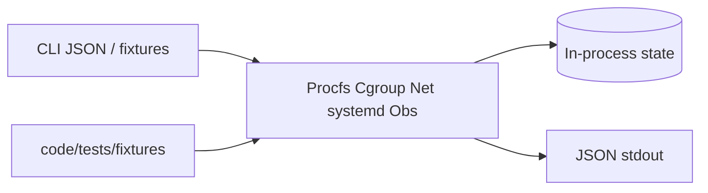

# Host State — Linux Host Workbench

## Status: Simulation State Only (Not a Product Database)

This portfolio implements **in-memory and fixture-backed host-state simulations in TypeScript** for teaching. It does not ship a production database product, managed service, ORM schema, or host inventory CMDB.

## Data Stance

| Concern | Approach |
| --- | --- |
| Authoritative host inventory / CMDB | **N/A** — fleet truth belongs to ops platforms; study platforms in [[16-DevOps/README\|DevOps]] |
| Process / memory view | Parsed from procfs-shaped fixtures |
| Cgroup tree | In-memory hierarchy + demand timelines |
| Network / firewall | Fixture tables + teaching nftables evaluator |
| systemd units | Parsed unit ASTs + dependency graph |
| Observability | Metric snapshots + snippet fixtures |
| Secrets | None required for core labs |
| Persistence | Optional lab export of reports only; not durability teaching |

## Module Storage Map

| Module | State |
| --- | --- |
| Procfs inspector | Stateless parse over fixture trees |
| Cgroup clinic | Tree + per-step counters |
| Network triage | Tables + rule lists |
| systemd workshop | Unit map + edges |
| Observability first-aid | Snapshot + optional upstream reports |

## Related Documents

- [[10-Linux/projects/Linux Host Workbench/ADR/ADR-001 Simulation Scope|ADR-001]]
- [[10-Linux/12-Incidents-Runbooks-and-Portfolio/Lab Environment and Reproducible Host Fixtures|Lab Environment and Reproducible Host Fixtures]]
- [[08-Databases/README|Databases]] (engine literacy handoff—not used here)
