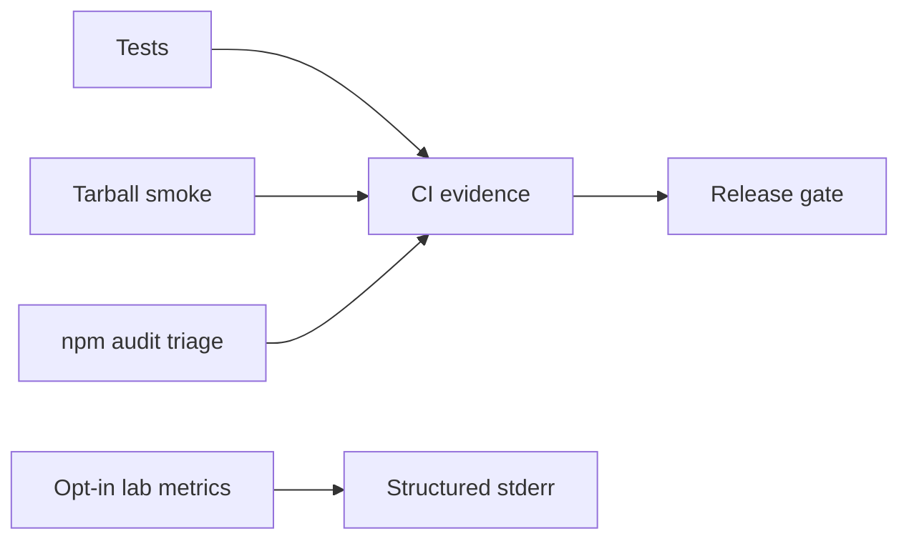

# Monitoring — Linux Host Workbench

## Operability Model

This is a local library/CLI, not an always-on host agent fleet; uptime SLOs would be misleading. Release health is measured through CI, tarball smoke tests, issue trends, and opt-in lab diagnostics.

| Signal | Target | Evidence |
| --- | --- | --- |
| Supported-platform verification | 100% required jobs pass | CI checks (fixture-only) |
| Tarball smoke success | 100% before publish | install/import run |
| Deterministic CLI errors | 100% contract tests | exit-code suite |
| Critical dependency exposure | 0 unmitigated releasable findings | audit record |
| Scenario regression | golden fixtures unchanged | cgroup/nft/unit/first-aid suites |

## Lab Diagnostics (Opt-In)

With explicit `LHW_DEBUG=1`, report command, duration bucket, fixture size bucket, module, and stable error code—never raw secrets, oversized process dumps, or live host identifiers on stdout.

## Related Documents

- [[10-Linux/projects/Linux Host Workbench/Deployment|Deployment]]
- [[10-Linux/12-Incidents-Runbooks-and-Portfolio/Golden Signals on a Single Box|Golden Signals on a Single Box]]
