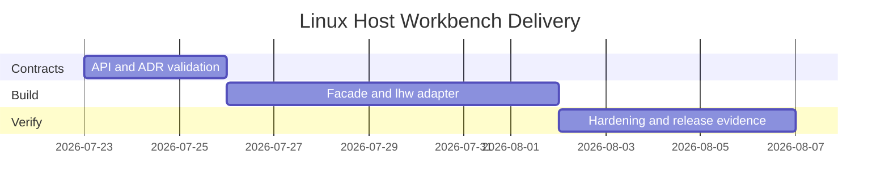

# Planning — Linux Host Workbench

## Problem Statement

Linux wiki notes explain host mechanisms, but learners lack a discoverable package surface, CLI workflow, compatibility contract, and release evidence—especially across procfs literacy, cgroup v2 budgets, network triage, systemd unit graphs, and first-aid observability playbooks.

## Success Definition

Every documented capability is importable and demonstrable through stable contracts; a clean checkout installs and passes tests on fixtures alone; documentation states production gaps without implying live-VM CI, Docker image builds, Kubernetes orchestration, or cloud IAM scope.

## Scope

**In scope:** package facade, CLI adapter (`lhw`), procfs inspector, cgroup v2 budget clinic, host network triage (nftables-default), systemd unit workshop, observability first-aid kit, typed contracts, tests, release artifact, security checks, five ADRs.

**Out of scope:** live VMs in CI, Docker/OCI image builds, Kubernetes/mesh control planes, cloud IAM, claiming kernel/systemd/nftables production parity.

## Milestones

| Milestone | Outcome | Exit criteria |
| --- | --- | --- |
| M1 Contracts | Public exports and CLI schemas fixed | ADRs accepted; contract tests define gaps |
| M2 Integration | Library + CLI vertical slice | Five command families pass positive/negative tests |
| M3 Hardening | Release-ready evidence | clean install, vitest, package smoke, docs match behavior |

## Risks

| Risk | Impact | Mitigation |
| --- | --- | --- |
| Docs exceed implementation | Misleading portfolio | Label target vs implemented; test every claimed command |
| Live-host parity implied | Incorrect learning | Explicit limitations; ADR-001 banners |
| CLI accepts unbounded fixtures | Hang / OOM | Caps on PIDs, cgroups, sockets, units, steps |
| Non-deterministic sims | Flaky CI | Seeds + step clocks only; fixture trees |
| Scope creep into Docker/K8s/IAM | Blurs track boundaries | Reject via ADR-001/005; handoff links |

## Dependencies

Node.js 20 LTS+, TypeScript, Vitest. No cloud credentials, Docker daemon, or privileged host access required. See [[10-Linux/projects/Linux Host Workbench/Roadmap|Roadmap]].

## Related Documents

- [[10-Linux/projects/Linux Host Workbench/Requirements|Requirements]]
- [[10-Linux/projects/Linux Host Workbench/Roadmap|Roadmap]]
