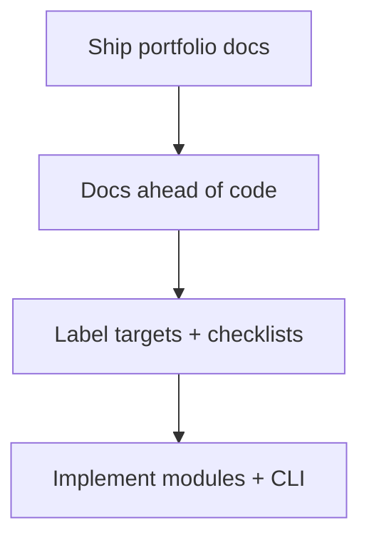

# Postmortem Index — Linux Host Workbench

## Delivery Readiness Retrospective

| Date | Event | Severity | Status |
| --- | --- | --- | --- |
| 2026-07-23 | Portfolio documentation landed ahead of full code lab implementation | SEV-4 documentation risk | mitigated, follow-ups open |

## Impact

No released npm consumers affected. Risk was documentation implying runnable `lhw` CLI and cohesive exports before [[10-Linux/code|10-Linux/code]] implements them.

## Contributing Conditions

Curriculum completeness pressure; parallel wiki track delivery; separate deliverables for modules, facade, CLI, and smoke tests.

## Corrective Actions

- [ ] Implement modules behind facade with contract tests
- [ ] Land `lhw` adapter with exit-code suite
- [ ] Add CI pack smoke before any “complete” claim
- [ ] Keep Known Issues KI-001/KI-002 visible until closed
- [ ] Never require live VM / Docker image build / K8s / cloud IAM for green CI

## Related Documents

- [[10-Linux/projects/Linux Host Workbench/Known Issues|Known Issues]]
- [[10-Linux/projects/Linux Host Workbench/Roadmap|Roadmap]]
- [[10-Linux/12-Incidents-Runbooks-and-Portfolio/Postmortem Evidence Collection on Linux|Postmortem Evidence Collection on Linux]]
