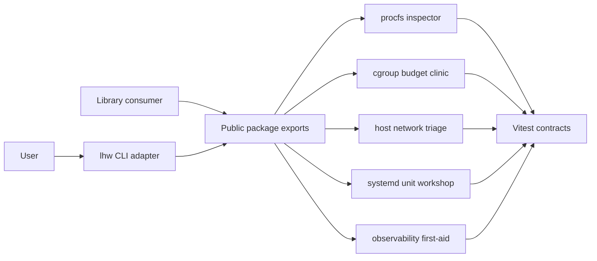

# Linux Host Workbench

## One-Line Purpose

A tested TypeScript library and thin CLI learning surface that exposes **Linux host operations simulations**: procfs inspection, cgroup v2 budgets, host network triage, systemd unit graphs, and observability first-aid—with typed contracts, fixture-driven CI, and explicit host-vs-container boundaries.

## Status

**Active.** Core modules and tests target [[10-Linux/code|10-Linux/code]]. Package facade, public re-exports, and CLI integration (`lhw`) are the active portfolio scope.

This workbench is **not a live VM farm, Docker image build pipeline, Kubernetes control plane, or cloud IAM product**. It is an inspectable educational model with explicit behavioral limits—see [[10-Linux/projects/Linux Host Workbench/ADR/ADR-001 Simulation Scope|ADR-001]].

## Goals

- Present integrated host-ops simulations through one versioned package boundary and a deterministic CLI.
- Preserve small modules that map 1:1 to mini projects and can be tested independently.
- Make cgroup budgets, systemd graphs, nftables triage, and procfs literacy visible with ADRs.
- Demonstrate production disciplines: contracts, security, tests, releases, and ops evidence for host literacy.

## Non-Goals

- Booting or SSH-ing into live VMs in CI.
- Building/publishing Docker images or OCI runtimes.
- Kubernetes, service mesh, or cloud control-plane orchestration.
- Cloud IAM, SSO, or managed identity products.
- Claiming production parity with systemd, nftables, or the Linux kernel.

## Architecture Snapshot



## Document Map

| Document | Purpose |
| --- | --- |
| [[10-Linux/projects/Linux Host Workbench/Planning\|Planning]] | Scope, milestones, risks |
| [[10-Linux/projects/Linux Host Workbench/Requirements\|Requirements]] | Functional and non-functional requirements |
| [[10-Linux/projects/Linux Host Workbench/Architecture\|Architecture]] | System shape and major components |
| [[10-Linux/projects/Linux Host Workbench/Host State\|Host State]] | Simulation state stance (not product DB) |
| [[10-Linux/projects/Linux Host Workbench/API\|API]] | Interfaces and contracts |
| [[10-Linux/projects/Linux Host Workbench/Deployment\|Deployment]] | Environments and release path |
| [[10-Linux/projects/Linux Host Workbench/Security\|Security]] | Threats, controls, secrets |
| [[10-Linux/projects/Linux Host Workbench/Testing\|Testing]] | Verification strategy |
| [[10-Linux/projects/Linux Host Workbench/Monitoring\|Monitoring]] | Release health and lab diagnostics |
| [[10-Linux/projects/Linux Host Workbench/Engineering Journal\|Engineering Journal]] | Session logs |
| [[10-Linux/projects/Linux Host Workbench/Debug Diary\|Debug Diary]] | Bug investigations |
| [[10-Linux/projects/Linux Host Workbench/Known Issues\|Known Issues]] | Open defects and debt |
| [[10-Linux/projects/Linux Host Workbench/Lessons Learned\|Lessons Learned]] | Durable takeaways |
| [[10-Linux/projects/Linux Host Workbench/Postmortem\|Postmortem]] | Retrospectives |
| [[10-Linux/projects/Linux Host Workbench/Ideas\|Ideas]] | Backlog |
| [[10-Linux/projects/Linux Host Workbench/Roadmap\|Roadmap]] | Phased delivery |
| [[10-Linux/projects/Linux Host Workbench/ADR/ADR-001 Simulation Scope\|ADR-001]] · [[10-Linux/projects/Linux Host Workbench/ADR/ADR-002 cgroup v2 Teaching Default\|ADR-002]] · [[10-Linux/projects/Linux Host Workbench/ADR/ADR-003 systemd-as-init Teaching Default\|ADR-003]] · [[10-Linux/projects/Linux Host Workbench/ADR/ADR-004 nftables over Legacy iptables Teaching Default\|ADR-004]] · [[10-Linux/projects/Linux Host Workbench/ADR/ADR-005 Host vs Container Boundary\|ADR-005]] |

## Mini Projects

| Mini project | Module focus |
| --- | --- |
| [[10-Linux/projects/Procfs Inspector Lab/README\|Procfs Inspector Lab]] | procfs parsers, RSS/VSZ, zombies/rlimits |
| [[10-Linux/projects/Cgroup Budget Clinic/README\|Cgroup Budget Clinic]] | cgroup v2 CPU/mem/IO budgets, noisy neighbor |
| [[10-Linux/projects/Host Network Triage Toolkit/README\|Host Network Triage Toolkit]] | ss/routes/nftables/conntrack fixtures |
| [[10-Linux/projects/systemd Unit Workshop/README\|systemd Unit Workshop]] | unit graphs, hardening, timers |
| [[10-Linux/projects/Observability First-Aid Kit/README\|Observability First-Aid Kit]] | golden signals, strace/lsof first-aid |

## Features

- **Procfs / cgroup / net / systemd / obs sims** — executable modules with deterministic JSON reports.
- **Fixture-first CI** — no live VM, Docker image build, K8s, or cloud IAM required (ADR-001).
- **ADR pack** — five accepted teaching defaults plus room for incident-specific ADRs.
- **Typed contracts** — public TypeScript exports with schema-validated CLI inputs.
- **Thin CLI** — `lhw <command> --json` adapter; domain logic stays in the library.

## Run and Test

```bash
cd 10-Linux/code
npm install
npm test
```

The documented CLI target is `lhw <command> --json`; until its adapter lands under [[10-Linux/code|10-Linux/code]], use imported TypeScript APIs described in [[10-Linux/projects/Linux Host Workbench/API|API]].

## Portfolio Acceptance Checklist

- [ ] All documented capabilities export from one package boundary.
- [ ] CLI output is deterministic JSON; errors use stable non-zero exit codes.
- [ ] Unit and integration tests cover procfs parse, cgroup contention, nft verdicts, unit cycles, and first-aid classification.
- [ ] Package ships typed public symbols and excludes test fixtures from artifacts.
- [ ] Security and monitoring checks pass before a tagged release.
- [ ] Docs never claim live-VM CI, Docker image builds, K8s, or cloud IAM scope.
- [ ] Five mini projects cross-linked; ADRs 001–005 accepted.

## Related Notes

- [[10-Linux/code/README|Linux Code Labs]]
- [[10-Linux/README|Linux Track]]
- [[10-Linux/12-Incidents-Runbooks-and-Portfolio/Linux Host Workbench Portfolio Map|Linux Host Workbench Portfolio Map]]
- [[Projects/README|Projects]]
- [[14-Docker/README|Docker]]
- [[15-Kubernetes/README|Kubernetes]]
- [[16-DevOps/README|DevOps]]
- [[Career/README|Career]]
