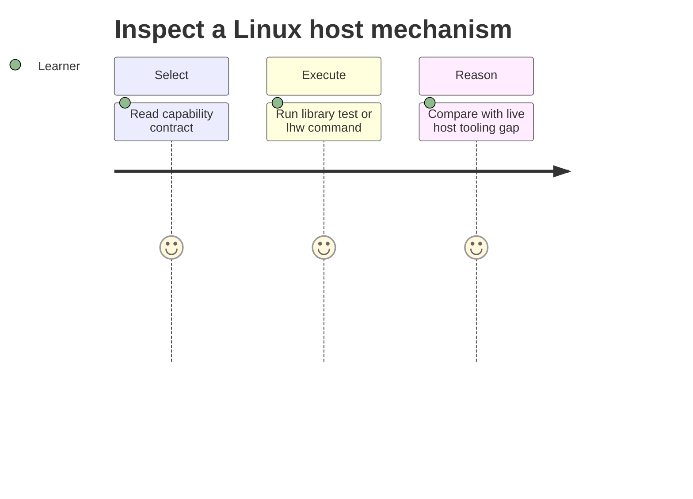

# Requirements — Linux Host Workbench

## Actors

| Actor | Goal |
| --- | --- |
| Learner | Run host-ops simulations and reason about failure modes |
| Library consumer | Import typed, documented educational APIs |
| CLI user | Run deterministic labs without writing code |
| Maintainer | Change modules without silently breaking contracts |
| Instructor | Score fixture scenarios (OOM, nft drop, unit cycle, noisy neighbor) |

## Functional Requirements

| ID | Requirement | Acceptance |
| --- | --- | --- |
| FR-001 | Export procfs inspector | Fixture → process/anomaly report |
| FR-002 | Export cgroup v2 budget clinic | Scenario → throttle/OOM/fairness report |
| FR-003 | Export host network triage | Fixtures → ranked hypotheses + nft verdicts |
| FR-004 | Export systemd unit workshop | Units → graph/hardening/timer report |
| FR-005 | Export observability first-aid | Signals → ordered playbook + classification |
| FR-006 | Offer JSON CLI for each capability | Valid input → documented JSON + exit 0 |
| FR-007 | Enforce resource ceilings | Oversized inputs → `LIMIT_EXCEEDED` |
| FR-008 | Compose mini reports into first-aid | Optional upstream report merge without live hosts |

## Non-Functional Requirements

| ID | Category | Requirement | Measurement |
| --- | --- | --- | --- |
| NFR-001 | Correctness | Deterministic sims with seeds/step clocks | 100% contract suite pass |
| NFR-002 | Performance | Bounded PIDs, cgroups, sockets, units, steps | limits enforced before work |
| NFR-003 | Security | No eval of CLI input; no privileged live probes | negative security tests pass |
| NFR-004 | Portability | Node LTS on Windows/Linux/macOS | CI matrix passes without Docker/K8s |
| NFR-005 | Observability | JSON stdout; diagnostics stderr | integration tests assert separation |
| NFR-006 | Honesty | Document gaps vs live kernel/systemd/nft | each module links limitations |

## Traceability

FR-001–FR-008 → [[10-Linux/projects/Linux Host Workbench/ADR/ADR-001 Simulation Scope|ADR-001]]; FR-002 → [[10-Linux/projects/Linux Host Workbench/ADR/ADR-002 cgroup v2 Teaching Default|ADR-002]]; FR-004 → [[10-Linux/projects/Linux Host Workbench/ADR/ADR-003 systemd-as-init Teaching Default|ADR-003]]; FR-003 → [[10-Linux/projects/Linux Host Workbench/ADR/ADR-004 nftables over Legacy iptables Teaching Default|ADR-004]]; FR-002/FR-008 handoff → [[10-Linux/projects/Linux Host Workbench/ADR/ADR-005 Host vs Container Boundary|ADR-005]].

## Related Documents

- [[10-Linux/projects/Linux Host Workbench/API|API]]
- [[10-Linux/projects/Linux Host Workbench/Testing|Testing]]
