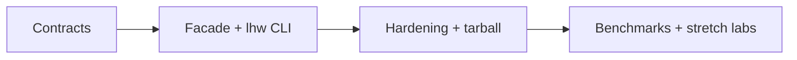

# Roadmap — Linux Host Workbench

## Current Phase

P0 contract and integration design is active. Wiki and project documentation exist; distributable product boundaries in [[10-Linux/code|10-Linux/code]] do not.

| Phase | Outcome | Exit criteria |
| --- | --- | --- |
| P0 | Truthful contracts and decisions | requirements, API, security, tests, ADRs reviewed |
| P1 | Integrated vertical slice | five exports and five CLI command families pass contracts |
| P2 | Release-ready artifact | CI matrix, audit triage, tarball smoke, docs match behavior |
| P3 | Evidence-led enhancements | bench fixtures + Ideas backlog justified by measured need |

## Now

Implement core modules under `10-Linux/code/src`, define facade exports, CLI JSON schemas, resource ceilings, error codes, and Vitest suites per mini project.

## Next

Land `lhw` adapter, npm pack smoke test, clean-install CI job (fixture-only), golden scenarios for cgroup/nft/systemd/first-aid.

## Later

Optional PSI signals, nft sets/maps mode, ENOSPC lab, evidence-pack export—only after P2 exit criteria.

## Related Documents

- [[10-Linux/projects/Linux Host Workbench/Planning|Planning]]
- [[10-Linux/projects/Linux Host Workbench/Ideas|Ideas]]
